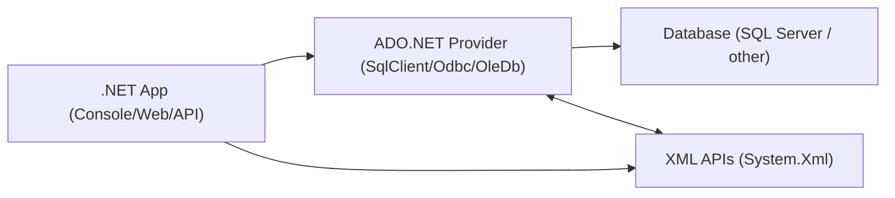
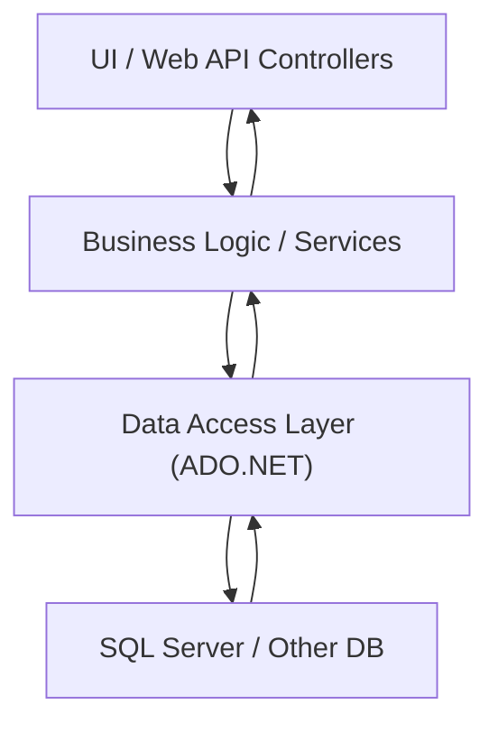
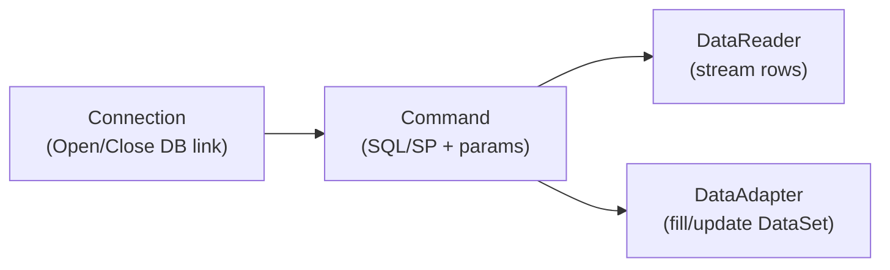
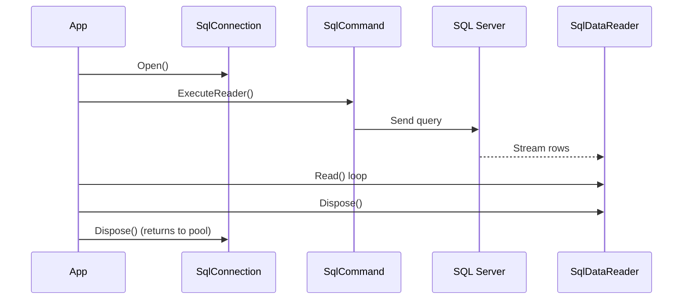
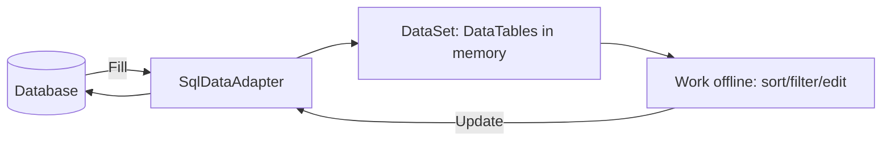
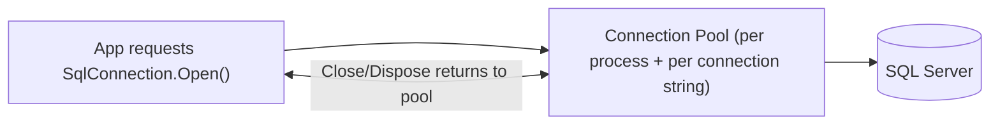
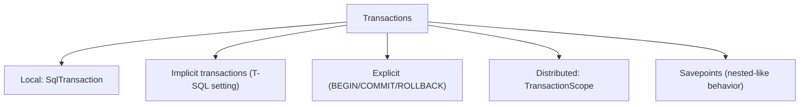
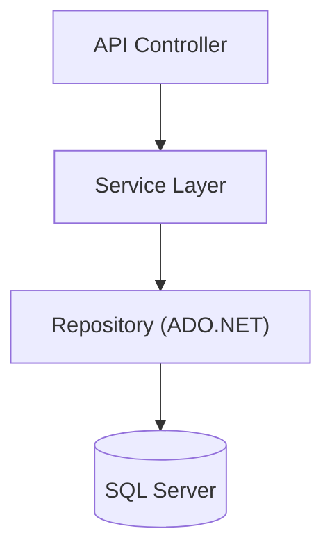

# ADO.NET — Detailed Learning Documentation (Step-by-Step + Copy-Ready Examples)

This guide consolidates **all concepts and notes** from `S2-Module-7 - .NET Advanced - ADO.NET.docx` and expands them into a practical, copy-ready reference with **Mermaid** illustrations.

---

## 1) What is ADO.NET?

**ADO.NET** provides a rich set of components for creating distributed, data-sharing applications. It is an integral part of the .NET Framework and provides access to:

- **Relational data** (SQL Server, etc.)
- **XML data**
- Data exposed through **OLE DB** and **ODBC**

**Key assemblies and integration**

- ADO.NET classes live in **`System.Data.dll`**
- ADO.NET is integrated with XML classes in **`System.Xml.dll`**



---

## 2) Architecture Overview

ADO.NET is typically used from a **Data Access Layer (DAL)**, which the rest of the application calls.



---

## 3) .NET Data Providers

A **.NET Framework data provider** is used for:

- Connecting to a database
- Executing commands
- Retrieving results

**Official docs**: `https://learn.microsoft.com/en-us/dotnet/framework/data/adonet/data-providers`

### 3.1 Core Objects of a Data Provider

Every provider is built around four core objects:



- **Connection**: `SqlConnection`, `OdbcConnection`, `OleDbConnection`
- **Command**: `SqlCommand`, `OdbcCommand`, `OleDbCommand`
- **DataReader**: `SqlDataReader`, `OdbcDataReader`, `OleDbDataReader`
- **DataAdapter**: `SqlDataAdapter`, `OdbcDataAdapter`, `OleDbDataAdapter`

---

## 4) Managed Providers

**Managed provider**: implemented in managed .NET code, integrates cleanly with .NET runtime services (exceptions, GC, etc.). A provider can still rely on native drivers underneath (e.g., ODBC driver manager), but your app uses a consistent .NET surface area.

---

## 5) Provider Types (ODBC, OLE DB, SQL Server)

### 5.1 ODBC Provider (`System.Data.Odbc`)

**ODBC** (Open Database Connectivity) is Microsoft’s strategic interface for accessing data in a heterogeneous environment of relational and non-relational DBMS systems.

- The .NET ODBC provider uses the **native ODBC Driver Manager (DM)** to enable data access.
- Namespace: **`System.Data.Odbc`**
- Reference: `https://learn.microsoft.com/en-us/dotnet/api/system.data.odbc?view=net-8.0`

**ODBC driver + DSN**

- ODBC is an industry-wide standard interface for accessing table-like data.
- Each database vendor provides an ODBC driver for their DB.

**Create a DSN (Windows)**

- Search for **ODBC Data Sources**
- Select the target **DSN type** (User/System) and click **Add**
- Select the driver
- Provide connection details
- Click **OK**, then verify the DSN appears in the list

**ODBC connection string example (SQL Server)**

```csharp
using System.Data.Odbc;

var connection = new OdbcConnection(
    "Driver={SQL Server};Server=myServerAddress;Database=myDataBase;UID=myUsername;PWD=myPassword;");
```

### 5.2 OLE DB Provider (`System.Data.OleDb`)

The .NET OLE DB provider uses **native OLE DB through COM interop** to enable data access.

Namespace: **`System.Data.OleDb`**

Common OleDB drivers (from the source notes):

- `SQLOLEDB` — Microsoft OLE DB provider for SQL Server
- `MSDAORA` — Microsoft OLE DB provider for Oracle
- `Microsoft.Jet.OLEDB.4.0` — OLE DB provider for Microsoft Jet

### 5.3 SQL Server Provider (SqlClient)

The SQL Server provider (`SqlClient`) uses its **own protocol** to communicate with SQL Server.

- Lightweight and performant
- Optimized to access SQL Server directly (no extra OLE DB/ODBC layer)

Namespace:

```csharp
using System.Data.SqlClient; // or Microsoft.Data.SqlClient (recommended for newer apps)
```

---

## 6) Namespaces You’ll Use Most

- **`System.Data`**
  - Common ADO.NET types: `DataSet`, `DataTable`, `DataRow`, `DataColumn`, `DataView`, and base `Db*` types.
- **`System.Data.SqlClient`** (classic)
  - SQL Server types: `SqlConnection`, `SqlCommand`, `SqlDataReader`, `SqlParameter`, `SqlTransaction`, `SqlDataAdapter`, `SqlBulkCopy`.
- **`System.Xml`**
  - XML parsing and processing; ADO.NET can serialize `DataSet` to XML.

---

## 7) How ADO.NET Works Internally (Conceptual)

### 7.1 Connected approach (DataReader)

The **DataReader** is the connected approach:

- Reads data **line by line**
- Uses a buffer
- **Forward-only**, **read-only**
- Keeps the connection open during reading



### 7.2 Disconnected approach (DataSet + DataAdapter)

The **DataSet** + **DataAdapter** is the disconnected approach:

- DataAdapter opens a connection temporarily
- Loads data into `DataSet` (in-memory)
- Connection closes
- App manipulates data offline
- App reconnects later to update DB

**Important notes (from the source)**

- One **DataSet** is a **collection of tables**
- Tables can come from **different data sources** (RDBMS, XML, internal tables)
- Relationships can be created between tables



---

## PHASE 2 — Core ADO.NET Components (SQL Server)

> The examples below use SQL Server classes. The same patterns apply to ODBC/OLE DB with equivalent types.

### 8) SqlConnection

```csharp
using System;
using System.Data.SqlClient;

const string cs = "Server=.;Database=SampleDb;Integrated Security=True;";

using (var connection = new SqlConnection(cs))
{
    connection.Open();
    Console.WriteLine(connection.State); // Open
}
```

### 9) SqlCommand

```csharp
using System.Data;
using System.Data.SqlClient;

const string cs = "Server=.;Database=SampleDb;Integrated Security=True;";

using (var connection = new SqlConnection(cs))
using (var command = new SqlCommand("INSERT INTO Customers(Name) VALUES(@Name);", connection))
{
    command.Parameters.Add("@Name", SqlDbType.NVarChar, 100).Value = "Alice";
    connection.Open();
    command.ExecuteNonQuery();
}
```

### 10) SqlDataReader

```csharp
using System.Data.SqlClient;

const string cs = "Server=.;Database=SampleDb;Integrated Security=True;";

using (var connection = new SqlConnection(cs))
using (var command = new SqlCommand("SELECT Id, Name FROM Customers;", connection))
{
    connection.Open();
    using (var reader = command.ExecuteReader())
    {
        while (reader.Read())
        {
            int id = reader.GetInt32(0);
            string name = reader.GetString(1);
            Console.WriteLine($"{id}: {name}");
        }
    }
}
```

### 11) SqlDataAdapter

```csharp
using System.Data;
using System.Data.SqlClient;

const string cs = "Server=.;Database=SampleDb;Integrated Security=True;";

var table = new DataTable();
using (var adapter = new SqlDataAdapter("SELECT Id, Name FROM Customers;", cs))
{
    adapter.Fill(table);
}
```

### 12) DataSet

```csharp
using System.Data;
using System.Data.SqlClient;

const string cs = "Server=.;Database=SampleDb;Integrated Security=True;";

var ds = new DataSet();
using (var adapter = new SqlDataAdapter("SELECT * FROM Customers; SELECT * FROM Orders;", cs))
{
    adapter.Fill(ds); // ds.Tables[0], ds.Tables[1]
}
```

### 13) DataTable, DataRow, DataColumn, DataView

```csharp
using System.Data;

var table = new DataTable("Customers");
table.Columns.Add(new DataColumn("Id", typeof(int)));
table.Columns.Add(new DataColumn("Name", typeof(string)));
table.Columns.Add(new DataColumn("City", typeof(string)));

var row = table.NewRow();
row["Id"] = 1;
row["Name"] = "Alice";
row["City"] = "London";
table.Rows.Add(row);

var view = new DataView(table)
{
    RowFilter = "City = 'London'",
    Sort = "Name ASC"
};
```

### 14) SqlParameter

```csharp
using System.Data;
using System.Data.SqlClient;

const string cs = "Server=.;Database=SampleDb;Integrated Security=True;";

using (var connection = new SqlConnection(cs))
using (var command = new SqlCommand("SELECT * FROM Customers WHERE City = @City;", connection))
{
    command.Parameters.Add("@City", SqlDbType.NVarChar, 50).Value = "London";
    connection.Open();
    using (var reader = command.ExecuteReader())
    {
        while (reader.Read())
        {
            Console.WriteLine(reader["Name"]);
        }
    }
}
```

### 15) SqlTransaction

```csharp
using System.Data.SqlClient;

const string cs = "Server=.;Database=SampleDb;Integrated Security=True;";

using (var connection = new SqlConnection(cs))
{
    connection.Open();
    using (var tx = connection.BeginTransaction())
    {
        try
        {
            using (var cmd = new SqlCommand("UPDATE Accounts SET Balance = Balance - 10 WHERE Id = 1;", connection, tx))
                cmd.ExecuteNonQuery();

            using (var cmd = new SqlCommand("UPDATE Accounts SET Balance = Balance + 10 WHERE Id = 2;", connection, tx))
                cmd.ExecuteNonQuery();

            tx.Commit();
        }
        catch
        {
            tx.Rollback();
            throw;
        }
    }
}
```

---

## PHASE 3 — Connectivity & Configuration

### 16) Connected vs Disconnected: When to use which?

**Connected architecture (SqlDataReader)**

- Best for: fast forward-only reads, low memory, streaming large results
- Trade-off: keeps connection open while reading

**Disconnected architecture (DataSet + DataAdapter)**

- Best for: offline work, UI binding, complex in-memory filtering/sorting, multiple tables and relations
- Trade-off: more memory; possible synchronization/concurrency complexity

#### Disconnected approach — advantages (from the source notes)

- Minimizes database load and network traffic (connect only when needed)
- Supports offline work + updating later
- Represents relational data (tables, relations, views) in memory
- Supports sorting/filtering/searching
- Handles multiple tables
- Relationships between tables
- Strong XML support (`ReadXml`, `WriteXml`)
- Serialization for transport across layers
- Batch updates via adapters/table adapters
- Can manage concurrency (multiple versions)

#### Disconnected approach — disadvantages (from the source notes)

- Memory consumption can be high for large datasets
- Synchronization issues if source changes frequently
- Concurrency issues (multi-user changes require careful handling)
- More complex update code
- Potential redundancy/security concerns (data copies exist in multiple places)

#### Alternatives (from the source notes)

- **DataReader** (connected, low memory)
- **LINQ to SQL / Entity Framework** (ORM)
- **Dapper** (micro-ORM, built on ADO.NET)

---

### 17) Connection Strings

#### Structure (common parts)

```text
Server=.;Database=SampleDb;Integrated Security=True;Encrypt=True;TrustServerCertificate=True;
```

Useful keywords:

- `Server` / `Data Source`
- `Database` / `Initial Catalog`
- `Integrated Security=True` (Windows auth)
- `User ID=...;Password=...` (SQL auth)
- `Encrypt=True/False`
- `TrustServerCertificate=True/False`
- `Pooling=True`
- `Min Pool Size=0;Max Pool Size=100`
- `Connection Timeout=15`

#### Store in `app.config` (Desktop / Console .NET Framework)

```xml
<configuration>
  <connectionStrings>
    <add name="DefaultConnection"
         connectionString="Server=.;Database=SampleDb;Integrated Security=True;"
         providerName="System.Data.SqlClient" />
  </connectionStrings>
</configuration>
```

#### Store in `web.config` (ASP.NET)

```xml
<configuration>
  <connectionStrings>
    <add name="DefaultConnection"
         connectionString="Server=.;Database=SampleDb;Integrated Security=True;"
         providerName="System.Data.SqlClient" />
  </connectionStrings>
</configuration>
```

#### Store in `appsettings.json` (.NET / ASP.NET Core)

```json
{
  "ConnectionStrings": {
    "DefaultConnection": "Server=.;Database=SampleDb;Integrated Security=True;"
  }
}
```

#### Encrypting connection strings (classic ASP.NET / web.config)

From an elevated command prompt:

```powershell
aspnet_regiis -pef "connectionStrings" "C:\Path\To\YourWebApp"
```

#### Read using `ConfigurationManager` (.NET Framework)

```csharp
using System.Configuration;

string cs = ConfigurationManager.ConnectionStrings["DefaultConnection"].ConnectionString;
```

#### Read using `IConfiguration` (.NET / ASP.NET Core)

```csharp
public class MyRepo
{
    private readonly string _cs;
    public MyRepo(IConfiguration config)
    {
        _cs = config.GetConnectionString("DefaultConnection");
    }
}
```

---

### 18) Authentication Methods

#### Windows Authentication

```text
Server=.;Database=SampleDb;Integrated Security=True;
```

#### SQL Server Authentication

```text
Server=.;Database=SampleDb;User ID=AppUser;Password=StrongPassword!;
```

#### Azure SQL authentication basics

At minimum, you typically enable encryption:

```text
Server=yourserver.database.windows.net;Database=SampleDb;
User ID=...;Password=...;Encrypt=True;TrustServerCertificate=False;
```

---

### 19) Connection Pooling

Connection pooling is a method used to manage and reuse DB connections to enhance performance and scalability.

**How it works (from the source notes)**

- When your app requests a connection, it is served from the pool (if possible).
- When your app closes a connection, the connection is returned to the pool (not physically closed).
- By default, SQL Server connection pooling is **enabled**.



**Common pooling settings**

```text
Pooling=True;Min Pool Size=0;Max Pool Size=100;Connection Timeout=15;
```

Notes (from the source):

- `Max Pool Size`: max connections in the pool (default often 100).
- `Min Pool Size`: minimum connections kept open (default often 0).
- `Connection Timeout`: how long to wait for a connection before error (default often 15s).

**Clear pools**

```csharp
using System.Data.SqlClient;

SqlConnection.ClearAllPools();
```

---

## PHASE 4 — Commands & Execution

### 20) SqlCommand execution methods

#### ExecuteNonQuery()

- `INSERT`, `UPDATE`, `DELETE`, DDL

```csharp
int rows = command.ExecuteNonQuery();
```

#### ExecuteReader()

```csharp
using (var reader = command.ExecuteReader())
{
    while (reader.Read()) { }
}
```

#### ExecuteScalar()

```csharp
object value = command.ExecuteScalar();
```

#### ExecuteXmlReader()

```csharp
using (var xml = command.ExecuteXmlReader())
{
    while (xml.Read()) { }
}
```

---

### 21) Command types and important options

#### Text commands

```csharp
command.CommandType = System.Data.CommandType.Text;
command.CommandText = "SELECT * FROM Customers WHERE Id = @Id;";
```

#### Stored procedures

```csharp
command.CommandType = System.Data.CommandType.StoredProcedure;
command.CommandText = "usp_GetCustomer";
```

#### Table-valued functions (commonly invoked as text)

```csharp
command.CommandType = System.Data.CommandType.Text;
command.CommandText = "SELECT * FROM dbo.GetCustomersByCity(@City);";
```

#### CommandTimeout

```csharp
command.CommandTimeout = 30; // seconds
```

#### CommandBehavior (reader)

```csharp
using (var reader = command.ExecuteReader(System.Data.CommandBehavior.SequentialAccess))
{
}
```

Common behaviors:

- `CloseConnection`
- `SingleRow`
- `SingleResult`
- `SequentialAccess` (large data streaming)

---

## PHASE 5 — Data Retrieval Approaches

### 22) SqlDataReader deep dive (Connected)

Key characteristics:

- **Forward-only**
- **Read-only**
- Very fast and memory efficient

#### Async reading

```csharp
using System.Data.SqlClient;

const string cs = "Server=.;Database=SampleDb;Integrated Security=True;";

await using var connection = new SqlConnection(cs);
await using var command = new SqlCommand("SELECT Id, Name FROM Customers;", connection);
await connection.OpenAsync();

await using var reader = await command.ExecuteReaderAsync();
while (await reader.ReadAsync())
{
    Console.WriteLine(reader.GetInt32(0));
}
```

#### Multiple result sets + NextResult()

```csharp
using (var reader = command.ExecuteReader())
{
    while (reader.Read()) { /* first result set */ }
    if (reader.NextResult())
        while (reader.Read()) { /* second result set */ }
}
```

---

### 23) DataSet & DataAdapter deep dive (Disconnected)

#### Fill()

```csharp
var ds = new System.Data.DataSet();
using (var adapter = new System.Data.SqlClient.SqlDataAdapter(
    "SELECT * FROM Customers; SELECT * FROM Orders;", cs))
{
    adapter.Fill(ds);
}
```

#### Update()

```csharp
using System.Data.SqlClient;

var table = new System.Data.DataTable();
using (var adapter = new SqlDataAdapter("SELECT Id, Name, City FROM Customers;", cs))
{
    adapter.Fill(table);

    table.Rows[0]["City"] = "Paris";

    var builder = new SqlCommandBuilder(adapter);
    adapter.UpdateCommand = builder.GetUpdateCommand();
    adapter.Update(table);
}
```

#### Handling multiple tables + mapping

```csharp
var ds = new System.Data.DataSet();
using (var adapter = new System.Data.SqlClient.SqlDataAdapter(
    "SELECT * FROM Customers; SELECT * FROM Orders;", cs))
{
    adapter.TableMappings.Add("Table", "Customers");
    adapter.TableMappings.Add("Table1", "Orders");
    adapter.Fill(ds);
}
```

#### DataRelation

```csharp
var customers = ds.Tables["Customers"];
var orders = ds.Tables["Orders"];
ds.Relations.Add("Customer_Orders", customers.Columns["Id"], orders.Columns["CustomerId"]);
```

#### DataView filtering

```csharp
var view = new System.Data.DataView(ds.Tables["Customers"])
{
    RowFilter = "City = 'London'",
    Sort = "Name ASC"
};
```

#### XML serialization

```csharp
ds.WriteXml("data.xml", System.Data.XmlWriteMode.WriteSchema);

var ds2 = new System.Data.DataSet();
ds2.ReadXml("data.xml");
```

#### Merge(), AcceptChanges(), RejectChanges()

```csharp
ds.Tables["Customers"].AcceptChanges();
ds.Tables["Customers"].RejectChanges();

ds.Merge(ds2);
```

---

## PHASE 6 — Security

### 24) SQL Injection

SQL injection happens when an attacker manipulates SQL via unsanitized input, allowing them to execute arbitrary SQL.

#### Vulnerable example (do not use)

```csharp
// BAD: concatenation
string sql = "SELECT * FROM Users WHERE UserName = '" + userInput + "'";
```

If `userInput` is:

```text
' OR '1'='1
```

Then the query condition becomes always true and can return all rows.

---

### 25) Parameterized Queries (Mitigation)

Use parameterized queries or stored procedures so user input is never directly concatenated.

```csharp
using System.Data;
using System.Data.SqlClient;

using (var connection = new SqlConnection(cs))
using (var command = new SqlCommand("SELECT * FROM Users WHERE UserName = @UserName;", connection))
{
    command.Parameters.Add("@UserName", SqlDbType.NVarChar, 50).Value = userInput;
    connection.Open();
    using (var reader = command.ExecuteReader()) { }
}
```

#### Add vs AddWithValue

- Prefer `Add(..., SqlDbType...)` for correct typing and query plan stability.
- `AddWithValue` can infer suboptimal types/sizes.

#### Output parameters, return values, TVPs

This guide includes all common patterns:

- Input params (default)
- Output params (`Direction = Output`)
- Return values (`Direction = ReturnValue`)
- Table-valued parameters (`SqlDbType.Structured`)

---

## PHASE 7 — Transactions

### 26) Transaction programming + ACID (from the source notes)

**Transaction**: a single logical unit of work with one or more SQL statements.

**ACID properties**

- **Atomicity**: all succeed or all fail (rollback on failure)
- **Consistency**: transaction moves DB from one valid state to another
- **Isolation**: concurrent transactions behave as if executed sequentially (depending on isolation level)
- **Durability**: committed work remains even after system failure (via transaction log)

Typical lifecycle:

- Begin transaction
- Execute SQL commands
- Commit if no errors
- Rollback if errors

### 27) Transaction types (overview)



### 28) Isolation levels (what they mean)

- **Read Uncommitted**: allows dirty reads
- **Read Committed**: default; prevents dirty reads
- **Repeatable Read**: prevents changes to rows you read
- **Serializable**: strongest locking; can reduce concurrency
- **Snapshot**: uses row versioning to reduce blocking (DB setting required)

---

## PHASE 8 — Advanced ADO.NET Topics

### 29) Asynchronous ADO.NET (OpenAsync/ExecuteAsync + cancellation)

```csharp
public async Task<int> InsertAsync(string cs, string name, CancellationToken ct)
{
    const string sql = "INSERT INTO Customers(Name) VALUES(@Name);";
    await using var connection = new System.Data.SqlClient.SqlConnection(cs);
    await using var command = new System.Data.SqlClient.SqlCommand(sql, connection);
    command.Parameters.Add("@Name", System.Data.SqlDbType.NVarChar, 100).Value = name;
    await connection.OpenAsync(ct);
    return await command.ExecuteNonQueryAsync(ct);
}
```

### 30) Bulk operations (SqlBulkCopy)

```csharp
using System.Data;
using System.Data.SqlClient;

public void BulkInsert(string cs, DataTable table)
{
    using var connection = new SqlConnection(cs);
    connection.Open();

    using var bulk = new SqlBulkCopy(connection)
    {
        DestinationTableName = "dbo.Customers"
    };

    bulk.ColumnMappings.Add("Name", "Name");
    bulk.ColumnMappings.Add("City", "City");
    bulk.WriteToServer(table);
}
```

### 31) Stored procedures (concept note from the source)

Stored procedures are a core ADO.NET pattern. Use `CommandType.StoredProcedure`, pass parameters, and handle:

- Multiple result sets (`NextResult()`)
- Output parameters
- Return status codes

### 32) XML & JSON with SQL Server

- Use `ExecuteXmlReader()` with `FOR XML`
- Use `ExecuteScalar()` to read `FOR JSON` output
- Use `OPENJSON` on the SQL side when needed

### 33) Handling large data

- Use `CommandBehavior.SequentialAccess` to stream `VARBINARY(MAX)` efficiently.

### 34) Error handling (`SqlException`) + retry for transient faults

- Inspect `SqlException.Number` for targeted handling.
- Consider retry for transient faults (especially in cloud/Azure SQL scenarios).

---

## PHASE 9 — Performance & Best Practices

### 35) Performance optimization (high-signal checklist)

- Use indexes properly; verify query plans
- Avoid `SELECT *` in production queries
- Use `SqlDataReader` for fast forward-only reads
- Avoid `DataSet` unless you need offline multi-table work
- Cache reference data where appropriate
- Profile with **SQL Profiler / Extended Events / Query Store**

### 36) Resource management

From the source notes, a key limitation of ADO.NET is **manual resource management**. Always:

- Use `using` / `await using` with connections, commands, readers
- Keep transactions short
- Prevent connection leaks by disposing on all paths
- Handle deadlocks and consider retry where appropriate

---

## PHASE 10 — Architecture & Real-World Usage

### 37) ADO.NET in Web API

Common patterns:

- Repository pattern
- Unit of Work (share connection + transaction)
- Clean architecture usage
- Dependency Injection



### 38) Logging & monitoring

- Log SQL execution time and row counts
- Include correlation IDs per request
- Log error number/state in `SqlException`

### 39) Testing

- Mock repository interfaces for unit tests
- Use integration tests against a real DB (LocalDB/Test DB)
- For in-memory alternatives, consider testing at repository boundary using fake `DataTable`/objects (ADO.NET itself expects a real provider)

---

## 11) ADO.NET Limitations (from the source notes) + Alternatives

### Limitations

- **Manual resource management**: connections/transactions must be opened/closed explicitly; mistakes cause leaks and perf issues.
- **Limited type safety**: often uses loosely typed structures (`DataSet`, `DataTable`) → runtime type mismatch errors.
- **Performance overhead**: `DataSet`/`DataTable` can add overhead for large datasets due to in-memory representation.

### Alternatives mentioned in the source notes

- **Entity Framework**: ORM with LINQ, change tracking, migrations; reduces boilerplate.
- **Dapper**: micro-ORM; maps results to objects efficiently; very fast.
- **LINQ to SQL**: older ORM option.

### When ADO.NET is still a great choice

- You need maximum control over SQL
- You need predictable performance and minimal abstraction
- You want to avoid ORM change-tracking overhead for read-heavy workloads

---

## References (from the source notes)

- Data providers: `https://learn.microsoft.com/en-us/dotnet/framework/data/adonet/data-providers`
- `System.Data.Odbc` API: `https://learn.microsoft.com/en-us/dotnet/api/system.data.odbc?view=net-8.0`

