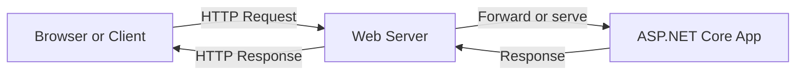
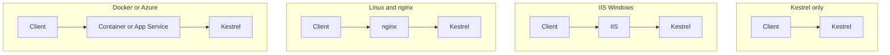
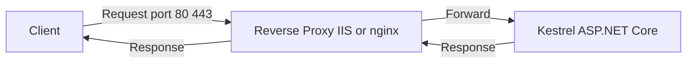
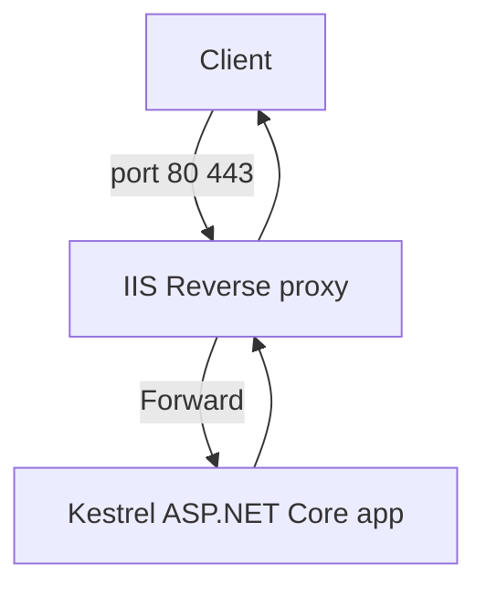
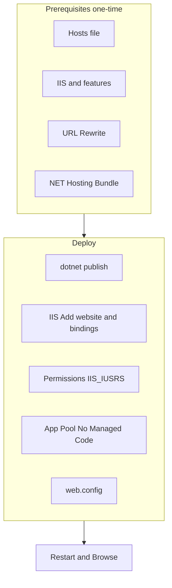
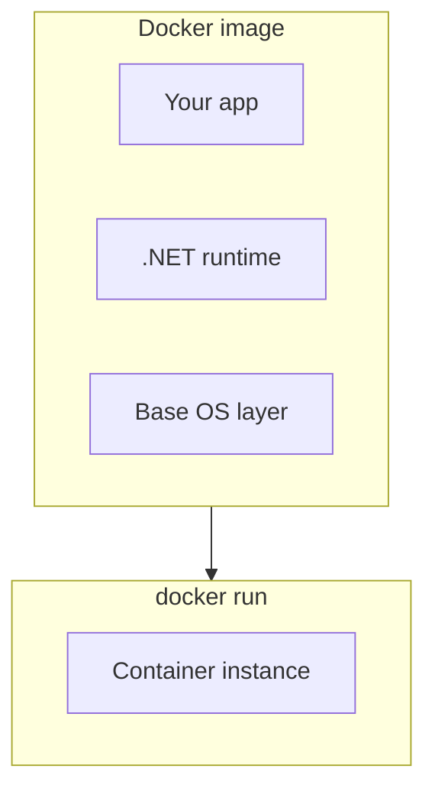

# ASP.NET Core — Hosting Guide

**Step-by-step reference** for hosting ASP.NET Core (MVC and API) applications: web server concepts, reverse proxy, IIS, Kestrel, Docker, and Azure App Service. Includes **Mermaid** diagrams and **numbered steps** where needed.

---

## Table of Contents

| Part | Topic |
|------|--------|
| 1 | [What is a Web Server? Why Use One for Hosting?](#1-what-is-a-web-server-why-use-one-for-hosting) |
| 2 | [ASP.NET Core Hosting Options (Brief)](#2-aspnet-core-hosting-options-brief) |
| 3 | [What is a Reverse Proxy? Why Use One?](#3-what-is-a-reverse-proxy-why-use-one) |
| 4 | [IIS Hosting — Overview, Pros/Cons, In-Process vs Out-of-Process](#4-iis-hosting--overview-proscons-in-process-vs-out-of-process) |
| 5 | [Step-by-Step: Create a New ASP.NET Core MVC App](#5-step-by-step-create-a-new-aspnet-core-mvc-app) |
| 6 | [Step-by-Step: Deploy to Local IIS](#6-step-by-step-deploy-to-local-iis) |
| 7 | [Step-by-Step: Hosting with Kestrel Only](#7-step-by-step-hosting-with-kestrel-only) |
| 8 | [What is Docker? Installing Docker Locally](#8-what-is-docker-installing-docker-locally) |
| 9 | [Step-by-Step: Hosting ASP.NET Core in Docker](#9-step-by-step-hosting-aspnet-core-in-docker) |
| 10 | [Step-by-Step: Hosting in Azure App Service](#10-step-by-step-hosting-in-azure-app-service) |
| — | [References](#references) |

---

## 1) What is a Web Server? Why Use One for Hosting?

### What is a web server?

A **web server** is software (and often the machine running it) that **listens for HTTP/HTTPS requests** and **responds** with content—static files, or dynamic content produced by an application. It handles:

- **Binding** to a port (e.g. 80, 443) and accepting connections  
- **Parsing** HTTP requests and routing them  
- **Serving** static files or **forwarding** requests to an application (e.g. ASP.NET Core)  
- **Sending** HTTP responses back to the client  



### Why use a web server for hosting?

| Reason | Explanation |
|--------|-------------|
| **Single entry point** | One place to listen on ports 80/443, handle many sites or apps (virtual hosts, bindings). |
| **Security** | Terminate SSL/TLS at the server, hide internal ports, apply security headers and rules. |
| **Performance & features** | Caching, compression, static files, URL rewriting, load balancing. |
| **Process management** | Restart apps on failure, manage worker processes, recycle app pools (IIS). |
| **Separation of concerns** | Web server handles “web” concerns; your app focuses on business logic. |

For **ASP.NET Core**, the app includes **Kestrel** (a built-in web server). In production you often put **IIS**, **nginx**, or another **reverse proxy** in front of Kestrel to get the benefits above.

---

## 2) ASP.NET Core Hosting Options (Brief)

ASP.NET Core can be hosted in several ways. The app always runs with **Kestrel** as the HTTP server; the difference is what (if anything) sits in front of it.



| Option | Description | Typical use |
|--------|-------------|-------------|
| **Kestrel only** | No reverse proxy. App listens directly on a port. | Development, internal tools, or when a reverse proxy is elsewhere (e.g. cloud load balancer). |
| **IIS** | IIS on Windows forwards requests to Kestrel (or hosts the app in-process). | Windows servers, existing IIS infrastructure. |
| **nginx / Apache** | Reverse proxy on Linux forwards to Kestrel. | Linux production servers. |
| **Docker** | App + runtime in a container; Kestrel inside the container. | Cross-platform, consistent environments, Kubernetes. |
| **Azure App Service** | Managed PaaS; runs your app (Kestrel) behind Azure’s front-end. | Quick production hosting, scaling, HTTPS. |

---

## 3) What is a Reverse Proxy? Why Use One?

### What is a reverse proxy?

A **reverse proxy** is a server that sits **in front of** your application. Clients send requests **to the proxy**; the proxy **forwards** them to your app (e.g. Kestrel) and returns the app’s response to the client. The client does not talk to your app directly.



### Why use a reverse proxy?

| Benefit | Explanation |
|---------|-------------|
| **SSL/TLS termination** | Proxy handles HTTPS; app can use HTTP on localhost (simpler certs and config). |
| **Single public endpoint** | One IP/port for many backend apps (different hostnames or paths). |
| **Security** | Hide internal ports and servers; add WAF, rate limiting, headers. |
| **Performance** | Caching, compression, static files at the proxy; app focuses on dynamic content. |
| **Load balancing** | Proxy can distribute requests across multiple app instances. |

With **IIS**, IIS is the reverse proxy and Kestrel is the backend. With **Linux**, nginx or Apache is the reverse proxy.

---

## 4) IIS Hosting — Overview, Pros/Cons, In-Process vs Out-of-Process

When you host ASP.NET Core on **IIS**, **Kestrel** is the HTTP engine that runs your app. **IIS** acts as the **reverse proxy**: it receives requests (e.g. on port 80/443) and forwards them to Kestrel (or, in in-process mode, runs the app inside the IIS worker process).



### Pros and cons of IIS hosting

| Pros | Cons |
|------|------|
| Fits existing **Windows** and **IIS** infrastructure. | **Windows-only** (IIS is not on Linux). |
| **SSL termination**, **URL rewriting**, **authentication** at IIS. | Requires **IIS setup** and often **admin rights**. |
| Familiar tooling (IIS Manager, app pools, bindings). | Extra configuration (app pool “No Managed Code”, web.config, Hosting Bundle). |
| Can run app **in-process** (inside w3wp) for fewer hops. | |

### In-Process vs Out-of-Process

| Mode | How it works |
|------|----------------------|
| **In-Process** | IIS loads the ASP.NET Core Module and runs your app **inside the IIS worker process** (w3wp.exe). No separate Kestrel process; lower overhead. |
| **Out-of-Process** | Your app runs as a **separate process** (e.g. `dotnet YourApp.dll`). IIS forwards requests to that process. Better isolation; slightly more overhead. |

In **web.config**, `hostingModel="inprocess"` or `hostingModel="outofprocess"` controls this. Default for ASP.NET Core is **inprocess** when hosted on IIS.

---

## 5) Step-by-Step: Create a New ASP.NET Core MVC App

Use these steps to create an MVC app that you will later deploy to IIS (or other targets).

**1. Open a terminal** in a folder where you want the project (e.g. `C:\Projects`).

**2. Create the project:**

```bash
dotnet new mvc -n RecipeApi -o RecipeApi
cd RecipeApi
```

- **-n** = project name  
- **-o** = output folder  

**3. (Optional) Add HTTPS redirect and ensure it runs:**

```bash
dotnet run
```

Open `https://localhost:5001` (or the URL shown). You should see the default MVC template.

**4. Publish for deployment:**

```bash
dotnet publish -c Release -o ./publish
```

The **publish** folder will contain the app DLLs and **web.config**. Use this folder path when configuring IIS (or for Docker/Azure).

**Note:** Replace any reference to “RecipeApi” in this guide with **your actual project name**. The main DLL name will be `RecipeApi.dll` (or your project name). Use that name in **web.config** in the next section.

---

## 6) Step-by-Step: Deploy to Local IIS

Follow these steps to host your ASP.NET Core app on **IIS** on your Windows machine, using a custom host name (e.g. `api.recipe.com`).



### 6.1 Prerequisites (one-time setup)

**Step 1 — Hosts file (custom host name)**

1. Open the hosts file as **Administrator**:  
   **Location:** `C:\Windows\System32\drivers\etc\hosts`  
   (Use Notepad “Run as administrator” or: `notepad C:\Windows\System32\drivers\etc\hosts`.)
2. Add a line so that `api.recipe.com` resolves to your machine:

   ```text
   127.0.0.1    api.recipe.com
   ```

3. Save the file. From a command prompt: `ping api.recipe.com` should reply from `127.0.0.1`.

**Step 2 — Enable IIS and required features**

1. Open **Turn Windows features on or off** (search in Start).
2. Enable **Internet Information Services**.
3. Under IIS, ensure these are selected:
   - **Application Development Features**
     - .NET Extensibility 3.5
     - .NET Extensibility 4.8
     - ASP.NET 3.5
     - ASP.NET 4.8
     - ISAPI Extensions
     - ISAPI Filters
     - WebSocket Protocol
4. Click OK and wait for installation. Reboot if prompted.

**Step 3 — Install URL Rewrite (optional but useful)**

- Download: [IIS URL Rewrite](https://www.iis.net/downloads/microsoft/url-rewrite)  
- Run the installer. This allows rewrite rules in web.config (e.g. HTTPS redirect, clean URLs).

**Step 4 — Install .NET (ASP.NET Core) Hosting Bundle**

- Your app needs the **.NET runtime** on the server. For ASP.NET Core, use the **.NET Hosting Bundle** (includes runtime + ASP.NET Core Module for IIS).  
- Download: [.NET Download](https://dotnet.microsoft.com/download) → choose **Hosting Bundle** for your .NET version (e.g. .NET 8).  
- Run the installer. Then **restart IIS** so it picks up the module:  
  - Open an **elevated** command prompt and run: `iisreset`

### 6.2 Publish the application

In your project folder:

```bash
dotnet publish -c Release -o ./publish
```

Remember the **full path** to the `publish` folder (e.g. `C:\Projects\RecipeApi\publish`). You will use it as the **physical path** in IIS.

### 6.3 Configure IIS — Add the website

**Step 1 — Add site**

1. Open **IIS Manager** (run `inetmgr` or search “IIS”).
2. In the left tree, expand the server node and click **Sites**.
3. **Right-click Sites** → **Add Website**.
4. Fill in:
   - **Site name:** `api.recipe.com` (or any name you prefer).
   - **Physical path:** Browse to your **publish** folder (e.g. `C:\Projects\RecipeApi\publish`).
   - **Binding:**
     - Type: **http**
     - IP address: **All Unassigned** (or leave unassigned).
     - Port: **80**
     - Host name: **api.recipe.com**
5. Click **OK**.

**Step 2 — Add HTTPS binding (optional)**

1. Right-click the site **api.recipe.com** → **Edit Bindings**.
2. **Add**:
   - Type: **https**
   - Port: **443**
   - Host name: **api.recipe.com**
   - SSL certificate: Select a certificate (e.g. default or one you imported). For local dev you may use a self-signed cert.
3. Click OK.

**Step 3 — Permissions on the publish folder**

1. In **File Explorer**, go to the **publish** folder.
2. **Right-click** the folder → **Properties** → **Security** tab → **Edit**.
3. **Add** → in “Enter the object names to select” type: **IIS_IUSRS**.
4. Click **Check Names** → **OK**.
5. Ensure **IIS_IUSRS** has at least **Read & execute** and **Read** (and **List folder contents** if needed).
6. Click **Apply** → **OK**.

**Step 4 — Application Pool**

1. In IIS Manager, click **Application Pools**.
2. Find the pool used by your site (same name as the site, e.g. `api.recipe.com`).
3. **Right-click** → **Advanced Settings**.
4. Set **.NET CLR Version** to **No Managed Code** (required for ASP.NET Core).
5. Click OK.

**Step 5 — web.config in the publish folder**

The **publish** output should already contain a **web.config**. If not, or if you need to fix it, ensure it looks like below. Replace **YourAppName** with your actual **output DLL name** (e.g. `RecipeApi` for `RecipeApi.dll`):

```xml
<?xml version="1.0" encoding="utf-8"?>
<configuration>
  <location path="." inheritInChildApplications="false">
    <system.webServer>
      <handlers>
        <add name="aspNetCore" path="*" verb="*" modules="AspNetCoreModuleV2" resourceType="Unspecified" />
      </handlers>
      <aspNetCore processPath="dotnet"
                  arguments=".\YourAppName.dll"
                  stdoutLogEnabled="false"
                  stdoutLogFile=".\logs\stdout"
                  hostingModel="inprocess" />
    </system.webServer>
  </location>
</configuration>
```

- **hostingModel="inprocess"** — app runs inside IIS worker process (recommended). Use **outofprocess** if you want a separate `dotnet` process.
- **arguments** — must point to your main app DLL (e.g. `.\RecipeApi.dll`).

**Step 6 — Restart and test**

1. In IIS Manager, right-click the site → **Manage Website** → **Restart** (or use **Restart** in the right panel).
2. **Browse** the site (e.g. `http://api.recipe.com` or `https://api.recipe.com`).

**If you see HTTP 403.14 (Forbidden):**

- Confirm **Application Pool** is **No Managed Code**.
- Confirm **.NET Hosting Bundle** is installed and **IIS was restarted** after installation.
- Confirm **web.config** has the correct DLL name and **AspNetCoreModuleV2**.
- Confirm **IIS_IUSRS** has read access to the publish folder and that the folder contains the published DLLs.

Once the module and app load correctly, you should see your MVC app (or API), not 403.14.

### 6.4 In-Process vs Out-of-Process (recap)

| web.config value | Behavior |
|------------------|----------|
| **hostingModel="inprocess"** | App runs inside the IIS worker process (w3wp.exe). Fewer hops; default. |
| **hostingModel="outofprocess"** | IIS starts a separate `dotnet YourApp.dll` process and forwards requests to it. |

Change only the `hostingModel` attribute in **web.config**; no need to change app pool to “Managed” for out-of-process—keep **No Managed Code**.

---

## 7) Step-by-Step: Hosting with Kestrel Only

Running **without** IIS or nginx means Kestrel is the only web server. Good for development or when a reverse proxy is elsewhere (e.g. cloud load balancer).

**1. Run from project folder:**

```bash
dotnet run
```

By default the app listens on URLs defined in **launchSettings.json** or **ASPNETCORE_URLS** (e.g. `http://localhost:5000`).

**2. Run published app with Kestrel:**

```bash
dotnet publish -c Release -o ./publish
cd publish
dotnet RecipeApi.dll
```

(Replace `RecipeApi.dll` with your app DLL.)

**3. Change URL/port:**

```bash
dotnet RecipeApi.dll --urls "http://0.0.0.0:5000"
```

Or set environment variable:

```text
set ASPNETCORE_URLS=http://0.0.0.0:5000
dotnet RecipeApi.dll
```

**4. Production note:** For production on a single server without a reverse proxy, consider limiting direct exposure (e.g. firewall) and optionally putting nginx or IIS in front for SSL and static files. In cloud (Azure, AWS), the platform often provides the “front” and forwards to Kestrel.

---

## 8) What is Docker? Installing Docker Locally

### What is Docker?

**Docker** is a platform for building, shipping, and running applications in **containers**. A **container** packages your app and its runtime/dependencies into an image; that image runs the same way on your machine, CI/CD, or production.



For ASP.NET Core, the image usually contains a Linux (or Windows) base, the .NET runtime, and your published app. **Kestrel** runs inside the container and listens on a port you expose.

### Installing Docker on your local machine

**Windows:**

1. Install **Docker Desktop for Windows**: [Docker Desktop](https://docs.docker.com/desktop/install/windows-install/).  
2. Enable **WSL 2** if prompted (recommended backend).  
3. Restart. Start **Docker Desktop** and ensure the whale icon shows “Docker is running”.  
4. In a terminal run: `docker --version` and `docker run hello-world` to verify.

**macOS:**

1. Install **Docker Desktop for Mac**: [Docker Desktop](https://docs.docker.com/desktop/install/mac-install/).  
2. Start Docker; run `docker --version` and `docker run hello-world`.

**Linux (e.g. Ubuntu):**

- Follow: [Docker Engine install](https://docs.docker.com/engine/install/).  
- Add your user to the `docker` group so you can run `docker` without sudo.

---

## 9) Step-by-Step: Hosting ASP.NET Core in Docker

**1. Create a Dockerfile** in your **project folder** (same folder as the .csproj file):

```dockerfile
FROM mcr.microsoft.com/dotnet/aspnet:8.0 AS base
WORKDIR /app
EXPOSE 8080
ENV ASPNETCORE_URLS=http://+:8080

FROM mcr.microsoft.com/dotnet/sdk:8.0 AS build
WORKDIR /src
COPY ["RecipeApi.csproj", "./"]
RUN dotnet restore "RecipeApi.csproj"
COPY . .
RUN dotnet build "RecipeApi.csproj" -c Release -o /app/build

FROM build AS publish
RUN dotnet publish "RecipeApi.csproj" -c Release -o /app/publish

FROM base AS final
WORKDIR /app
COPY --from=publish /app/publish .
ENTRYPOINT ["dotnet", "RecipeApi.dll"]
```

- Replace **RecipeApi** with your **project name** (both in file paths and in `ENTRYPOINT`). The DLL name must match your assembly name (usually the same as the project name).  
- **EXPOSE 8080** — container listens on 8080. **ENV ASPNETCORE_URLS** ensures Kestrel binds to that port inside the container.

**2. Build the image:**

From the **project folder** (where the Dockerfile and .csproj are):

```bash
docker build -t recipe-api .
```

**3. Run the container:**

```bash
docker run -p 5000:8080 --name recipe-api recipe-api
```

- **-p 5000:8080** — host port 5000 maps to container port 8080.  
- Open `http://localhost:5000`.

**4. Stop/remove:**

```bash
docker stop recipe-api
docker rm recipe-api
```

---

## 10) Step-by-Step: Hosting in Azure App Service

Azure App Service is a **managed** way to host web apps. Azure runs your published app (Kestrel) behind its own front-end (HTTPS, scaling, deployment slots).

### Option A — Deploy from Visual Studio

**1. Prerequisites**

- Visual Studio with **Azure development** workload.  
- Signed in to Azure (View → Cloud Explorer, or right-click project → Publish).

**2. Publish**

1. Right-click the **ASP.NET Core project** → **Publish**.  
2. Target: **Azure** → **Azure App Service (Windows)** or **Linux**.  
3. Sign in and select or create a **Subscription** and **Resource group**.  
4. **Create** or select an **App Service** (name will be used in the URL, e.g. `myrecipeapi.azurewebsites.net`).  
5. Click **Finish** → **Publish**. Visual Studio builds and deploys.

**3. After publish**

- Open the site URL (e.g. `https://myrecipeapi.azurewebsites.net`).  
- Configuration (connection strings, app settings) can be set in Azure Portal → App Service → Configuration.

### Option B — Deploy using dotnet and Azure CLI

**1. Install Azure CLI**

- Windows: [Install Azure CLI](https://learn.microsoft.com/en-us/cli/azure/install-azure-cli-windows) (MSI).  
- Or: `winget install Microsoft.AzureCLI`  
- Restart the terminal. Run: `az --version`.

**2. Sign in and set subscription**

```bash
az login
az account set --subscription "Your Subscription Name or ID"
```

**3. Create resource group and App Service plan**

```bash
az group create --name rg-recipe-api --location eastus
az appservice plan create --name plan-recipe-api --resource-group rg-recipe-api --sku B1 --is-linux
```

- **--is-linux** — use Linux plan (common for .NET Core). Omit for Windows.  
- **--sku B1** — basic tier; use F1 for free (with limits).

**4. Create the web app**

```bash
az webapp create --name myrecipeapi --resource-group rg-recipe-api --plan plan-recipe-api --runtime "DOTNETCORE:8.0"
```

- **--runtime** — use the runtime that matches your app (e.g. `DOTNETCORE:8.0`). For Linux, runtime is often specified as `DOTNET|8.0`. Check: `az webapp list-runtimes`.

**5. Publish and deploy**

From your **project folder**:

```bash
dotnet publish -c Release -o ./publish
```

Create a zip of the **publish** folder contents:

- **Windows (PowerShell):** `Compress-Archive -Path .\publish\* -DestinationPath deploy.zip`  
- **Linux/macOS:** `cd publish && zip -r ../deploy.zip . && cd ..`

Deploy the zip:

```bash
az webapp deployment source config-zip --resource-group rg-recipe-api --name myrecipeapi --src deploy.zip
```

**6. Open the app**

```bash
az webapp show --name myrecipeapi --resource-group rg-recipe-api --query defaultHostName -o tsv
```

Open `https://<defaultHostName>` in a browser.

**7. Optional — configure settings**

```bash
az webapp config appsettings set --resource-group rg-recipe-api --name myrecipeapi --settings ASPNETCORE_ENVIRONMENT=Production
```

---

## References

- [Host and deploy ASP.NET Core](https://learn.microsoft.com/en-us/aspnet/core/host-and-deploy/)
- [Host ASP.NET Core on Windows with IIS](https://learn.microsoft.com/en-us/aspnet/core/host-and-deploy/iis/)
- [ASP.NET Core Module](https://learn.microsoft.com/en-us/aspnet/core/host-and-deploy/aspnet-core-module)
- [Docker docs](https://docs.docker.com/)
- [Azure App Service](https://learn.microsoft.com/en-us/azure/app-service/)
