# ASP.NET Core — Network, HTTP & Web Fundamentals

**Professional reference** for building web applications with ASP.NET Core: why choose it, network programming basics, TCP vs HTTP, HTTP vs HTTPS (SSL/TLS), and HTTP in detail. Includes **Mermaid** diagrams for key concepts.

---

## Table of Contents

| Section | Topic |
|--------|--------|
| 1 | [Why ASP.NET Core?](#1-why-aspnet-core) |
| 2 | [Network Programming & Network Protocols](#2-network-programming--network-protocols) · [What is a Port?](#what-is-a-port) |
| 3 | [TCP vs HTTP in Detail & Why HTTP for the Web](#3-tcp-vs-http-in-detail--why-http-for-the-web) |
| 3b | [.NET TCP Server and TCP Client](#3b-net-tcp-server-and-tcp-client) |
| 4 | [HTTP vs HTTPS](#4-http-vs-https) · [SSL/TLS Handshake](#ssl-tls-handshake) · [Encryption](#asymmetric-vs-symmetric-encryption) |
| 5 | [HTTP in Detail](#5-http-in-detail) · [Methods](#http-methods) · [Important Concepts](#important-http-concepts) |
| 6 | [What is ASP.NET Core?](#6-what-is-aspnet-core) · [Application Structure](#basic-structure-of-an-aspnet-core-application) · [Program.cs](#programcs) · [WebApplication Builder](#webapplication-builder-in-detail) |
| 7 | [Launch Settings, IIS Express, HTTP vs HTTPS vs WSL](#7-launch-settings-iis-express-http-vs-https-vs-wsl) |
| 8 | [Deployment — Production Options](#8-deployment--production-options) · [In-Process vs Out-of-Process](#in-process-vs-out-of-process) |
| 9 | [Reading Configuration](#9-reading-configuration) |
| 10 | [ASP.NET MVC Core & MVC Architecture](#10-aspnet-mvc-core--mvc-architecture) · [Visual flow of MVC](#visual-flow-of-mvc-architecture) |
| 11 | [MVC vs MVVM](#11-mvc-vs-mvvm) |
| 12 | [MVVM in Angular with Example](#12-mvvm-in-angular-with-example) |
| — | [References](#references) |

---

## 1) Why ASP.NET Core?

**ASP.NET Core** is a cross-platform, high-performance, open-source framework for building modern web applications and APIs. It is a redesign of ASP.NET that runs on **.NET Core** (and now unified **.NET**), not the Windows-only .NET Framework.

### Key reasons to choose ASP.NET Core

| Reason | Description |
|--------|-------------|
| **Cross-platform** | Runs on Windows, Linux, and macOS. Deploy to any cloud or on-premises server. |
| **High performance** | One of the fastest web frameworks in benchmarks (TechEmpower). Built for low latency and high throughput. |
| **Unified stack** | Same framework for web apps, APIs, microservices, Blazor, gRPC, SignalR. |
| **Open source** | Hosted on GitHub; transparent development, community contributions, and long-term support. |
| **Dependency injection** | First-class DI built in; testable, maintainable architecture. |
| **Configuration & logging** | Flexible configuration (JSON, environment variables, Azure Key Vault) and structured logging. |
| **Middleware pipeline** | Request/response pipeline with custom middleware for auth, routing, CORS, etc. |
| **Modern C# & .NET** | Async/await, minimal APIs, source generators, nullable reference types. |
| **Cloud & containers** | Designed for Docker, Kubernetes, and cloud-native patterns. |

### When to use ASP.NET Core

- **Web APIs** (REST, JSON) for mobile apps, SPAs, or other services  
- **Web applications** (MVC, Razor Pages, Blazor)  
- **Microservices** and backend-for-frontend (BFF)  
- **Real-time** apps (SignalR)  
- **gRPC** for high-performance RPC  
- **Hosted services** and background jobs  

---

## 2) Network Programming & Network Protocols

### What is network programming?

**Network programming** is writing software that communicates over a network: sending and receiving data between machines (e.g., client–server, peer-to-peer). It involves:

- **Sockets**: Low-level endpoints for sending/receiving data (TCP or UDP).  
- **Protocols**: Agreed rules for format, order, and meaning of messages.  
- **Addresses and ports**: Identifying *which* machine and *which* application (e.g., IP + port).

In .NET, network programming typically uses types from `System.Net` and `System.Net.Sockets` (e.g., `TcpClient`, `TcpListener`, `Socket`).

### What is a port?

A **port** is a 16-bit number (0–65535) that, together with an **IP address**, identifies a specific **endpoint** on a machine. The IP address identifies *which* computer; the port identifies *which* application or service on that computer.

- **One IP** can host many services: e.g., `192.168.1.10:80` (web), `192.168.1.10:443` (HTTPS), `192.168.1.10:5432` (PostgreSQL). Each port corresponds to a listening process.
- **Well-known ports** (0–1023) are reserved for standard services: 80 (HTTP), 443 (HTTPS), 22 (SSH), 25 (SMTP). Your app typically uses **ephemeral** or **registered** ports (1024–65535) unless it *is* that service.
- When a **client** connects, it uses its own **source port** (often chosen by the OS) and the server’s **destination port** (e.g., 443). The pair (client IP:port, server IP:port) uniquely identifies the connection.

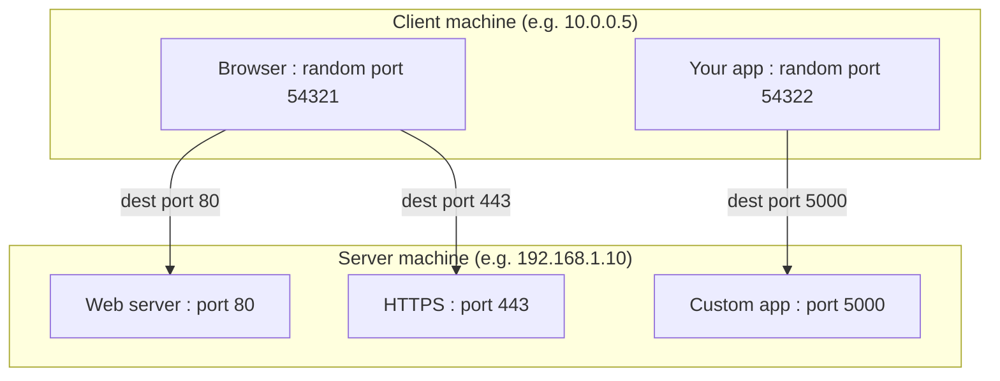

**Summary:** Port = “which program on this machine.” IP + port = **socket address** = one endpoint for a connection.

### What are network protocols?

A **network protocol** is a set of rules that define how data is formatted, transmitted, and interpreted across a network. Protocols exist at different layers of the **OSI model** (or TCP/IP stack):

| Layer (simplified) | Examples | Role |
|--------------------|----------|------|
| **Application** | HTTP, HTTPS, FTP, SMTP, DNS | What the application “says” (requests, responses, commands). |
| **Transport** | TCP, UDP | End-to-end delivery, reliability (TCP) or speed (UDP). |
| **Network** | IP (IPv4, IPv6) | Addressing and routing packets. |
| **Link / Physical** | Ethernet, Wi-Fi | Frames and physical transmission. |

- **TCP** and **UDP** are **transport** protocols: they move bytes between two endpoints.  
- **HTTP** is an **application** protocol: it defines *messages* (method, URL, headers, body) on top of a transport (usually TCP).

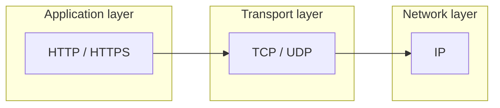

Understanding both **TCP** (reliable transport) and **HTTP** (web application protocol) is essential for web development with ASP.NET Core.

---

## 3) TCP vs HTTP in Detail & Why HTTP for the Web?

### TCP (Transmission Control Protocol) — Transport layer

**TCP** is a **connection-oriented**, **reliable** transport protocol. It does *not* define the meaning of the data—only that a stream of bytes is delivered in order and without loss.

| Aspect | TCP |
|--------|-----|
| **Layer** | Transport (Layer 4) |
| **Role** | Reliable byte stream between two endpoints (IP + port). |
| **Connection** | Connection-oriented: handshake (SYN, SYN-ACK, ACK), then data, then tear-down. |
| **Reliability** | Acknowledgments, retransmissions, checksums. Guarantees order and delivery. |
| **Data semantics** | None. Raw bytes; application must define meaning. |
| **Addressing** | IP address + port (e.g., `192.168.1.1:443`). |

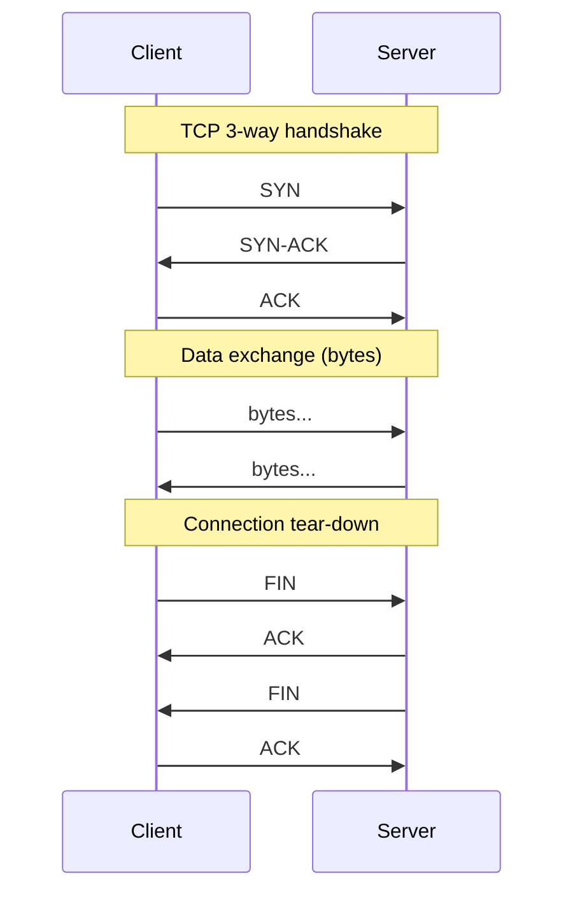

### HTTP (Hypertext Transfer Protocol) — Application layer

**HTTP** is an **application-layer** protocol. It defines **messages**: request (method, URI, headers, body) and response (status, headers, body). It usually runs **on top of TCP** (e.g., port 80 for HTTP, 443 for HTTPS).

| Aspect | HTTP |
|--------|------|
| **Layer** | Application (Layer 7) |
| **Role** | Structured request/response protocol for resources (documents, APIs, etc.). |
| **Connection** | Uses TCP (or TLS over TCP for HTTPS). HTTP/1.1 can reuse connection (keep-alive). |
| **Data semantics** | Rich: method (GET, POST, etc.), URL, headers (Content-Type, Authorization), status codes, body. |
| **Addressing** | URL: scheme, host, port, path, query (e.g., `https://api.example.com/v1/users?page=1`). |

So: **TCP** = “reliable pipe for bytes.” **HTTP** = “rules for what those bytes mean as web requests and responses.”

### Why HTTP for the web, not raw TCP?

| Reason | Explanation |
|--------|-------------|
| **Standard semantics** | Browsers, proxies, CDNs, and servers all understand methods, URLs, headers, and status codes. No need to invent a custom protocol. |
| **Interoperability** | Any client (browser, mobile app, curl, Postman) can talk to any HTTP server. Ecosystem (caching, auth, CORS) is built around HTTP. |
| **Abstraction** | Developers work with “GET /users” and “200 OK,” not with raw byte streams and custom framing. |
| **Infrastructure** | Load balancers, WAFs, API gateways, and CDNs are built for HTTP. |
| **Tooling** | Logging, monitoring, debugging (e.g., browser DevTools, Fiddler) assume HTTP. |

**When raw TCP (or UDP) is used instead of HTTP:**

- Custom protocols (e.g., game servers, IoT binary protocols).  
- Maximum performance and minimal overhead (e.g., high-frequency trading).  
- Real-time binary streams where HTTP’s request/response model is a poor fit (though WebSockets or HTTP/2 streams can still use HTTP semantics).

**Summary:** For the web and most APIs, **HTTP (over TCP, often with TLS)** is the right choice because it provides a universal, toolable, and infrastructure-friendly application protocol. ASP.NET Core is built around HTTP (and HTTPS).

---

## 3b) .NET TCP Server and TCP Client

A minimal example shows how **TCP** delivers a raw byte stream: the application defines the meaning of the bytes (here, simple text lines). In .NET you use `TcpListener` (server) and `TcpClient` (client) from `System.Net.Sockets`.

### Architecture (high level)

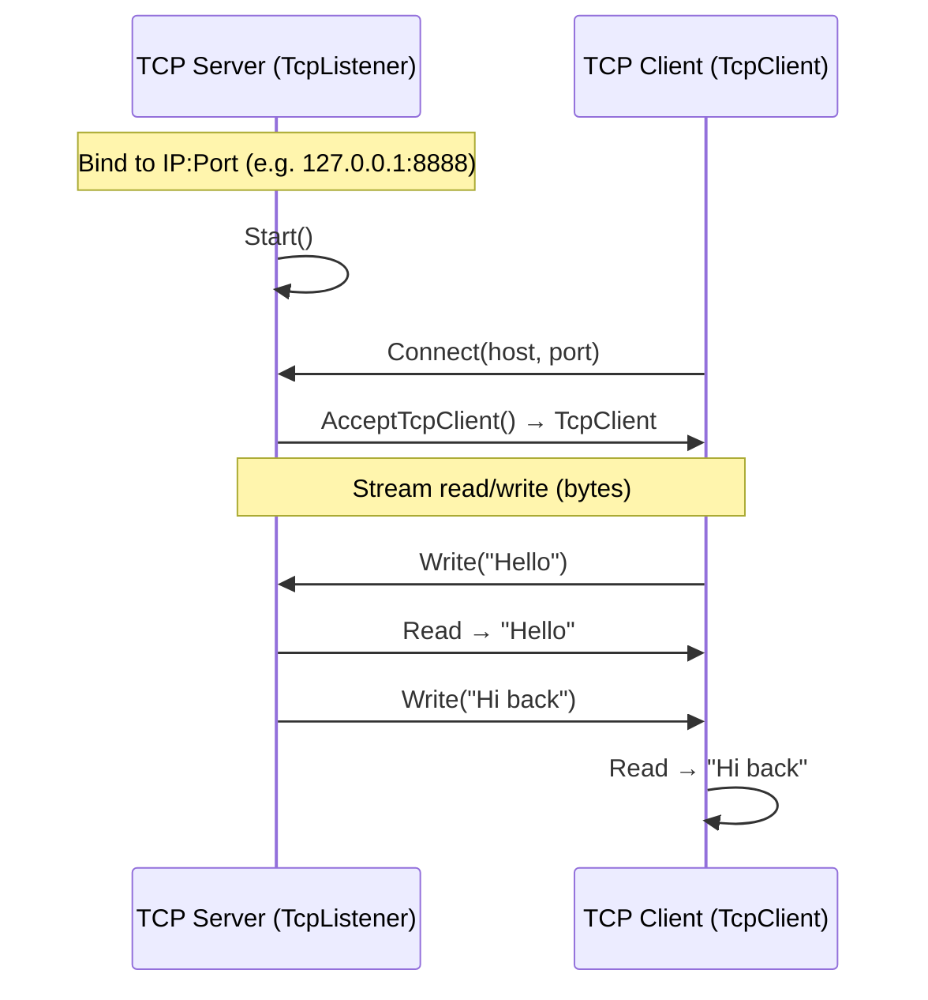

### Simple TCP server (console)

The server listens on a port, accepts a client, then reads and writes on the client’s stream. This example echoes one line and sends a reply.

```csharp
using System.Net;
using System.Net.Sockets;
using System.Text;

var listener = new TcpListener(IPAddress.Loopback, 8888);
listener.Start();
Console.WriteLine("Server listening on 127.0.0.1:8888");

while (true)
{
    using var client = await listener.AcceptTcpClientAsync();
    using var stream = client.GetStream();

    var buffer = new byte[1024];
    int received = await stream.ReadAsync(buffer, 0, buffer.Length);
    string message = Encoding.UTF8.GetString(buffer, 0, received);
    Console.WriteLine($"Received: {message}");

    string reply = "Hi back from server";
    await stream.WriteAsync(Encoding.UTF8.GetBytes(reply));
}
```

### Simple TCP client (console)

The client connects to the same IP and port, writes a string, then reads the reply.

```csharp
using System.Net.Sockets;
using System.Text;

using var client = new TcpClient();
await client.ConnectAsync("127.0.0.1", 8888);
using var stream = client.GetStream();

string message = "Hello";
await stream.WriteAsync(Encoding.UTF8.GetBytes(message));

var buffer = new byte[1024];
int received = await stream.ReadAsync(buffer, 0, buffer.Length);
string reply = Encoding.UTF8.GetString(buffer, 0, received);
Console.WriteLine($"Reply: {reply}");
```

**Explanation:**

| Component | Role |
|-----------|------|
| **TcpListener** | Binds to an IP and port, accepts incoming TCP connections. |
| **TcpClient** | Connects to a server; provides a `NetworkStream` for read/write. |
| **NetworkStream** | Read/Write (async) raw bytes. No HTTP—you decide framing (e.g., newline or length-prefix). |

Run the server first, then the client. You should see the client print the server’s reply. This is **transport-only** (TCP); for the web you’d use HTTP on top (e.g., ASP.NET Core with Kestrel).

---

## 4) HTTP vs HTTPS

### HTTP vs HTTPS at a glance

| Aspect | HTTP | HTTPS |
|--------|------|--------|
| **Port** | 80 | 443 |
| **Data** | Plain text (readable by anyone on the path) | Encrypted (confidentiality, integrity) |
| **Identity** | No built-in server identity | Server (and optionally client) identity via certificates |
| **Protocol** | HTTP over TCP | HTTP over **TLS** (or SSL) over TCP |

**HTTPS** = HTTP + **TLS/SSL**: the same HTTP semantics (methods, headers, bodies), but the payload is encrypted and the server (and optionally the client) is authenticated using **X.509 certificates**.

### SSL/TLS handshake

Before any HTTP data is sent over HTTPS, the client and server perform a **TLS handshake** to:

1. Agree on the TLS version and cipher suite.  
2. Authenticate the server (and optionally the client) using certificates.  
3. Exchange keys and establish a **symmetric** session key for encrypting application data.

**Visual representation — TLS 1.2/1.3 handshake (simplified):**

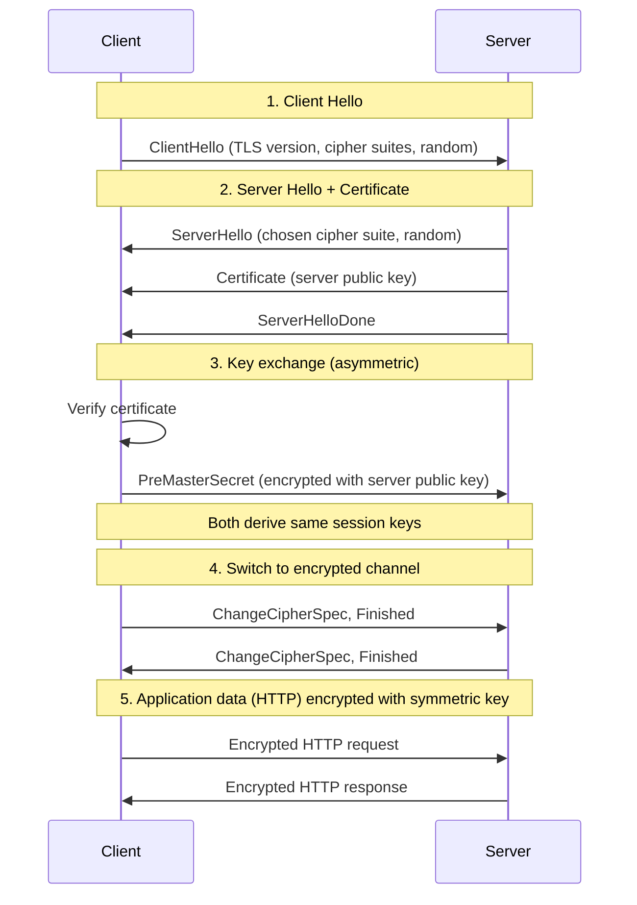

**Steps in plain terms:**

1. **Client Hello**: Client sends supported TLS versions and cipher suites + random value.  
2. **Server Hello + Certificate**: Server picks a cipher suite, sends its **certificate** (contains **public key**) and a random value.  
3. **Key exchange**: Client verifies the certificate (chain, expiry, hostname). Client generates **PreMasterSecret**, encrypts it with the **server’s public key**, and sends it. Only the server (with private key) can decrypt it. Both sides derive the same **symmetric session keys** from the PreMasterSecret and randoms.  
4. **ChangeCipherSpec / Finished**: Both sides switch to the new keys and send an encrypted “Finished” message to confirm.  
5. **Application data**: All subsequent HTTP traffic is encrypted with the **symmetric** session key.

So: **asymmetric** encryption (public/private key) is used only for **authenticating the server** and **securely exchanging** the **symmetric** key; the actual HTTP data is encrypted with **symmetric** encryption for performance.

### Asymmetric vs Symmetric Encryption

| Aspect | Asymmetric (Public-key) | Symmetric |
|--------|-------------------------|-----------|
| **Keys** | Two keys: public (share) + private (keep secret) | One shared secret key (same for encrypt & decrypt) |
| **Usage in TLS** | Encrypt PreMasterSecret; sign certificates | Encrypt/decrypt all application data (HTTP) after handshake |
| **Speed** | Slower (large numbers, exponentiation) | Fast (block/stream ciphers) |
| **Typical key size** | 2048–4096 bits (RSA), 256 bits (ECDH) | 128–256 bits (AES) |

**Why both?**

- **Asymmetric**: Safe key exchange over an insecure channel (no prior shared secret) and authentication (certificate binding public key to identity).  
- **Symmetric**: Efficient bulk encryption of the actual HTTP traffic.

### Supported algorithms (commonly used with TLS)

**Asymmetric (key exchange / signature):**

| Algorithm | Use | Notes |
|-----------|-----|--------|
| **RSA** | Key exchange (encrypt PreMasterSecret), certificate signatures | 2048+ bits; TLS 1.3 uses it mainly for signatures. |
| **ECDHE** (Elliptic Curve Diffie–Hellman Ephemeral) | Key agreement | Forward secrecy; preferred in TLS 1.3. |
| **DHE** (Diffie–Hellman Ephemeral) | Key agreement | Forward secrecy; heavier than ECDHE. |

**Symmetric (bulk encryption):**

| Algorithm | Type | Notes |
|-----------|------|--------|
| **AES-GCM** | Block (AEAD) | Preferred in TLS 1.3; authenticated encryption. |
| **AES-CCM** | Block (AEAD) | Alternative AEAD. |
| **ChaCha20-Poly1305** | Stream (AEAD) | Good for devices without AES hardware. |

**Hashing / integrity:**

- **SHA-256**, **SHA-384** (e.g., in certificate signatures and PRFs).

In **ASP.NET Core**, HTTPS is enabled via Kestrel or a reverse proxy (IIS, nginx). You configure certificates and optionally TLS options (protocol versions, cipher suites) in `Program.cs` or configuration.

---

## 5) HTTP in Detail

HTTP is a **request–response**, **stateless** protocol. The client sends a **request** (method, URI, headers, optional body); the server returns a **response** (status, headers, optional body).

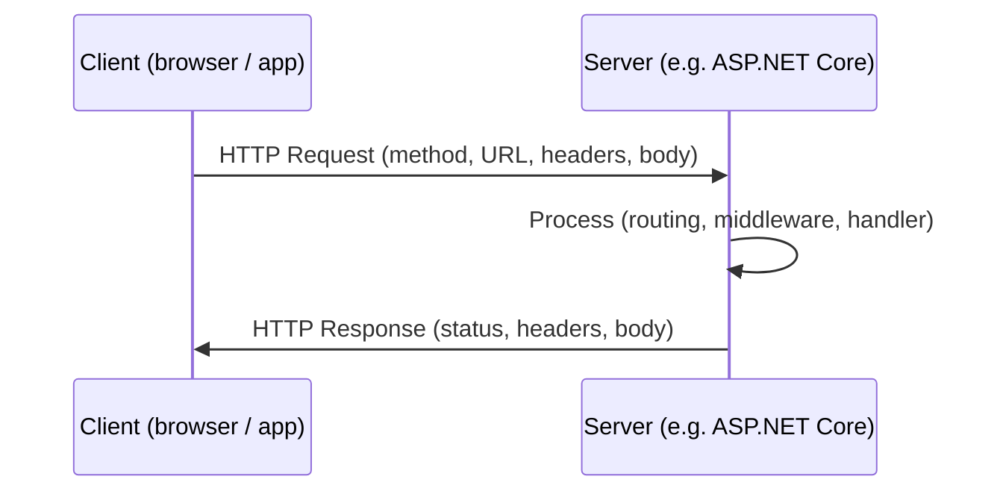

### HTTP message structure (simplified)

**Request:**

```http
GET /api/users?id=1 HTTP/1.1
Host: api.example.com
Accept: application/json
Authorization: Bearer <token>
```

**Response:**

```http
HTTP/1.1 200 OK
Content-Type: application/json
Content-Length: 42

{"id":1,"name":"Alice"}
```

- **Request line**: method, path (and query), HTTP version.  
- **Headers**: key-value metadata (Host, Accept, Content-Type, etc.).  
- **Body**: optional (common with POST, PUT, PATCH).

### HTTP methods

| Method | Semantics | Idempotent? | Body typical? | Use in REST/APIs |
|--------|-----------|-------------|----------------|-------------------|
| **GET** | Retrieve a resource | Yes | No | Read; cacheable. |
| **POST** | Submit data / create resource | No | Yes | Create; form submit; RPC-like. |
| **PUT** | Replace resource at URI | Yes | Yes | Full update or create at URI. |
| **PATCH** | Partial update | No* | Yes | Partial update. |
| **DELETE** | Remove resource | Yes | Optional | Delete. |
| **HEAD** | Like GET but no body | Yes | No | Metadata only (e.g., check existence/size). |
| **OPTIONS** | Supported methods / CORS | Yes | No | Preflight, discovery. |
| **TRACE** | Echo request (debug) | Yes | No | Rare. |
| **CONNECT** | Tunnel (e.g., HTTPS proxy) | — | — | Proxies. |

*PATCH idempotency depends on the patch format.

In **ASP.NET Core** (Minimal APIs or MVC), you map these to actions with `MapGet`, `MapPost`, `[HttpGet]`, `[HttpPost]`, etc.

### Important HTTP concepts

| Concept | Description |
|--------|-------------|
| **Statelessness** | Each request is independent; server does not retain client state between requests. Session state is stored server-side (or in tokens/cookies) and identified by the client. |
| **Resources and URIs** | Resources are identified by URIs. Same URI with same method should be stable (e.g., GET is cacheable). |
| **Headers** | **Request**: `Host`, `Accept`, `Content-Type`, `Authorization`, `Cookie`, `If-None-Match`. **Response**: `Content-Type`, `Content-Length`, `Cache-Control`, `Set-Cookie`, `Location`. |
| **Status codes** | **2xx** success (200 OK, 201 Created, 204 No Content). **3xx** redirect (301, 302, 304 Not Modified). **4xx** client error (400 Bad Request, 401 Unauthorized, 403 Forbidden, 404 Not Found). **5xx** server error (500 Internal Server Error, 503 Service Unavailable). |
| **Content negotiation** | Client sends `Accept` (e.g., `application/json`); server responds with `Content-Type` and appropriate body. ASP.NET Core supports this via formatters. |
| **Caching** | `Cache-Control`, `ETag`, `If-None-Match`, `Last-Modified`, `If-Modified-Since` for conditional requests and caching. |
| **Connection management** | HTTP/1.1 **keep-alive** reuses a single TCP connection for multiple requests. HTTP/2 multiplexes many streams over one connection. |
| **Cookies** | `Set-Cookie` (response) and `Cookie` (request) for session or preference state. |
| **CORS** | Cross-Origin Resource Sharing: `Origin`, `Access-Control-Allow-Origin`, etc. Configured in ASP.NET Core with `UseCors()`. |

Understanding these concepts helps you design and debug APIs and web apps in ASP.NET Core correctly.

---

## 6) What is ASP.NET Core?

**ASP.NET Core** is the cross-platform, open-source web framework built on **.NET** (formerly .NET Core). It is not the same as **ASP.NET** on the .NET Framework: it runs on Windows, Linux, and macOS and is optimized for performance, containers, and cloud.

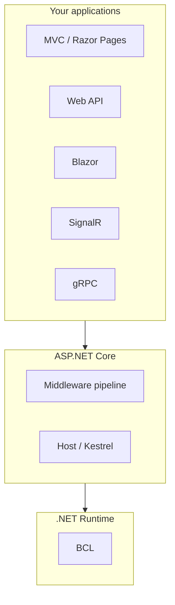

| Aspect | Description |
|--------|-------------|
| **Framework** | Libraries and patterns for web: routing, model binding, filters, dependency injection, configuration, logging. |
| **Host** | Runs the app and listens for HTTP (Kestrel). Can sit behind IIS, nginx, or another reverse proxy. |
| **Request pipeline** | Incoming HTTP request passes through middleware (auth, CORS, routing, etc.) and is handled by your endpoints or controllers. |

**Request pipeline (middleware order):**

```mermaid
flowchart LR
    Req[Request] --> Exception[Exception handling]
    Exception --> HSTS[HSTS / HTTPS]
    HSTS --> Static[Static files]
    Static --> Routing[Routing]
    Routing --> Auth[Authentication]
    Auth --> CORS[CORS]
    CORS --> Endpoint[Endpoint (controller / minimal API)]
    Endpoint --> Resp[Response]
```

---

## Basic structure of an ASP.NET Core application

A typical project has a small set of files and folders. The exact layout depends on the template (Empty, API, MVC, Blazor).

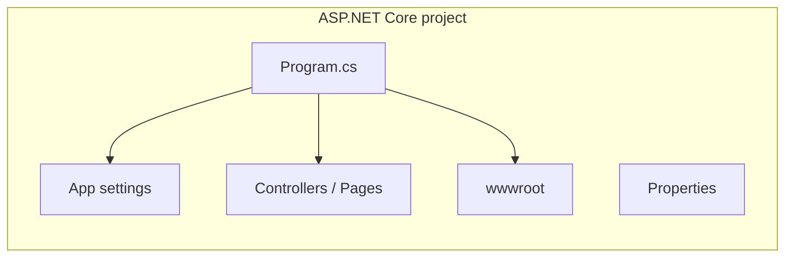

| Item | Purpose |
|------|---------|
| **Program.cs** | Entry point: builds the host, configures services and middleware, runs the app. |
| **appsettings.json** | Default configuration (can be overridden by environment and secrets). |
| **appsettings.Development.json** | Development-only settings (e.g., detailed errors). |
| **Controllers/** or **Pages/** | MVC controllers or Razor Pages (if using that template). |
| **wwwroot** | Static files (CSS, JS, images) served as-is. |
| **Properties/launchSettings.json** | How to run and which URLs/ports to use when pressing F5 (see [Launch settings](#7-launch-settings-iis-express-http-vs-https-vs-wsl)). |

**Example folder structure (simplified):**

```text
MyWebApp/
├── Program.cs
├── appsettings.json
├── appsettings.Development.json
├── Controllers/
├── Models/
├── Views/           (if MVC)
├── Pages/            (if Razor Pages)
├── wwwroot/
└── Properties/
    └── launchSettings.json
```

---

## Program.cs

**Program.cs** is the entry point of an ASP.NET Core app. It creates the **host**, configures **services** (DI) and the **request pipeline** (middleware), then runs the app.

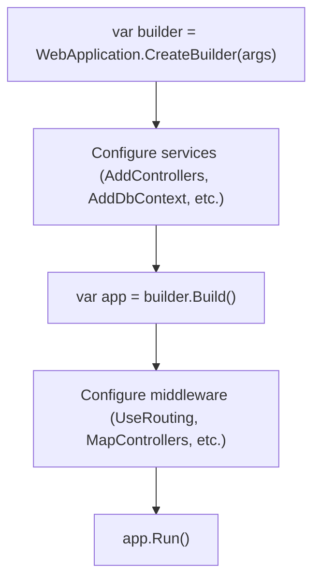

**Minimal example:**

```csharp
var builder = WebApplication.CreateBuilder(args);

// Add services to the container
builder.Services.AddControllers();

var app = builder.Build();

// Configure the HTTP request pipeline
app.UseRouting();
app.MapControllers();

app.Run();
```

| Step | Meaning |
|------|--------|
| **CreateBuilder(args)** | Creates a `WebApplicationBuilder` that loads configuration and sets up the host (including Kestrel). |
| **Add*** | Register services in DI (e.g., `AddControllers`, `AddDbContext`). |
| **Build()** | Builds the `WebApplication` (host + configured services). |
| **Use*** / **Map*** | Defines middleware order and endpoint mapping. |
| **Run()** | Starts listening for HTTP and never returns until shutdown. |

---

## WebApplication builder in detail

`WebApplication.CreateBuilder(args)` returns a **WebApplicationBuilder** that configures the host, configuration, logging, and DI before you call `Build()`.

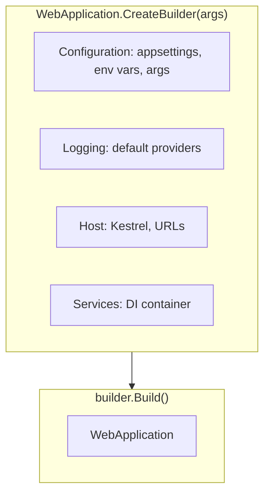

| Builder area | What it does |
|--------------|--------------|
| **Configuration** | `builder.Configuration`: merged from `appsettings.json`, `appsettings.{Environment}.json`, environment variables, command-line args, user secrets (in Development). |
| **Logging** | `builder.Logging`: add providers (Console, Debug, etc.); log levels from config. |
| **Services** | `builder.Services`: register all app services (controllers, DbContext, custom services) for dependency injection. |
| **Host / Kestrel** | `builder.WebHost` (or `builder.Host`): URLs to listen on, timeouts, limits. Can be overridden by `ASPNETCORE_URLS` or launch settings. |

**Common configuration in Program.cs:**

```csharp
var builder = WebApplication.CreateBuilder(args);

builder.Services.AddControllers();
builder.Services.AddEndpointsApiExplorer();
builder.Services.AddSwaggerGen();

// Custom config from appsettings
var connectionString = builder.Configuration.GetConnectionString("DefaultConnection");

var app = builder.Build();
// ...
```

---

## 7) Launch settings, IIS Express, HTTP vs HTTPS vs WSL

### Launch settings

**Properties/launchSettings.json** defines how the app is started when you run or debug from the IDE (e.g., F5). It does **not** affect production; it only sets environment name, URLs, and the profile (e.g., IIS Express vs Kestrel).

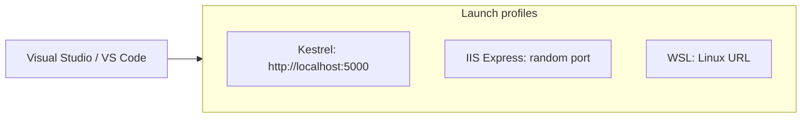

**Typical contents:**

| Property | Meaning |
|----------|--------|
| **applicationUrl** | URLs Kestrel will listen on (e.g., `http://localhost:5000;https://localhost:5001`). |
| **environmentVariables** | e.g. `ASPNETCORE_ENVIRONMENT=Development`. |
| **launchBrowser** | Whether to open a browser on start. |
| **hotReload** | Enable hot reload (when supported). |

**Example (Kestrel profile):**

```json
{
  "profiles": {
    "MyWebApp": {
      "commandName": "Project",
      "applicationUrl": "http://localhost:5000;https://localhost:5001",
      "environmentVariables": {
        "ASPNETCORE_ENVIRONMENT": "Development"
      }
    }
  }
}
```

### IIS Express vs Kestrel vs WSL

| Mode | Description |
|------|-------------|
| **Kestrel (Project)** | `commandName: "Project"`. The app runs with its own **Kestrel** server. Direct HTTP/HTTPS to the URLs in `applicationUrl`. No IIS. |
| **IIS Express** | `commandName: "IISExpress"`. IIS Express acts as a **reverse proxy** in front of your app (out-of-process by default). Good for testing IIS-specific behavior on Windows. |
| **WSL** | Run the app inside **Windows Subsystem for Linux** (e.g., from VS Code with WSL extension). Same ASP.NET Core app; URLs are Linux (e.g., `http://localhost:5000` from Windows browser). |

**HTTP vs HTTPS in launch settings:**

- **HTTP**: `http://localhost:5000` — no certificate; fine for local dev.  
- **HTTPS**: `https://localhost:5001` — uses the dev certificate (e.g., `dotnet dev-certs https --trust`).  
- You can have both in `applicationUrl` so that some tabs use HTTP and some HTTPS during development.

---

## 8) Deployment — Production options

ASP.NET Core apps are typically published as **self-contained** or **framework-dependent** executables or DLLs and run behind a web server or in a container.

```mermaid
flowchart TB
    subgraph Options["Deployment options"]
        IIS[IIS (Windows)]
        Linux[Linux + Kestrel / nginx]
        Docker[Docker container]
        Azure[Azure App Service / AKS]
        K8s[Kubernetes]
    end

    Code[Your ASP.NET Core app] --> Publish[dotnet publish]
    Publish --> Options
```

| Option | Description |
|--------|-------------|
| **IIS (Windows)** | Publish to a folder; IIS acts as reverse proxy (out-of-process) or in-process host. App runs in an app pool. |
| **Linux + Kestrel** | Run Kestrel directly (`dotnet MyApp.dll`) or behind **nginx**/Apache as reverse proxy (recommended for HTTPS and static files). |
| **Docker** | Build an image (often Linux + runtime + published app). Run the container; Kestrel listens inside. |
| **Azure App Service** | Deploy via Git, ZIP, or CI/CD. Runs on Windows or Linux; runtime is provided. |
| **Kubernetes (AKS, etc.)** | Run containers; use Ingress for HTTP/HTTPS and load balancing. |

**Publish commands (examples):**

```bash
# Framework-dependent (requires .NET runtime on server)
dotnet publish -c Release -o ./publish

# Self-contained (includes runtime)
dotnet publish -c Release -r linux-x64 --self-contained -o ./publish
```

---

## In-Process vs Out-of-Process

When hosting behind **IIS**, the ASP.NET Core app can run **in-process** (inside the IIS worker process) or **out-of-process** (separate process, IIS forwards requests).

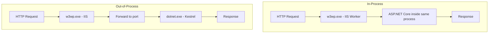

| Mode | How it works | Pros / cons |
|------|----------------|-------------|
| **In-Process** | IIS loads the ASP.NET Core module and runs the app inside the same **w3wp.exe** process. No separate Kestrel process. | Better performance (no proxy hop), simpler. IIS manages process lifecycle. |
| **Out-of-Process** | IIS acts as reverse proxy. Your app runs as a separate process (e.g., `dotnet MyApp.dll`) and listens on a port; IIS forwards to it. | Isolation from IIS; can debug/restart app independently. Slight overhead. |

**Configuration (IIS):** In the project file, `<AspNetCoreHostingModel>InProcess</AspNetCoreHostingModel>` (default) or `OutOfProcess`. For **Linux** or **Docker**, there is no IIS—Kestrel runs directly or behind nginx; the “in/out of process” concept applies to the IIS hosting model only.

---

## 9) Reading Configuration

ASP.NET Core uses a **configuration** system that merges values from multiple sources (JSON files, environment variables, command-line args, user secrets, etc.) into a single key-value tree. You **read** configuration via `IConfiguration` (injected or from the builder).

### Configuration sources (order matters)

Configuration is built in a defined order; later sources override earlier ones for the same key.

```mermaid
flowchart LR
    subgraph Sources["Configuration sources (first → last)"]
        A[appsettings.json]
        B[appsettings.{Environment}.json]
        C[User Secrets - Dev]
        D[Environment variables]
        E[Command-line args]
    end
    A --> B --> C --> D --> E
    E --> Merged[IConfiguration]
```

| Source | When loaded | Typical use |
|--------|-------------|-------------|
| **appsettings.json** | Always | Defaults (connection strings, logging, custom keys). |
| **appsettings.{Environment}.json** | When `ASPNETCORE_ENVIRONMENT` matches | Environment-specific overrides (e.g., Development). |
| **User Secrets** | Development only (when configured) | Secrets on dev machine (no commit). |
| **Environment variables** | Always | Overrides in production; Docker/Kubernetes. |
| **Command-line arguments** | Always | Overrides when launching the app. |

### Reading configuration in code

**1. In Program.cs (from builder):**

```csharp
var builder = WebApplication.CreateBuilder(args);

// Read a single value (string)
string? env = builder.Configuration["ASPNETCORE_ENVIRONMENT"];

// Read a section (e.g. connection string)
string? connStr = builder.Configuration.GetConnectionString("DefaultConnection");

// Read nested key (colon in JSON key becomes __ in env vars)
string? logLevel = builder.Configuration["Logging:LogLevel:Default"];
```

**2. Inject IConfiguration in a service or controller:**

```csharp
public class MyController : ControllerBase
{
    private readonly IConfiguration _config;

    public MyController(IConfiguration config) => _config = config;

    public IActionResult Get()
    {
        var apiUrl = _config["ExternalApi:BaseUrl"];
        var timeout = _config.GetValue<int>("ExternalApi:TimeoutSeconds", 30);
        return Ok(apiUrl);
    }
}
```

**3. Bind to an options object (recommended for structured config):**

```csharp
// In Program.cs
builder.Services.Configure<MyOptions>(builder.Configuration.GetSection("MyOptions"));

// MyOptions.cs
public class MyOptions
{
    public string BaseUrl { get; set; } = "";
    public int TimeoutSeconds { get; set; } = 30;
}

// In a service: inject IOptions<MyOptions> and use options.Value
```

**Key points:**

- Keys are case-insensitive. Nested keys use `:` in code (e.g. `Logging:LogLevel:Default`).  
- Environment variables often use `__` (double underscore) for hierarchy (e.g. `Logging__LogLevel__Default`).  
- Use **GetSection**, **GetConnectionString**, **GetValue&lt;T&gt;**; for complex blocks use **Configure&lt;T&gt;** and **IOptions&lt;T&gt;** (or IOptionsSnapshot for per-request reload).

---

## 10) ASP.NET MVC Core & MVC Architecture

### What is ASP.NET Core MVC?

**ASP.NET Core MVC** is the **Model-View-Controller** implementation in ASP.NET Core. It is a framework for building web apps and APIs with clear separation of concerns: **Models** (data and logic), **Views** (UI templates), and **Controllers** (handle requests and coordinate Model and View).

| Component | Responsibility |
|-----------|-----------------|
| **Model** | Data structures, business logic, validation. Can be POCOs, entities, or view models. |
| **View** | Renders UI (e.g., Razor `.cshtml`). Receives data from the controller; no business logic. |
| **Controller** | Handles HTTP requests, invokes model/business logic, selects a view (or returns API response) and passes data (ViewBag, ViewData, or a strongly-typed model). |

MVC is **server-side**: the server generates HTML from views and sends it to the browser. For APIs, the “view” is often just the serialized response (JSON/XML), not a Razor view.

### MVC architecture (conceptual)

The flow is: **Request → Routing → Controller → Model (optional) → View (or API response) → Response.**

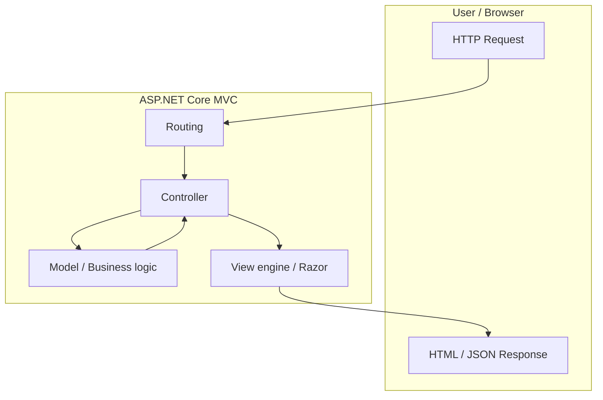

### Visual flow of MVC architecture

A more detailed request-to-response flow shows how URL, controller action, model, and view interact.

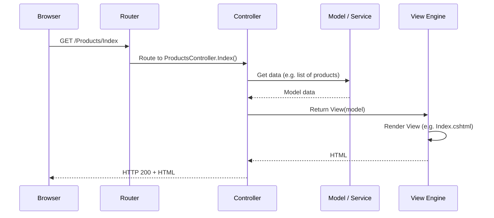

**Step-by-step:**

1. **Request**: User requests a URL (e.g. `/Products/Index`).  
2. **Routing**: MVC routing matches the URL to a **controller** and **action** (e.g. `ProductsController`, `Index`).  
3. **Controller**: Action runs; it may call **models** or **services** to get data.  
4. **Model**: Business logic and data access return data to the controller.  
5. **View**: Controller returns `View(model)`. The **view engine** (Razor) renders the correct `.cshtml` with the model.  
6. **Response**: Rendered HTML (or JSON for API) is sent back to the browser.

---

## 11) MVC vs MVVM

| Aspect | MVC | MVVM |
|--------|-----|------|
| **Stands for** | Model-View-Controller | Model-View-ViewModel |
| **Origin / context** | Server-side web (e.g. ASP.NET MVC), desktop | Often client-side / UI (WPF, Silverlight, Angular, Vue). |
| **Controller** | Exists. Handles input, talks to Model, chooses View. | No controller. **ViewModel** sits between View and Model. |
| **ViewModel** | Not part of MVC. | Central: exposes data and **commands** for the View; often implements binding and state. |
| **Binding** | Typically server-rendered; form POST back to controller. | **Data binding** and **command binding** (View ↔ ViewModel); often two-way. |
| **Who updates the View?** | Controller passes model to View; View renders once. | ViewModel; View updates automatically when ViewModel properties change (observable/binding). |
| **Best for** | Server-rendered pages, request/response, SEO-friendly sites. | Rich client apps, SPAs, reactive UIs with less full-page refresh. |

**Summary:** In **MVC**, the **Controller** drives the flow and selects the View. In **MVVM**, the **ViewModel** exposes state and actions, and the **View** binds to it; there is no controller in the same sense. MVC is common on the server (ASP.NET Core MVC); MVVM is common on the client (Angular, Vue, WPF).

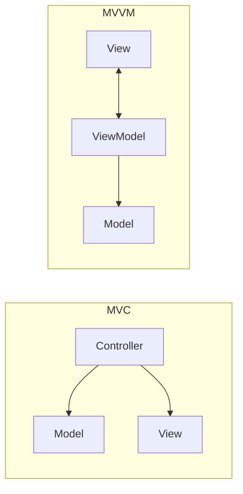

---

## 12) MVVM in Angular with Example

Angular does not use the label “MVVM” in its docs, but the pattern is similar: **View** (templates + components), **ViewModel** (component class: properties and methods the template binds to), and **Model** (data/services). The **component** acts as the ViewModel: it holds state and exposes it to the template; the template **binds** to that state.

### MVVM-like structure in Angular

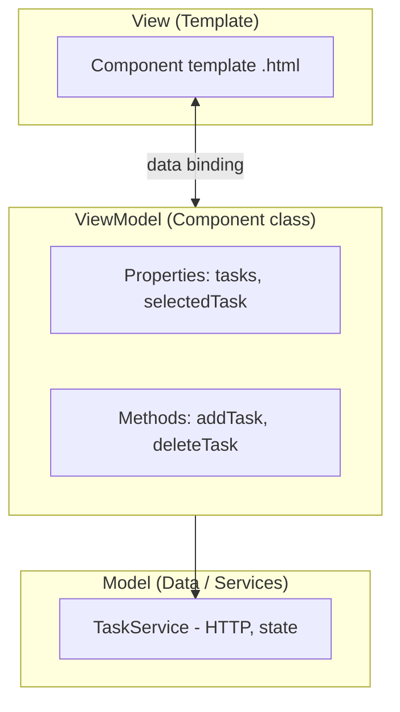

- **View**: The component’s `.html` template (e.g. `task-list.component.html`).  
- **ViewModel**: The component class (e.g. `TaskListComponent`). It exposes properties and methods; the template binds to them with `{{ }}`, `[property]`, `(event)`, etc.  
- **Model**: Data and logic (e.g. `Task` interface, `TaskService` that talks to the API). The ViewModel calls the service; the service is the “model” layer.

### Example: simple task list (MVVM-style in Angular)

**1. Model (data + service):**

```typescript
// task.model.ts
export interface Task {
  id: number;
  title: string;
  done: boolean;
}

// task.service.ts
import { Injectable } from '@angular/core';

@Injectable({ providedIn: 'root' })
export class TaskService {
  private tasks: Task[] = [
    { id: 1, title: 'Learn Angular', done: false },
    { id: 2, title: 'Learn ASP.NET Core', done: true },
  ];

  getTasks(): Task[] {
    return this.tasks;
  }

  addTask(title: string): void {
    this.tasks.push({
      id: this.tasks.length + 1,
      title,
      done: false,
    });
  }

  toggleDone(id: number): void {
    const t = this.tasks.find((x) => x.id === id);
    if (t) t.done = !t.done;
  }
}
```

**2. ViewModel (component class):**

```typescript
// task-list.component.ts
import { Component } from '@angular/core';
import { TaskService } from '../task.service';
import { Task } from '../task.model';

@Component({
  selector: 'app-task-list',
  templateUrl: './task-list.component.html',
})
export class TaskListComponent {
  tasks: Task[] = [];
  newTitle = '';

  constructor(private taskService: TaskService) {
    this.tasks = this.taskService.getTasks();
  }

  addTask(): void {
    if (this.newTitle.trim()) {
      this.taskService.addTask(this.newTitle.trim());
      this.tasks = this.taskService.getTasks();
      this.newTitle = '';
    }
  }

  toggleDone(id: number): void {
    this.taskService.toggleDone(id);
  }
}
```

**3. View (template — binds to ViewModel):**

```html
<!-- task-list.component.html -->
<div class="task-list">
  <input [(ngModel)]="newTitle" placeholder="New task" (keyup.enter)="addTask()" />
  <button (click)="addTask()">Add</button>

  <ul>
    <li *ngFor="let task of tasks">
      <input type="checkbox" [checked]="task.done" (change)="toggleDone(task.id)" />
      <span [class.done]="task.done">{{ task.title }}</span>
    </li>
  </ul>
</div>
```

**How this maps to MVVM:**

| MVVM part | In this example |
|-----------|------------------|
| **Model** | `Task` interface and `TaskService` (data and behavior). |
| **ViewModel** | `TaskListComponent`: exposes `tasks`, `newTitle`, `addTask()`, `toggleDone()`. |
| **View** | Template: `[(ngModel)]`, `*ngFor`, `(click)`, `(change)` — two-way and event binding to ViewModel. |

The **View** never talks to the **Model** directly; it only binds to the **ViewModel** (component). The ViewModel talks to the Model (service). That’s the MVVM-style separation in Angular.

---

## References

- [ASP.NET Core documentation](https://learn.microsoft.com/en-us/aspnet/core/)
- [HTTP — MDN](https://developer.mozilla.org/en-US/docs/Web/HTTP)
- [TLS — RFC 8446 (TLS 1.3)](https://www.rfc-editor.org/rfc/rfc8446)
- [RFC 7230–7235 — HTTP/1.1 (Message Syntax, Semantics, etc.)](https://httpwg.org/specs/rfc7230.html)
