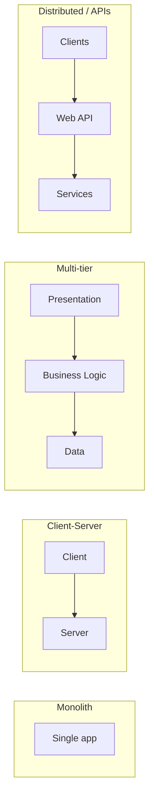

# ASP.NET Web API & REST

**Reference guide** for building RESTful APIs with ASP.NET Core: evolution of distributed architectures, REST introduction and principles, uniform interface, HTTP methods, and example requests and responses. Includes a **Recipe management** example and an **HTTP status code** reference.

**Reference:** [REST API concepts (YouTube)](https://www.youtube.com/watch?v=xkKcdK1u95s&list=PLqq-6Pq4lTTZh5U8RbdXq0WaYvZBz2rbn)

---

## Table of Contents

| Section | Topic |
|--------|--------|
| 1 | [Evolution of Distributed Architectures](#1-evolution-of-distributed-architectures) |
| 2 | [Introduction to REST](#2-introduction-to-rest) |
| 3 | [Key Principles of REST](#3-key-principles-of-rest) |
| 4 | [Uniform Interface — Resources and Representations](#4-uniform-interface--resources-and-representations) |
| 5 | [HTTP Methods and Uniform Interface](#5-http-methods-and-uniform-interface) |
| 6 | [Example HTTP Requests and Responses](#6-example-http-requests-and-responses) |
| 7 | [HTTP Status Code Reference](#7-http-status-code-reference) |
| — | [References](#references) |

---

## 1) Evolution of Distributed Architectures

### Why distributed systems?

Applications evolved from **single, monolithic** systems (one process, one machine) to **distributed** systems (multiple processes, often across multiple machines) for several reasons:

| Driver | Explanation |
|--------|-------------|
| **Scale** | Handle more users and load by adding or scaling separate services. |
| **Separation of concerns** | Frontend (UI), backend (business logic), and data can be developed and deployed independently. |
| **Technology fit** | Use the best stack per component (e.g. .NET for API, React for UI, dedicated DB servers). |
| **Resilience** | Failure of one component does not necessarily bring down the whole system. |
| **Team organization** | Different teams can own different services. |

### Evolution (simplified)



| Phase | Description |
|-------|-------------|
| **Monolith** | One application; UI, logic, and data in one process. Simple to deploy but hard to scale or change in parts. |
| **Client-Server** | Client (UI) and server (logic + data) separated over the network. Clear split of responsibilities. |
| **Multi-tier** | Presentation, business logic, and data tiers separated (e.g. browser, API, database). |
| **Distributed / APIs** | Multiple clients (web, mobile, partners) talk to **Web APIs** (REST). APIs become the contract between frontend and backend; services can be scaled and versioned independently. |

REST is an **architectural style** for these distributed, networked systems: it defines how clients and servers should communicate over HTTP so that APIs are consistent, stateless, and resource-oriented.

---

## 2) Introduction to REST

**REST** stands for **Representational State Transfer**. It is an **architectural style** for designing networked applications, not a protocol or standard. It relies on a **stateless**, **client-server** communication protocol — **HTTP**.

| Idea | Description |
|------|-------------|
| **Stateless** | Each request carries everything the server needs; the server does not keep session state for the client. |
| **Client-Server** | Client (e.g. browser, mobile app) and server (e.g. ASP.NET Web API) are separate; client handles UI and user state, server handles data and business logic. |
| **Resources** | The API exposes **resources** (e.g. recipes, categories) identified by **URLs**. |
| **Representations** | Clients work with **representations** of resources (e.g. JSON, XML), not with the server’s internal storage format. |

**RESTful** applications use **HTTP requests** to perform **CRUD** (Create, Read, Update, Delete) operations on resources:

- **Create** → POST  
- **Read** → GET  
- **Update** → PUT or PATCH  
- **Delete** → DELETE  

Resources are identified by **URLs** (e.g. `/recipes`, `/recipes/1`). The **JSON** (or XML) representation is used to send and receive resource data, and standard **HTTP methods** and **status codes** describe the operation and result.

---

## 3) Key Principles of REST

### Stateless

Each request from a client to a server must contain **all the information** needed to understand and process the request. The server **does not store** session state about the client between requests.

- **Implications:** Authentication/authorization is sent per request (e.g. token in header). Scaling is easier because any server can handle any request.
- **Violation:** Storing “current user” or “current cart” only in server memory and relying on server-side session IDs without the client sending full context.

### Client-Server Architecture

The **client** and **server** are separate:

| Side | Responsibility |
|------|-----------------|
| **Client** | User interface, user experience, sending requests and rendering responses. |
| **Server** | Data storage, business logic, validation, and returning representations of resources. |

This separation allows clients (web, mobile, desktop) and servers to evolve and scale independently.

### Uniform Interface

REST relies on a **uniform interface** between components so that the architecture stays simple and decoupled. It includes:

1. **Identification of resources** — Resources are identified in the request, typically by **URLs**.  
2. **Manipulation through representations** — Clients interact with resources via their **representations** (e.g. JSON, XML).  
3. **Self-descriptive messages** — Each message includes enough information (method, headers, body) to know how to process it.  
4. **Hypermedia (optional)** — Responses can include links to related resources (HATEOAS).

The next sections spell this out with the Recipe management example.

---

## 4) Uniform Interface — Resources and Representations

### Identification of resources (URLs)

Resources are identified in the request, typically using **URLs**. For a **Recipe management system**, example resources and URLs:

| Resource | URL | Description |
|----------|-----|-------------|
| **Categories** | `/categories` | List or create categories. |
| **Recipes** | `/recipes` | List or create recipes. |
| **A specific recipe** | `/recipes/1`, `/recipes/2` | Get, update, or delete one recipe. |
| **Ingredients** | `/ingredients` | List or create ingredients. |

### Manipulation through representations

Clients interact with resources using **representations** (e.g. JSON). The server sends and accepts these representations; the client does not access the database directly.

**Example — Recipe representation (JSON):**

```json
{
  "id": 2,
  "name": "Paneer Tikka",
  "category": "Appetizer",
  "ingredients": [
    "Paneer",
    "Yogurt",
    "Ginger-Garlic Paste",
    "Spices",
    "Lemon Juice",
    "Vegetables (e.g., bell peppers, onions)"
  ],
  "instructions": "Marinate paneer with yogurt, ginger-garlic paste, spices, and lemon juice. Skewer paneer and vegetables. Grill until golden brown."
}
```

### Self-descriptive messages

Each request and response includes enough information to process it: **HTTP method**, **URL**, **headers** (e.g. `Content-Type`, `Accept`), and optionally a **body**.

**Example — GET request to retrieve a recipe:**

```http
GET /recipes/2 HTTP/1.1
Host: example.com
Accept: application/json
```

**Example — Response:**

```json
{
  "id": 2,
  "name": "Paneer Tikka",
  "category": "Appetizer",
  "ingredients": [
    "Paneer",
    "Yogurt",
    "Ginger-Garlic Paste",
    "Spices",
    "Lemon Juice",
    "Vegetables (e.g., bell peppers, onions)"
  ],
  "instructions": "Marinate paneer with yogurt, ginger-garlic paste, spices, and lemon juice. Skewer paneer and vegetables. Grill until golden brown."
}
```

The **Accept** header tells the server the client wants JSON; the server uses **Content-Type: application/json** in the response. That makes the message self-descriptive.

---

## 5) HTTP Methods and Uniform Interface

RESTful services use **HTTP methods** explicitly to perform operations on resources. For the Recipe management system:

| Method | Purpose | Example |
|--------|---------|---------|
| **GET** | Retrieve a resource or list | `GET /recipes` — list recipes; `GET /recipes/1` — get one recipe. |
| **POST** | Create a new resource | `POST /recipes` — create a recipe. |
| **PUT** | Replace an existing resource | `PUT /recipes/1` — full update of recipe 1. |
| **PATCH** | Partially update a resource | `PATCH /recipes/1` — change only some fields. |
| **DELETE** | Remove a resource | `DELETE /recipes/1` — delete recipe 1. |

Summary for recipes:

- **GET /recipes** — Retrieve list of recipes.  
- **GET /recipes/1** — Retrieve recipe with id 1.  
- **POST /recipes** — Create a new recipe.  
- **PUT /recipes/1** — Update recipe 1 (full replacement).  
- **PATCH /recipes/1** — Partially update recipe 1.  
- **DELETE /recipes/1** — Delete recipe 1.

---

## 6) Example HTTP Requests and Responses

Below are full request/response examples for the Recipe API using the same resource representation.

### Create a new recipe (POST /recipes)

**Request:**

```http
POST /recipes HTTP/1.1
Host: example.com
Content-Type: application/json

{
  "name": "Paneer Tikka",
  "category": "Appetizer",
  "ingredients": [
    "Paneer",
    "Yogurt",
    "Ginger-Garlic Paste",
    "Spices",
    "Lemon Juice",
    "Vegetables (e.g., bell peppers, onions)"
  ],
  "instructions": "Marinate paneer with yogurt, ginger-garlic paste, spices, and lemon juice. Skewer paneer and vegetables. Grill until golden brown."
}
```

**Response:**

```http
HTTP/1.1 201 Created
Content-Type: application/json
Location: /recipes/2

{
  "id": 2,
  "name": "Paneer Tikka",
  "category": "Appetizer",
  "ingredients": [
    "Paneer",
    "Yogurt",
    "Ginger-Garlic Paste",
    "Spices",
    "Lemon Juice",
    "Vegetables (e.g., bell peppers, onions)"
  ],
  "instructions": "Marinate paneer with yogurt, ginger-garlic paste, spices, and lemon juice. Skewer paneer and vegetables. Grill until golden brown."
}
```

---

### Retrieve a specific recipe (GET /recipes/2)

**Request:**

```http
GET /recipes/2 HTTP/1.1
Host: example.com
Accept: application/json
```

**Response:**

```http
HTTP/1.1 200 OK
Content-Type: application/json

{
  "id": 2,
  "name": "Paneer Tikka",
  "category": "Appetizer",
  "ingredients": [
    "Paneer",
    "Yogurt",
    "Ginger-Garlic Paste",
    "Spices",
    "Lemon Juice",
    "Vegetables (e.g., bell peppers, onions)"
  ],
  "instructions": "Marinate paneer with yogurt, ginger-garlic paste, spices, and lemon juice. Skewer paneer and vegetables. Grill until golden brown."
}
```

---

### Update an existing recipe (PUT /recipes/2)

**Request:**

```http
PUT /recipes/2 HTTP/1.1
Host: example.com
Content-Type: application/json

{
  "name": "Paneer Tikka",
  "category": "Appetizer",
  "ingredients": [
    "Paneer",
    "Yogurt",
    "Ginger-Garlic Paste",
    "Spices",
    "Lemon Juice",
    "Vegetables (e.g., bell peppers, onions)"
  ],
  "instructions": "Marinate paneer with yogurt, ginger-garlic paste, spices, and lemon juice. Skewer paneer and vegetables. Grill until golden brown."
}
```

**Response:**

```http
HTTP/1.1 200 OK
Content-Type: application/json

{
  "id": 2,
  "name": "Paneer Tikka",
  "category": "Appetizer",
  "ingredients": [
    "Paneer",
    "Yogurt",
    "Ginger-Garlic Paste",
    "Spices",
    "Lemon Juice",
    "Vegetables (e.g., bell peppers, onions)"
  ],
  "instructions": "Marinate paneer with yogurt, ginger-garlic paste, spices, and lemon juice. Skewer paneer and vegetables. Grill until golden brown."
}
```

---

### Delete a recipe (DELETE /recipes/2)

**Request:**

```http
DELETE /recipes/2 HTTP/1.1
Host: example.com
```

**Response:**

```http
HTTP/1.1 204 No Content
```

---

### Partially update a recipe (PATCH /recipes/2)

**Request:**

```http
PATCH /recipes/2 HTTP/1.1
Host: example.com
Content-Type: application/json

{
  "category": "Main Course"
}
```

**Response:**

```http
HTTP/1.1 200 OK
Content-Type: application/json

{
  "id": 2,
  "name": "Paneer Tikka",
  "category": "Main Course",
  "ingredients": [
    "Paneer",
    "Yogurt",
    "Ginger-Garlic Paste",
    "Spices",
    "Lemon Juice",
    "Vegetables (e.g., bell peppers, onions)"
  ],
  "instructions": "Marinate paneer with yogurt, ginger-garlic paste, spices, and lemon juice. Skewer paneer and vegetables. Grill until golden brown."
}
```

---

The **JSON representation** is used to interact with the resource, and the standard HTTP methods (POST, GET, PUT, PATCH, DELETE) map to **CRUD** operations.

---

## 7) HTTP Status Code Reference

REST APIs use **HTTP status codes** to indicate the result of the request. Below is a concise reference.

### 2xx — Success

| Code | Status | Meaning |
|------|--------|---------|
| **200** | OK | Request succeeded. Commonly used for GET, PUT, PATCH. |
| **201** | Created | Resource created (e.g. after POST). Response often includes `Location` header and body. |
| **204** | No Content | Request succeeded, no body to return (e.g. after DELETE). |

### 3xx — Redirection

| Code | Status | Meaning |
|------|--------|---------|
| **301** | Moved Permanently | Resource has a new permanent URL (use new URL). |
| **302** | Found | Temporary redirect to another URL. |
| **304** | Not Modified | Cached representation still valid (conditional GET). |

### 4xx — Client Error

| Code | Status | Meaning |
|------|--------|---------|
| **400** | Bad Request | Malformed request or invalid input (validation errors). |
| **401** | Unauthorized | Authentication required or failed (e.g. missing or invalid token). |
| **403** | Forbidden | Authenticated but not allowed to perform this action. |
| **404** | Not Found | Resource (or URL) does not exist. |
| **405** | Method Not Allowed | HTTP method not supported for this resource. |
| **409** | Conflict | Request conflicts with current state (e.g. duplicate, version conflict). |
| **422** | Unprocessable Entity | Syntax valid but semantic or validation error. |

### 5xx — Server Error

| Code | Status | Meaning |
|------|--------|---------|
| **500** | Internal Server Error | Unexpected server error (e.g. unhandled exception). |
| **502** | Bad Gateway | Invalid response from upstream server (e.g. proxy). |
| **503** | Service Unavailable | Server temporarily unable to handle request (overload or maintenance). |
| **504** | Gateway Timeout | Upstream server did not respond in time. |

### Typical usage in REST

| Scenario | Status |
|----------|--------|
| GET returns a resource | 200 OK |
| POST creates a resource | 201 Created + `Location` |
| PUT/PATCH updates a resource | 200 OK (or 204 No Content) |
| DELETE removes a resource | 204 No Content |
| Resource not found | 404 Not Found |
| Validation error on input | 400 Bad Request (or 422) |
| Not authenticated | 401 Unauthorized |
| Not allowed | 403 Forbidden |

---

## References

- [REST API concepts — YouTube playlist](https://www.youtube.com/watch?v=xkKcdK1u95s&list=PLqq-6Pq4lTTZh5U8RbdXq0WaYvZBz2rbn)
- [ASP.NET Core Web API](https://learn.microsoft.com/en-us/aspnet/core/web-api/)
- [RFC 7231 — HTTP Semantics (methods, status codes)](https://httpwg.org/specs/rfc7231.html)
