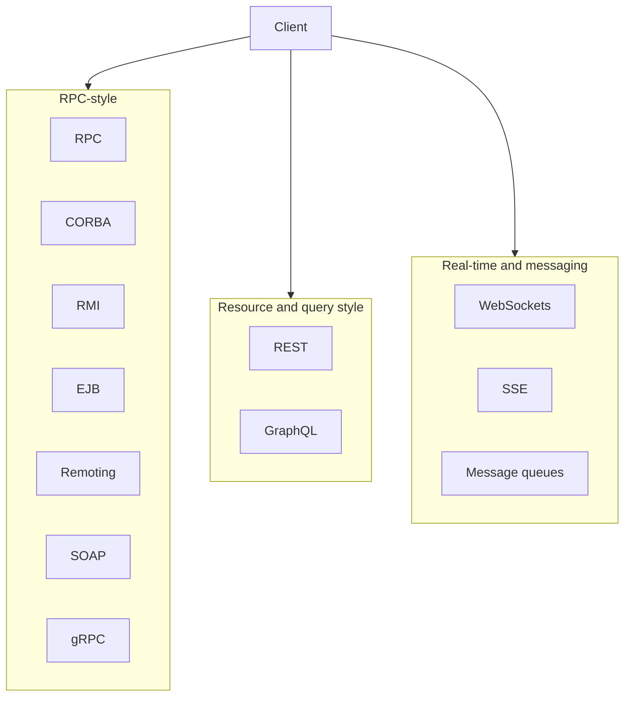

# ASP.NET Web API & REST

**Reference guide** for building RESTful APIs with ASP.NET Core: evolution of distributed architectures, REST introduction and principles, uniform interface, HTTP methods, and example requests and responses. Includes a **Recipe management** example and an **HTTP status code** reference.

**Reference:** [REST API concepts (YouTube)](https://www.youtube.com/watch?v=xkKcdK1u95s&list=PLqq-6Pq4lTTZh5U8RbdXq0WaYvZBz2rbn)

---

## Table of Contents

| Section | Topic |
|--------|--------|
| 1 | [Evolution of Distributed Architectures](#1-evolution-of-distributed-architectures) · [Service description, message format, samples](#service-description-message-format-and-samples) |
| 2 | [Introduction to REST](#2-introduction-to-rest) |
| 3 | [Key Principles of REST](#3-key-principles-of-rest) |
| 4 | [Uniform Interface — Resources and Representations](#4-uniform-interface--resources-and-representations) |
| 5 | [HTTP Methods and Uniform Interface](#5-http-methods-and-uniform-interface) |
| 6 | [Example HTTP Requests and Responses](#6-example-http-requests-and-responses) |
| 7 | [HTTP Status Code Reference](#7-http-status-code-reference) |
| — | [References](#references) |

---

## 1) Evolution of Distributed Architectures

Distributed systems need a way for **processes on different machines** (or in different languages) to **invoke operations** and **exchange data**. Over time, many approaches have emerged: **RPC**, **CORBA**, **RMI**, **EJB**, **.NET Remoting**, **SOAP**, **REST**, **gRPC**, **GraphQL**, **WebSockets**, and others. Each reflects the technology and requirements of its era.

### Why distributed?

| Driver | Explanation |
|--------|-------------|
| **Scale** | Spread load across machines; scale components independently. |
| **Separation of concerns** | UI, business logic, and data on different tiers or services. |
| **Technology and language mix** | Different stacks (Java, .NET, C++, browser) need to interoperate. |
| **Resilience and deployment** | Deploy and update services without bringing down the whole system. |

### Overview of distributed technologies

The following table summarizes the main paradigms and technologies. They are grouped roughly by era and style (RPC-style vs resource/query style vs real-time).

| Technology | Era / context | Style | Brief description |
|------------|----------------|-------|--------------------|
| **RPC** (Remote Procedure Call) | 1980s onward | Procedure call over network | Client calls a remote function as if it were local. Protocol and payload vary (e.g. Sun RPC, later JSON-RPC). |
| **CORBA** (Common Object Request Broker Architecture) | 1990s | Object RPC, language-neutral | OMG standard; objects in different languages communicate via IDL and an object request broker. Complex, heavyweight. |
| **RMI** (Java Remote Method Invocation) | Late 1990s | Object RPC, Java-only | Java-to-Java remote method calls. Tightly coupled to JVM; firewall-unfriendly (custom protocols). |
| **EJB** (Enterprise JavaBeans) | Late 1990s–2000s | Server-side components + remoting | Java EE component model; session beans and entity beans could be accessed remotely (RMI-style). Often used with RMI. |
| **.NET Remoting** | Early 2000s | Object RPC, .NET-only | .NET-to-.NET remote objects (TCP or HTTP). Binary or SOAP; replaced by WCF and later by HTTP APIs. |
| **SOAP** (Simple Object Access Protocol) / **WCF** | 2000s | XML RPC over HTTP | XML-based RPC or document exchange over HTTP. WSDL describes the service; WS-* adds security, transactions. Cross-platform but verbose. |
| **REST** | 2000s onward | Resource-oriented over HTTP | Resources identified by URLs; CRUD via HTTP methods (GET, POST, PUT, DELETE). Stateless, often JSON. Dominant for public and internal HTTP APIs. |
| **gRPC** | 2010s onward | High-performance RPC | HTTP/2, binary (Protocol Buffers). Strongly typed, streaming, low latency. Used in microservices, cloud, mobile backends. |
| **GraphQL** | 2010s onward | Query language over HTTP | Single endpoint; client sends a query and gets exactly the fields it needs. Reduces over/under-fetching; often used for UIs and aggregating backends. |
| **WebSockets** | 2010s onward | Full-duplex, persistent connection | Upgrade from HTTP to a long-lived, bidirectional channel. Used for real-time push, chat, dashboards, games. Not RPC or REST by itself; complements them. |
| **Others** | Various | — | **Message queues** (AMQP, RabbitMQ, Kafka) for async; **SignalR** ( .NET) over WebSockets; **Server-Sent Events (SSE)** for server-to-client stream; **JSON-RPC** for simple RPC over HTTP. |

### Short descriptions

**RPC (Remote Procedure Call)**  
The idea: call a **procedure or method on another machine** as if it were local. The client sends a request (procedure id + arguments); the server runs the procedure and returns a result. Early RPC (e.g. Sun RPC) used custom binary protocols. Later variants use HTTP and JSON (e.g. JSON-RPC) or binary (gRPC). **Pros:** familiar programming model. **Cons:** tight coupling to method signatures; versioning and evolution can be hard.

**CORBA (Common Object Request Broker Architecture)**  
An **OMG** standard for distributed objects across **languages and vendors**. You define interfaces in **IDL**; the ORB (Object Request Broker) handles marshalling and location. **Pros:** language-neutral, standardized. **Cons:** complex, heavyweight, and in practice often replaced by HTTP-based or simpler RPC.

**RMI (Java Remote Method Invocation)**  
**Java-only** remote method calls. Objects implement remote interfaces; the client holds a stub that forwards calls to the JVM where the object lives. **Pros:** natural in Java. **Cons:** tied to Java, custom protocol, often blocked by firewalls; less used today in favor of REST or gRPC.

**EJB (Enterprise JavaBeans)**  
**Server-side component model** in Java EE. **Session beans** and **entity beans** could expose remote interfaces (via RMI). EJBs handled transactions, persistence, and lifecycle. **Pros:** standardized server-side Java. **Cons:** heavyweight; remote EJB usage declined in favor of REST and simpler services.

**.NET Remoting**  
**.NET** mechanism for remote objects: client and server use .NET types across process or machine boundaries. Could use TCP (binary) or HTTP (SOAP). **Pros:** .NET-native. **Cons:** .NET-only, complex lifecycle; superseded by **WCF** and then by **HTTP APIs** (e.g. ASP.NET Web API, REST).

**SOAP (Simple Object Access Protocol) / Web services**  
**XML-based** messages over HTTP (or other transports). **WSDL** describes the service contract; **WS-*** standards add security, reliability, transactions. **WCF** (Windows Communication Foundation) is the main .NET implementation. **Pros:** cross-platform, tooling, contracts. **Cons:** verbose, complex; many new APIs prefer REST and JSON.

**REST (Representational State Transfer)**  
**Architectural style** over HTTP: **resources** (identified by URLs), **representations** (e.g. JSON), and **HTTP methods** (GET, POST, PUT, PATCH, DELETE) for CRUD. Stateless, cacheable, simple. **Pros:** simple, universal (HTTP everywhere), good for public and internal APIs. **Cons:** no formal contract by default (often supplemented by OpenAPI); over/under-fetching unless designed carefully.

**gRPC**  
**RPC** over **HTTP/2** with **Protocol Buffers** (binary). Strongly typed, supports **streaming** (client, server, or bidirectional). **Pros:** performance, streaming, code generation from .proto. **Cons:** less browser-native than REST; tooling and debugging differ from JSON. Common in microservices and cloud.

**GraphQL**  
**Query language** and runtime: one (or few) HTTP endpoints; the client sends a **query** describing the data it needs and gets a JSON response shaped to that query. **Pros:** flexible, avoids over-fetching and multiple round-trips. **Cons:** complexity on server (resolvers, authorization); caching is harder than with REST URLs.

**WebSockets**  
**Upgrade** of an HTTP connection to a **full-duplex**, persistent channel. Both sides can send frames at any time. **Pros:** real-time, low latency. **Cons:** not REST or RPC by itself; often used alongside REST (e.g. REST for CRUD, WebSocket for live updates). **SignalR** (ASP.NET) abstracts WebSockets and fallbacks.

### Service description, message format, and samples

For each technology below: **service description** (how the contract is defined), **message format** (wire format), and **sample** request/response or messages.

---

#### RPC (e.g. Sun RPC / JSON-RPC)

| Aspect | Description |
|--------|-------------|
| **Service description** | **Sun RPC:** described in an **.x file** (e.g. `recipe.x`) that defines program number, procedure numbers, and argument/result types. **JSON-RPC:** no formal schema; method name and params are documented (e.g. OpenAPI for HTTP JSON-RPC). |
| **Message format** | **Sun RPC:** **XDR** (External Data Representation), binary. **JSON-RPC:** **JSON** over HTTP or raw TCP. |

**JSON-RPC 2.0 sample — request:**

```json
{
  "jsonrpc": "2.0",
  "method": "getRecipe",
  "params": { "id": 2 },
  "id": 1
}
```

**JSON-RPC 2.0 sample — response:**

```json
{
  "jsonrpc": "2.0",
  "result": {
    "id": 2,
    "name": "Paneer Tikka",
    "category": "Appetizer"
  },
  "id": 1
}
```

---

#### CORBA

| Aspect | Description |
|--------|-------------|
| **Service description** | **IDL** (Interface Definition Language). Interfaces, operations, and types are defined in `.idl` files; compiled to client stubs and server skeletons in each target language. |
| **Message format** | **IIOP** (Internet Inter-ORB Protocol): binary protocol (CDR — Common Data Representation) over TCP. |

**IDL sample:**

```idl
interface RecipeService {
  Recipe getRecipe(in long id);
  long createRecipe(in Recipe r);
};

struct Recipe {
  long id;
  string name;
  string category;
  sequence<string> ingredients;
  string instructions;
};
```

**Wire:** Binary CDR (not human-readable); request includes operation name, parameters marshalled in CDR order.

---

#### RMI (Java)

| Aspect | Description |
|--------|-------------|
| **Service description** | **Java interface** extending `java.rmi.Remote`; method signatures declare `RemoteException`. No separate IDL; the interface is the contract. |
| **Message format** | **Java Serialization** over a custom **JRMP** (Java Remote Method Protocol) or optional **IIOP**. Binary. |

**Interface sample:**

```java
public interface RecipeService extends Remote {
  Recipe getRecipe(int id) throws RemoteException;
  int createRecipe(Recipe r) throws RemoteException;
}
```

**Wire:** Serialized Java objects (binary); request contains object id, method hash, serialized arguments.

---

#### EJB (remote)

| Aspect | Description |
|--------|-------------|
| **Service description** | **Remote business interface** (Java interface annotated or declared in deployment descriptor). EJB container generates RMI stubs; contract is the Java interface + deployment metadata. |
| **Message format** | Same as **RMI**: Java serialization over JRMP (or IIOP for interoperability). Binary. |

**Remote interface sample:**

```java
@Remote
public interface RecipeServiceRemote {
  Recipe getRecipe(int id);
  int createRecipe(Recipe r);
}
```

**Wire:** Same as RMI — serialized method call and return value.

---

#### .NET Remoting

| Aspect | Description |
|--------|-------------|
| **Service description** | **.NET types**: shared interface or base class (in a shared assembly or generated from WSDL if using SOAP). No standard IDL; .NET metadata describes types. |
| **Message format** | **Binary** (BinaryFormatter) over TCP, or **SOAP/XML** over HTTP. Configurable via channel and formatter. |

**C# interface sample:**

```csharp
public interface IRecipeService
{
  Recipe GetRecipe(int id);
  int CreateRecipe(Recipe r);
}
```

**Wire (SOAP over HTTP):** Same family as SOAP below (XML envelope). Binary formatter: .NET-specific binary serialization.

---

#### SOAP / WCF

| Aspect | Description |
|--------|-------------|
| **Service description** | **WSDL** (Web Services Description Language): XML document describing endpoints, operations, and message types (XSD). Clients generate proxies from WSDL. **WCF:** also uses .NET contracts (interface + attributes). |
| **Message format** | **XML** in a **SOAP envelope** (Envelope, Header, Body) over HTTP (or other transports). |

**WSDL (simplified):** Defines types, messages, portType (operations), binding, and service endpoint URL.

**SOAP request sample:**

```xml
POST /RecipeService.svc HTTP/1.1
Host: example.com
Content-Type: application/xml; charset=utf-8
SOAPAction: "http://example.com/GetRecipe"

<soap:Envelope xmlns:soap="http://schemas.xmlsoap.org/soap/envelope/">
  <soap:Body>
    <GetRecipe xmlns="http://example.com/">
      <id>2</id>
    </GetRecipe>
  </soap:Body>
</soap:Envelope>
```

**SOAP response sample:**

```xml
HTTP/1.1 200 OK
Content-Type: application/xml; charset=utf-8

<soap:Envelope xmlns:soap="http://schemas.xmlsoap.org/soap/envelope/">
  <soap:Body>
    <GetRecipeResponse xmlns="http://example.com/">
      <GetRecipeResult>
        <id>2</id>
        <name>Paneer Tikka</name>
        <category>Appetizer</category>
        <ingredients>Paneer</ingredients>
        <ingredients>Yogurt</ingredients>
        <instructions>Marinate paneer...</instructions>
      </GetRecipeResult>
    </GetRecipeResponse>
  </soap:Body>
</soap:Envelope>
```

---

#### REST

| Aspect | Description |
|--------|-------------|
| **Service description** | No single standard; often **OpenAPI (Swagger)** (YAML/JSON) describes URLs, methods, request/response schemas. **WADL** (XML) is another option. REST itself does not mandate a contract format. |
| **Message format** | **JSON** or **XML** (or other) in HTTP body; **HTTP method, URL, and headers** carry semantics. |

**Contract (OpenAPI snippet):** Paths like `GET /recipes/{id}`, `POST /recipes`; schemas for `Recipe` in request/response.

**Request sample:** See [Example HTTP Requests and Responses](#6-example-http-requests-and-responses) in this document.

**REST GET sample:**

```http
GET /recipes/2 HTTP/1.1
Host: example.com
Accept: application/json
```

**REST response sample:**

```json
{
  "id": 2,
  "name": "Paneer Tikka",
  "category": "Appetizer",
  "ingredients": ["Paneer", "Yogurt", "Spices"],
  "instructions": "Marinate paneer..."
}
```

---

#### gRPC

| Aspect | Description |
|--------|-------------|
| **Service description** | **Protocol Buffers** `.proto` file: defines **services** (RPC methods) and **messages** (request/response types). Code generated for each language. |
| **Message format** | **Binary** (Protocol Buffers encoding) over **HTTP/2**. Compact, typed, streaming-capable. |

**.proto sample:**

```protobuf
syntax = "proto3";

service RecipeService {
  rpc GetRecipe(GetRecipeRequest) returns (Recipe);
  rpc CreateRecipe(CreateRecipeRequest) returns (Recipe);
}

message GetRecipeRequest {
  int32 id = 1;
}

message CreateRecipeRequest {
  string name = 1;
  string category = 2;
  repeated string ingredients = 3;
  string instructions = 4;
}

message Recipe {
  int32 id = 1;
  string name = 2;
  string category = 3;
  repeated string ingredients = 4;
  string instructions = 5;
}
```

**Wire:** Binary; not human-readable. HTTP/2 frames carry path (e.g. `/RecipeService/GetRecipe`) and binary protobuf payload.

---

#### GraphQL

| Aspect | Description |
|--------|-------------|
| **Service description** | **Schema** (SDL — Schema Definition Language): types, queries, mutations, subscriptions. Often exposed via introspection (`__schema`). No separate IDL file required; schema is the contract. |
| **Message format** | **JSON** over HTTP. Request body contains `query` (and optionally `variables`, `operationName`). Response body is JSON with `data` and optionally `errors`. |

**Schema sample (SDL):**

```graphql
type Recipe {
  id: ID!
  name: String!
  category: String!
  ingredients: [String!]!
  instructions: String
}

type Query {
  recipe(id: ID!): Recipe
  recipes: [Recipe!]!
}

type Mutation {
  createRecipe(input: RecipeInput!): Recipe!
}

input RecipeInput {
  name: String!
  category: String!
  ingredients: [String!]!
  instructions: String
}
```

**Request sample:**

```http
POST /graphql HTTP/1.1
Host: example.com
Content-Type: application/json

{
  "query": "query { recipe(id: 2) { id name category ingredients instructions } }"
}
```

**Response sample:**

```json
{
  "data": {
    "recipe": {
      "id": "2",
      "name": "Paneer Tikka",
      "category": "Appetizer",
      "ingredients": ["Paneer", "Yogurt", "Spices"],
      "instructions": "Marinate paneer..."
    }
  }
}
```

---

#### WebSockets

| Aspect | Description |
|--------|-------------|
| **Service description** | No standard contract. Application-defined: either **ad-hoc** (e.g. JSON messages with a `type` field) or documented (e.g. “send `{ \"action\": \"subscribe\", \"channel\": \"recipes\" }`”). Some use **WAMP** or **Socket.IO** conventions. |
| **Message format** | **Frames** (binary or text). Payload is usually **JSON** or binary; format is up to the application. |

**Handshake (HTTP upgrade):**

```http
GET /ws HTTP/1.1
Host: example.com
Upgrade: websocket
Connection: Upgrade
Sec-WebSocket-Key: dGhlIHNhbXBsZSBub25jZQ==
Sec-WebSocket-Version: 13
```

**Application message sample (JSON over WebSocket):**

```json
{ "type": "recipe_updated", "id": 2, "name": "Paneer Tikka" }
```

---

#### Others (summary)

| Technology | Service description | Message format | Sample |
|------------|---------------------|----------------|--------|
| **Message queues (AMQP, Kafka)** | Queue/topic name and message schema (often documented or in a registry, e.g. Avro schema). | Binary or JSON; AMQP has its own framing. | Publish: `{"id":2,"name":"Paneer Tikka"}` to queue `recipe.created`. |
| **SSE (Server-Sent Events)** | No formal contract; event types and payload format are application-defined. | **Text** stream; `data:` lines + optional `event:` and `id:`. | `event: recipe_updated\ndata: {"id":2,"name":"Paneer Tikka"}\n\n` |
| **SignalR** | .NET hubs define methods; client invokes by name. Contract is the hub interface. | Negotiation then WebSocket (or long polling); payload is JSON (or MessagePack). | Client sends `{"H":"RecipeHub","M":"GetRecipe","A":[2]}`. |
| **JSON-RPC** | Same as RPC above — method names and params documented or described (e.g. OpenAPI). | JSON request/response with `jsonrpc`, `method`, `params`, `id`. | See RPC samples above. |

---

### How they relate (conceptually)



- **RPC-style** (RPC, CORBA, RMI, EJB, Remoting, SOAP, gRPC): emphasis on **calling operations** or **methods** with parameters and return values.  
- **Resource/query style** (REST, GraphQL): emphasis on **resources** or **data** and how to read/update them (HTTP methods or queries).  
- **Real-time and messaging** (WebSockets, SSE, queues): **persistent or async** channels; often used in addition to REST or gRPC.

REST is one of the most common choices for **HTTP APIs** (including ASP.NET Web API) because it uses standard HTTP, is easy to consume from any client, and fits well with the web and firewalls. The rest of this document focuses on **REST**.

---

## 2) Introduction to REST

**REST** stands for **Representational State Transfer**. It is an **architectural style** for designing networked applications, not a protocol or standard. It relies on a **stateless**, **client-server** communication protocol — **HTTP**.

| Idea | Description |
|------|-------------|
| **Stateless** | Each request carries everything the server needs; the server does not keep session state for the client. |
| **Client-Server** | Client (e.g. browser, mobile app) and server (e.g. ASP.NET Web API) are separate; client handles UI and user state, server handles data and business logic. |
| **Resources** | The API exposes **resources** (e.g. recipes, categories) identified by **URLs**. |
| **Representations** | Clients work with **representations** of resources (e.g. JSON, XML), not with the server’s internal storage format. |

**RESTful** applications use **HTTP requests** to perform **CRUD** (Create, Read, Update, Delete) operations on resources:

- **Create** → POST  
- **Read** → GET  
- **Update** → PUT or PATCH  
- **Delete** → DELETE  

Resources are identified by **URLs** (e.g. `/recipes`, `/recipes/1`). The **JSON** (or XML) representation is used to send and receive resource data, and standard **HTTP methods** and **status codes** describe the operation and result.

---

## 3) Key Principles of REST

### Stateless

Each request from a client to a server must contain **all the information** needed to understand and process the request. The server **does not store** session state about the client between requests.

- **Implications:** Authentication/authorization is sent per request (e.g. token in header). Scaling is easier because any server can handle any request.
- **Violation:** Storing “current user” or “current cart” only in server memory and relying on server-side session IDs without the client sending full context.

### Client-Server Architecture

The **client** and **server** are separate:

| Side | Responsibility |
|------|-----------------|
| **Client** | User interface, user experience, sending requests and rendering responses. |
| **Server** | Data storage, business logic, validation, and returning representations of resources. |

This separation allows clients (web, mobile, desktop) and servers to evolve and scale independently.

### Uniform Interface

REST relies on a **uniform interface** between components so that the architecture stays simple and decoupled. It includes:

1. **Identification of resources** — Resources are identified in the request, typically by **URLs**.  
2. **Manipulation through representations** — Clients interact with resources via their **representations** (e.g. JSON, XML).  
3. **Self-descriptive messages** — Each message includes enough information (method, headers, body) to know how to process it.  
4. **Hypermedia (optional)** — Responses can include links to related resources (HATEOAS).

The next sections spell this out with the Recipe management example.

---

## 4) Uniform Interface — Resources and Representations

### Identification of resources (URLs)

Resources are identified in the request, typically using **URLs**. For a **Recipe management system**, example resources and URLs:

| Resource | URL | Description |
|----------|-----|-------------|
| **Categories** | `/categories` | List or create categories. |
| **Recipes** | `/recipes` | List or create recipes. |
| **A specific recipe** | `/recipes/1`, `/recipes/2` | Get, update, or delete one recipe. |
| **Ingredients** | `/ingredients` | List or create ingredients. |

### Manipulation through representations

Clients interact with resources using **representations** (e.g. JSON). The server sends and accepts these representations; the client does not access the database directly.

**Example — Recipe representation (JSON):**

```json
{
  "id": 2,
  "name": "Paneer Tikka",
  "category": "Appetizer",
  "ingredients": [
    "Paneer",
    "Yogurt",
    "Ginger-Garlic Paste",
    "Spices",
    "Lemon Juice",
    "Vegetables (e.g., bell peppers, onions)"
  ],
  "instructions": "Marinate paneer with yogurt, ginger-garlic paste, spices, and lemon juice. Skewer paneer and vegetables. Grill until golden brown."
}
```

### Self-descriptive messages

Each request and response includes enough information to process it: **HTTP method**, **URL**, **headers** (e.g. `Content-Type`, `Accept`), and optionally a **body**.

**Example — GET request to retrieve a recipe:**

```http
GET /recipes/2 HTTP/1.1
Host: example.com
Accept: application/json
```

**Example — Response:**

```json
{
  "id": 2,
  "name": "Paneer Tikka",
  "category": "Appetizer",
  "ingredients": [
    "Paneer",
    "Yogurt",
    "Ginger-Garlic Paste",
    "Spices",
    "Lemon Juice",
    "Vegetables (e.g., bell peppers, onions)"
  ],
  "instructions": "Marinate paneer with yogurt, ginger-garlic paste, spices, and lemon juice. Skewer paneer and vegetables. Grill until golden brown."
}
```

The **Accept** header tells the server the client wants JSON; the server uses **Content-Type: application/json** in the response. That makes the message self-descriptive.

---

## 5) HTTP Methods and Uniform Interface

RESTful services use **HTTP methods** explicitly to perform operations on resources. For the Recipe management system:

| Method | Purpose | Example |
|--------|---------|---------|
| **GET** | Retrieve a resource or list | `GET /recipes` — list recipes; `GET /recipes/1` — get one recipe. |
| **POST** | Create a new resource | `POST /recipes` — create a recipe. |
| **PUT** | Replace an existing resource | `PUT /recipes/1` — full update of recipe 1. |
| **PATCH** | Partially update a resource | `PATCH /recipes/1` — change only some fields. |
| **DELETE** | Remove a resource | `DELETE /recipes/1` — delete recipe 1. |

Summary for recipes:

- **GET /recipes** — Retrieve list of recipes.  
- **GET /recipes/1** — Retrieve recipe with id 1.  
- **POST /recipes** — Create a new recipe.  
- **PUT /recipes/1** — Update recipe 1 (full replacement).  
- **PATCH /recipes/1** — Partially update recipe 1.  
- **DELETE /recipes/1** — Delete recipe 1.

---

## 6) Example HTTP Requests and Responses

Below are full request/response examples for the Recipe API using the same resource representation.

### Create a new recipe (POST /recipes)

**Request:**

```http
POST /recipes HTTP/1.1
Host: example.com
Content-Type: application/json

{
  "name": "Paneer Tikka",
  "category": "Appetizer",
  "ingredients": [
    "Paneer",
    "Yogurt",
    "Ginger-Garlic Paste",
    "Spices",
    "Lemon Juice",
    "Vegetables (e.g., bell peppers, onions)"
  ],
  "instructions": "Marinate paneer with yogurt, ginger-garlic paste, spices, and lemon juice. Skewer paneer and vegetables. Grill until golden brown."
}
```

**Response:**

```http
HTTP/1.1 201 Created
Content-Type: application/json
Location: /recipes/2

{
  "id": 2,
  "name": "Paneer Tikka",
  "category": "Appetizer",
  "ingredients": [
    "Paneer",
    "Yogurt",
    "Ginger-Garlic Paste",
    "Spices",
    "Lemon Juice",
    "Vegetables (e.g., bell peppers, onions)"
  ],
  "instructions": "Marinate paneer with yogurt, ginger-garlic paste, spices, and lemon juice. Skewer paneer and vegetables. Grill until golden brown."
}
```

---

### Retrieve a specific recipe (GET /recipes/2)

**Request:**

```http
GET /recipes/2 HTTP/1.1
Host: example.com
Accept: application/json
```

**Response:**

```http
HTTP/1.1 200 OK
Content-Type: application/json

{
  "id": 2,
  "name": "Paneer Tikka",
  "category": "Appetizer",
  "ingredients": [
    "Paneer",
    "Yogurt",
    "Ginger-Garlic Paste",
    "Spices",
    "Lemon Juice",
    "Vegetables (e.g., bell peppers, onions)"
  ],
  "instructions": "Marinate paneer with yogurt, ginger-garlic paste, spices, and lemon juice. Skewer paneer and vegetables. Grill until golden brown."
}
```

---

### Update an existing recipe (PUT /recipes/2)

**Request:**

```http
PUT /recipes/2 HTTP/1.1
Host: example.com
Content-Type: application/json

{
  "name": "Paneer Tikka",
  "category": "Appetizer",
  "ingredients": [
    "Paneer",
    "Yogurt",
    "Ginger-Garlic Paste",
    "Spices",
    "Lemon Juice",
    "Vegetables (e.g., bell peppers, onions)"
  ],
  "instructions": "Marinate paneer with yogurt, ginger-garlic paste, spices, and lemon juice. Skewer paneer and vegetables. Grill until golden brown."
}
```

**Response:**

```http
HTTP/1.1 200 OK
Content-Type: application/json

{
  "id": 2,
  "name": "Paneer Tikka",
  "category": "Appetizer",
  "ingredients": [
    "Paneer",
    "Yogurt",
    "Ginger-Garlic Paste",
    "Spices",
    "Lemon Juice",
    "Vegetables (e.g., bell peppers, onions)"
  ],
  "instructions": "Marinate paneer with yogurt, ginger-garlic paste, spices, and lemon juice. Skewer paneer and vegetables. Grill until golden brown."
}
```

---

### Delete a recipe (DELETE /recipes/2)

**Request:**

```http
DELETE /recipes/2 HTTP/1.1
Host: example.com
```

**Response:**

```http
HTTP/1.1 204 No Content
```

---

### Partially update a recipe (PATCH /recipes/2)

**Request:**

```http
PATCH /recipes/2 HTTP/1.1
Host: example.com
Content-Type: application/json

{
  "category": "Main Course"
}
```

**Response:**

```http
HTTP/1.1 200 OK
Content-Type: application/json

{
  "id": 2,
  "name": "Paneer Tikka",
  "category": "Main Course",
  "ingredients": [
    "Paneer",
    "Yogurt",
    "Ginger-Garlic Paste",
    "Spices",
    "Lemon Juice",
    "Vegetables (e.g., bell peppers, onions)"
  ],
  "instructions": "Marinate paneer with yogurt, ginger-garlic paste, spices, and lemon juice. Skewer paneer and vegetables. Grill until golden brown."
}
```

---

The **JSON representation** is used to interact with the resource, and the standard HTTP methods (POST, GET, PUT, PATCH, DELETE) map to **CRUD** operations.

---

## 7) HTTP Status Code Reference

REST APIs use **HTTP status codes** to indicate the result of the request. Below is a concise reference.

### 2xx — Success

| Code | Status | Meaning |
|------|--------|---------|
| **200** | OK | Request succeeded. Commonly used for GET, PUT, PATCH. |
| **201** | Created | Resource created (e.g. after POST). Response often includes `Location` header and body. |
| **204** | No Content | Request succeeded, no body to return (e.g. after DELETE). |

### 3xx — Redirection

| Code | Status | Meaning |
|------|--------|---------|
| **301** | Moved Permanently | Resource has a new permanent URL (use new URL). |
| **302** | Found | Temporary redirect to another URL. |
| **304** | Not Modified | Cached representation still valid (conditional GET). |

### 4xx — Client Error

| Code | Status | Meaning |
|------|--------|---------|
| **400** | Bad Request | Malformed request or invalid input (validation errors). |
| **401** | Unauthorized | Authentication required or failed (e.g. missing or invalid token). |
| **403** | Forbidden | Authenticated but not allowed to perform this action. |
| **404** | Not Found | Resource (or URL) does not exist. |
| **405** | Method Not Allowed | HTTP method not supported for this resource. |
| **409** | Conflict | Request conflicts with current state (e.g. duplicate, version conflict). |
| **422** | Unprocessable Entity | Syntax valid but semantic or validation error. |

### 5xx — Server Error

| Code | Status | Meaning |
|------|--------|---------|
| **500** | Internal Server Error | Unexpected server error (e.g. unhandled exception). |
| **502** | Bad Gateway | Invalid response from upstream server (e.g. proxy). |
| **503** | Service Unavailable | Server temporarily unable to handle request (overload or maintenance). |
| **504** | Gateway Timeout | Upstream server did not respond in time. |

### Typical usage in REST

| Scenario | Status |
|----------|--------|
| GET returns a resource | 200 OK |
| POST creates a resource | 201 Created + `Location` |
| PUT/PATCH updates a resource | 200 OK (or 204 No Content) |
| DELETE removes a resource | 204 No Content |
| Resource not found | 404 Not Found |
| Validation error on input | 400 Bad Request (or 422) |
| Not authenticated | 401 Unauthorized |
| Not allowed | 403 Forbidden |

---

## References

- [REST API concepts — YouTube playlist](https://www.youtube.com/watch?v=xkKcdK1u95s&list=PLqq-6Pq4lTTZh5U8RbdXq0WaYvZBz2rbn)
- [ASP.NET Core Web API](https://learn.microsoft.com/en-us/aspnet/core/web-api/)
- [RFC 7231 — HTTP Semantics (methods, status codes)](https://httpwg.org/specs/rfc7231.html)
