# Multi-Threading and TPL: Questions & Answers Guide

A comprehensive guide covering processors, processes, threads, synchronization, and the Task Parallel Library in .NET with scenario-based questions and visualizations.

---

## 1. What is a Processor?

**Question:** What is a Processor?

**Answer:** A processor (CPU – Central Processing Unit) is the hardware in your computer that executes instructions. Think of the CPU as the brain of the computer.

**Key Points:**
- Executes machine instructions (add, move, compare, jump…)
- Modern CPUs have multiple cores (dual-core, quad-core, etc.)
- Each core can run multiple threads concurrently (via Hyper-Threading)
- Performance depends on clock speed (e.g., 3.2GHz ≈ 3.2 billion cycles/sec)

**Intel Processor Tiers Explained (i3, i5, i7, i9):**

| Tier | Typical Cores | Hyper-Threading | Use Case |
|------|---------------|-----------------|----------|
| **i3** | 2–4 cores | Some models | Entry-level, light tasks, browsing |
| **i5** | 4–6 cores | Yes (mostly) | Mid-range, gaming, productivity |
| **i7** | 6–8 cores | Yes | High performance, content creation |
| **i9** | 8–24+ cores | Yes | Workstation, heavy multi-threading |

Higher tiers offer more cores, higher base/boost clock speeds, and larger cache for better multi-threaded performance.

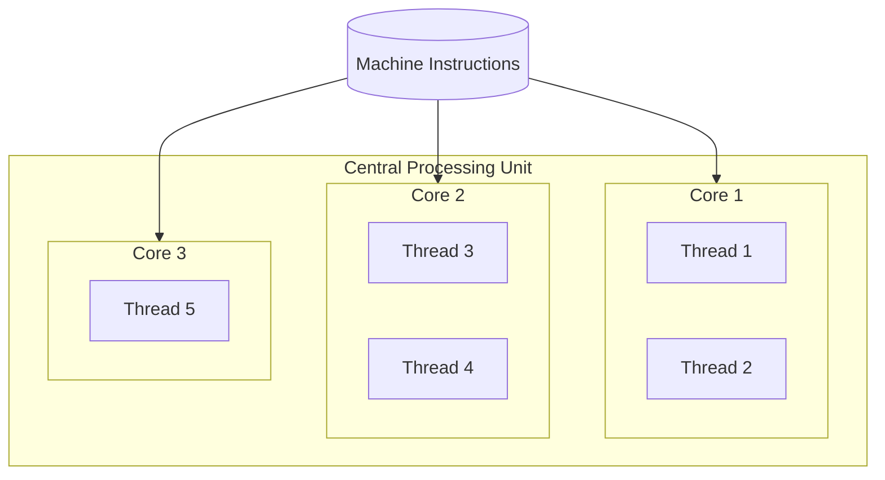

---

## 2. What is a Process?

**Question:** What is a Process?

**Answer:** A process is an instance of a running program. It is an isolated container that the operating system uses to manage resources (memory, handles, threads) for that program.

**Key Points:**
- Each process has its own virtual address space (memory)
- Processes are isolated from each other – one crashing doesn’t bring down others
- A process contains one or more threads
- The OS allocates resources per process (CPU time, memory, file handles, etc.)

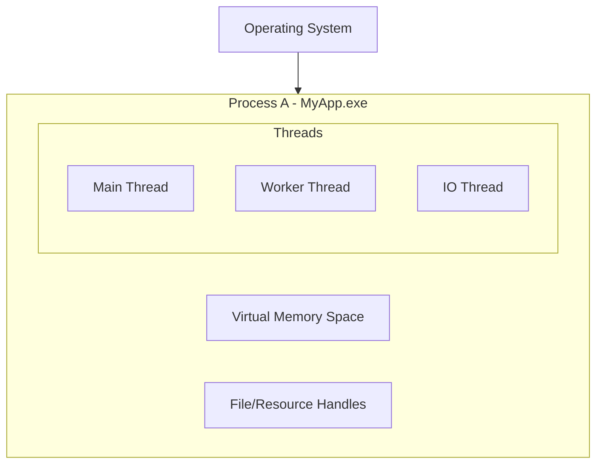

---

## 3. What is a Thread?

**Question:** What is a Thread?

**Answer:** A thread is the smallest unit of execution that the OS can schedule. Within a process, multiple threads share the same memory space and can run concurrently.

**Key Points:**
- Threads within a process share memory (heap, static data)
- Each thread has its own stack and instruction pointer
- Multiple threads allow parallel work and responsive UIs
- Thread context switching has overhead; too many threads can hurt performance

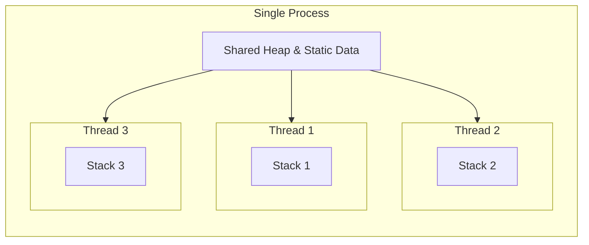

---

## 4. What is Processor Cycle Time (CPU Clock Cycle)?

**Question:** What is Processor Cycle Time (CPU Clock Cycle)?

**Answer:** The processor cycle time (clock cycle) is the time for one clock tick of the CPU. It defines how fast the CPU can execute basic operations.

**Key Points:**
- Measured in Hertz (Hz): 1 GHz = 1 billion cycles per second
- One cycle = one unit of work (e.g., fetch, decode, execute)
- Shorter cycle time → faster CPU (higher clock speed)
- Formula: Cycle Time = 1 / Clock Frequency (e.g., 3.2 GHz → ~0.31 ns per cycle)

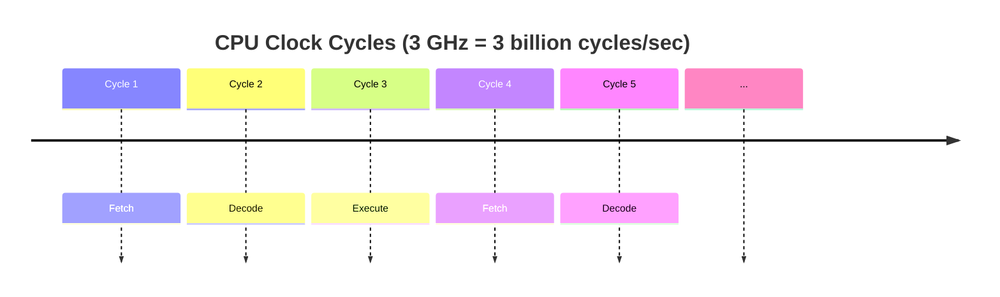

---

## 5. What is Process Time Slice?

**Question:** What is Process Time Slice?

**Answer:** A time slice (quantum) is the maximum continuous time a thread or process can run on a CPU core before the scheduler may switch to another thread.

**Key Points:**
- OS uses preemptive multitasking – threads are interrupted after their time slice
- Typical time slice: 10–100 ms (varies by OS and load)
- Allows many threads to appear to run “at the same time”
- Too short: more context switching overhead; too long: poor responsiveness

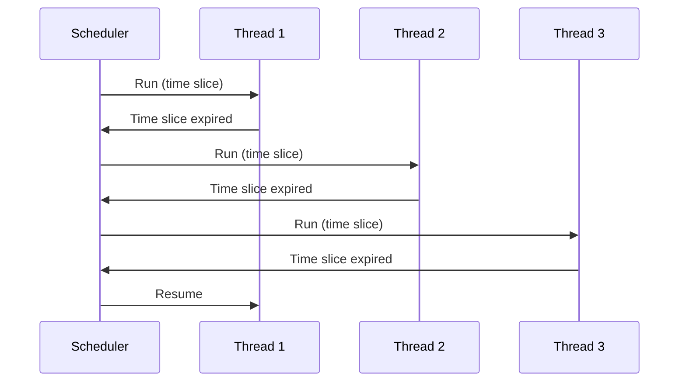

---

## 6. Worker Thread vs I/O Thread

**Question:** What is the difference between a Worker Thread and an I/O Thread?

**Answer:** 

| Aspect | Worker Thread | I/O Thread |
|--------|----------------|------------|
| **Purpose** | CPU-bound work (computations) | I/O-bound work (disk, network, DB) |
| **Blocks on** | CPU processing | Waiting for I/O completion |
| **Pool** | Thread pool worker threads | Thread pool I/O threads (IOCP) |
| **Example** | Image processing, encryption | File read, HTTP request, DB query |

**Key Points:**
- **Worker thread:** Uses CPU; blocks while doing work; limited by CPU cores.
- **I/O thread:** Uses little CPU; blocks waiting for I/O; can scale to many pending operations via I/O Completion Ports (IOCP).

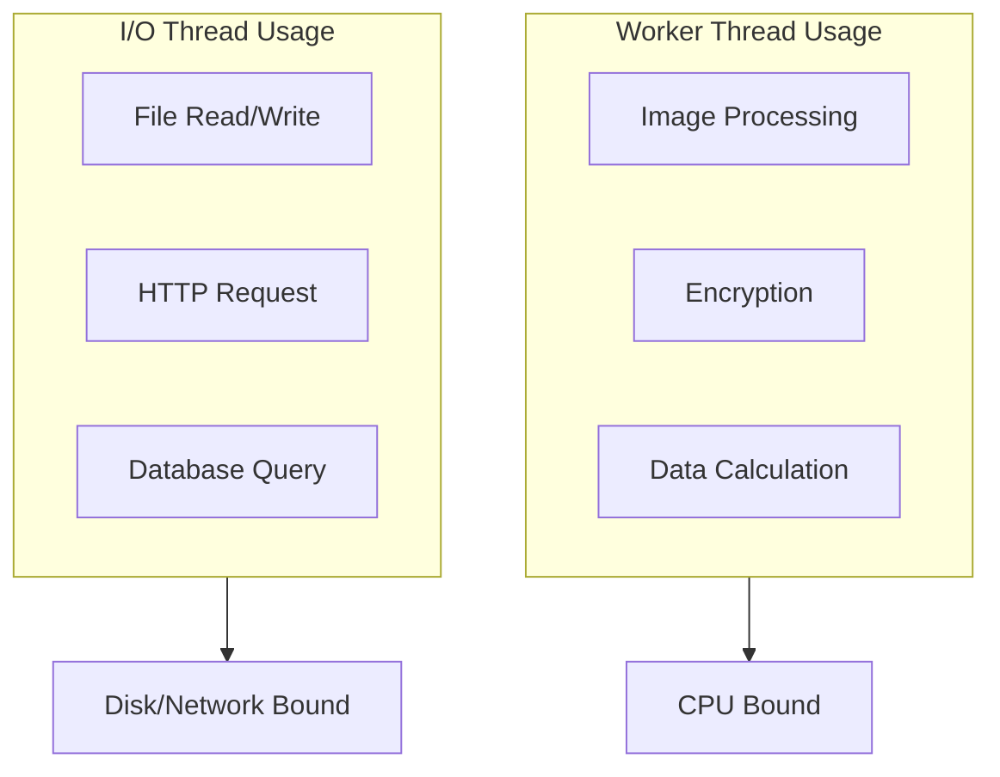

---

## 7. Thread Class

**Question:** What is the Thread class, and how do you use it?

**Answer:** In .NET, `System.Threading.Thread` represents an OS thread. You create a thread, associate it with a delegate (e.g., `ThreadStart`), and call `Start()`.

**Example – Real-Time Scenario (Order Processing):**

```csharp
// Scenario: Process incoming orders on a separate thread so the main UI stays responsive
public class OrderProcessor
{
    private Thread _orderThread;
    private Queue<Order> _orderQueue = new Queue<Order>();
    private bool _running = true;

    public void Start()
    {
        _orderThread = new Thread(ProcessOrders)
        {
            Name = "OrderProcessor",
            IsBackground = false
        };
        _orderThread.Start();
    }

    private void ProcessOrders()
    {
        while (_running)
        {
            Order order = null;
            lock (_orderQueue)
            {
                if (_orderQueue.Count > 0)
                    order = _orderQueue.Dequeue();
            }
            if (order != null)
            {
                ValidateAndShipOrder(order);
            }
            Thread.Sleep(100);
        }
    }

    public void EnqueueOrder(Order order)
    {
        lock (_orderQueue)
        {
            _orderQueue.Enqueue(order);
        }
    }

    private void ValidateAndShipOrder(Order order) { /* ... */ }
}
```

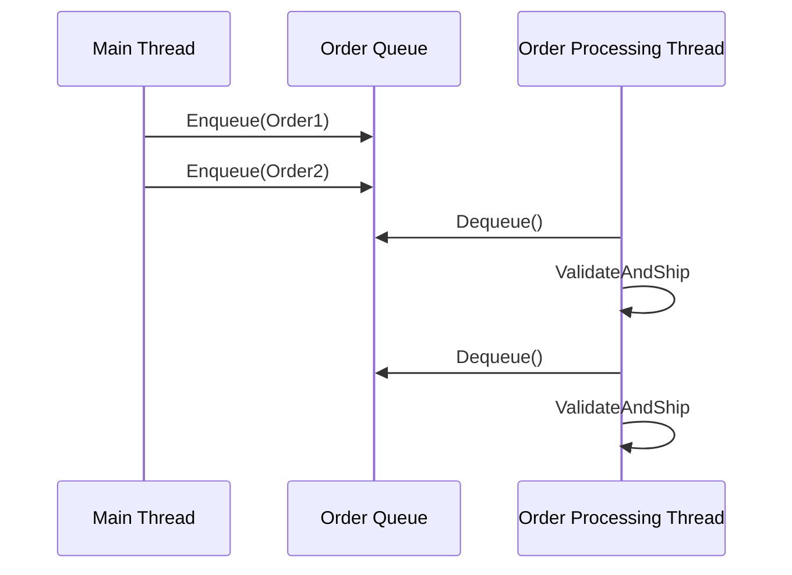

---

## 8. ThreadStart

**Question:** What is ThreadStart?

**Answer:** `ThreadStart` is a delegate that represents a method with no parameters and no return value. It is used to specify what a new thread will execute.

**Signature:**
```csharp
public delegate void ThreadStart();
```

**Example:**
```csharp
void DoWork()
{
    Console.WriteLine($"Thread {Thread.CurrentThread.ManagedThreadId} is working");
}

// Usage
Thread t = new Thread(new ThreadStart(DoWork));
t.Start();

// Or using method group
Thread t2 = new Thread(DoWork);
t2.Start();
```

---

## 9. ParameterizedThreadStart

**Question:** What is ParameterizedThreadStart?

**Answer:** `ParameterizedThreadStart` is a delegate for methods that accept a single `object` parameter. It lets you pass data into the thread method.

**Signature:**
```csharp
public delegate void ParameterizedThreadStart(object obj);
```

**Example:**
```csharp
void ProcessOrder(object data)
{
    var order = (Order)data;
    Console.WriteLine($"Processing order {order.Id}");
}

// Usage
var order = new Order { Id = 12345 };
Thread t = new Thread(new ParameterizedThreadStart(ProcessOrder));
t.Start(order);
```

---

## 10. ThreadPool

**Question:** What is ThreadPool?

**Answer:** The ThreadPool is a pool of reusable worker threads managed by the CLR. Instead of creating new threads for short tasks, you queue work items, and the pool assigns them to available threads.

**Key Points:**
- Reduces overhead of creating/destroying threads
- Automatically adjusts pool size based on load
- Ideal for short, independent tasks
- Don’t use for long-running or blocking tasks that would starve the pool

**Real-Time Scenario – High-Traffic Web Application:**

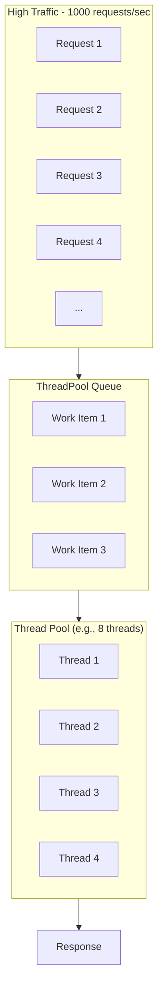

```csharp
// Each incoming HTTP request gets handled by a ThreadPool thread
// ASP.NET Core uses ThreadPool by default for request handling
// When traffic spikes, work items queue up; pool grows within limits
```

---

## 11. Thread vs ThreadPool

**Question:** When should you use Thread vs ThreadPool?

**Answer:**

| Criterion | Thread | ThreadPool |
|-----------|--------|------------|
| **Creation** | Explicit, higher cost | Reused, lower cost |
| **Lifecycle** | You control start/stop | Managed by CLR |
| **Use Case** | Long-running, dedicated work | Short, fire-and-forget tasks |
| **Examples** | Background services, listeners | Request handling, parallel loops |
| **Resource** | One OS thread per instance | Shared pool of threads |

**Rule of thumb:** Use ThreadPool (or TPL) for short tasks; use Thread for long-running, dedicated work that must not block the pool.

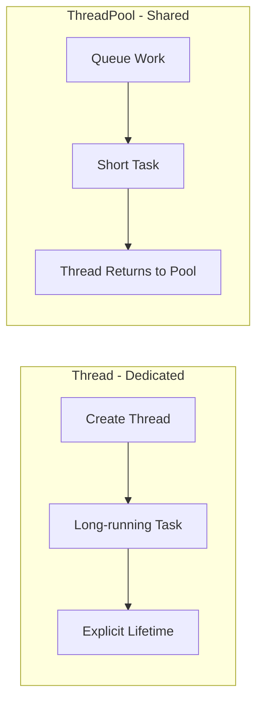

---

## 12. QueueUserWorkItem

**Question:** What is QueueUserWorkItem?

**Answer:** `QueueUserWorkItem` queues a method to run on a ThreadPool thread. It’s a simple way to run work asynchronously without creating a new thread.

**Real-Time Scenario – Report Generation:**

```csharp
// Scenario: User requests a report; we queue generation on ThreadPool
// so the API returns immediately and the report is generated in background

public class ReportService
{
    public string RequestReport(int reportId)
    {
        ThreadPool.QueueUserWorkItem(state =>
        {
            var id = (int)state;
            var report = GenerateHeavyReport(id);
            SaveReportToStorage(report);
            NotifyUserReportReady(id);
        }, reportId);

        return $"Report {reportId} queued for generation";
    }

    private byte[] GenerateHeavyReport(int id) { /* ... */ return null; }
    private void SaveReportToStorage(byte[] report) { /* ... */ }
    private void NotifyUserReportReady(int id) { /* ... */ }
}
```

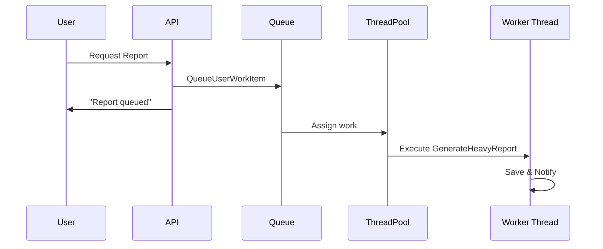

---

## 13. Foreground vs Background Threads

**Question:** What is the difference between Foreground and Background threads?

**Answer:** 
- **Foreground thread:** Keeps the process alive until it finishes. The CLR waits for all foreground threads before shutting down.
- **Background thread:** Does not keep the process alive. When all foreground threads exit, background threads are terminated immediately.

| Type | Process Shutdown | Use Case |
|------|------------------|----------|
| **Foreground** | Waits for thread to complete | Critical work that must finish |
| **Background** | Terminates with process | Non-critical, best-effort work |

**Real-Time Scenario:**

```csharp
// Upload a large file to the server → VERY IMPORTANT → MUST finish
// → Use Foreground Thread
Thread uploadThread = new Thread(UploadLargeFile)
{
    IsBackground = false  // Default - Process won't exit until upload completes
};
uploadThread.Start();

// Write logs to a file every few seconds → not critical → optional
// → Use Background Thread
Thread logThread = new Thread(PeriodicLogWriter)
{
    IsBackground = true  // OK if terminated when app exits
};
logThread.Start();
```

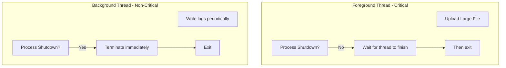

---

## Scenario-Based Question 1: Thread-Safe Counter

**Scenario:** Multiple threads increment a shared counter. Without synchronization, the final count is often wrong. How would you fix this?

```csharp
// Broken code
int _counter = 0;
void Increment() { _counter++; }  // NOT thread-safe!

// Fix options:
// 1. lock
private object _lockObj = new object();
void IncrementSafe()
{
    lock (_lockObj) { _counter++; }
}

// 2. Interlocked (best for simple counter)
void IncrementAtomic()
{
    Interlocked.Increment(ref _counter);
}
```

---

## 14. Synchronization

**Question:** What is Synchronization in multi-threading?

**Answer:** Synchronization is the coordination of multiple threads so they safely access shared resources and avoid race conditions, deadlocks, and inconsistent state.

**Key Concepts:**
- **Race condition:** Outcome depends on timing of thread execution
- **Critical section:** Code that accesses shared data
- **Mutual exclusion:** Only one thread in critical section at a time
- **Atomic operation:** Operation that cannot be partially observed

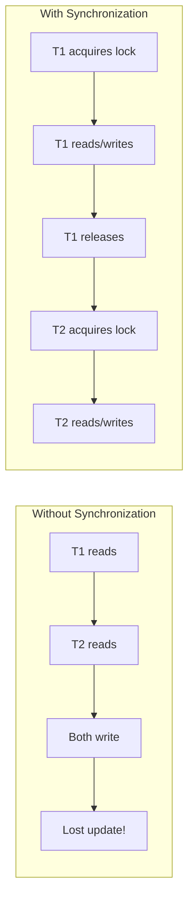

---

## 15. Lock Types: Lock, Monitor, Semaphore, Mutex, SpinLock, ReaderWriterLock

**Question:** Explain the different lock types and when to use each.

**Answer:**

| Lock Type | Scope | Use Case |
|-----------|-------|----------|
| **lock** | Single process | Simple mutual exclusion; sugar for Monitor |
| **Monitor** | Single process | Same as lock; supports Wait/Pulse for signaling |
| **Mutex** | Cross-process | Named mutex for inter-process sync |
| **Semaphore** | Single/cross-process | Limit concurrency (e.g., max N threads) |
| **SemaphoreSlim** | Single process | Lightweight semaphore; preferred in-process |
| **SpinLock** | Single process | Very short critical sections; spins instead of blocking |
| **ReaderWriterLockSlim** | Single process | Many readers, few writers; better than exclusive lock |

**Code Examples:**

```csharp
// 1. lock (Monitor)
lock (_syncObject) { /* critical section */ }

// 2. Monitor (equivalent, more control)
Monitor.Enter(_syncObject);
try { /* critical section */ }
finally { Monitor.Exit(_syncObject); }

// 3. Mutex (cross-process)
using var mutex = new Mutex(false, "Global\\MyAppMutex");
mutex.WaitOne();
try { /* critical section */ }
finally { mutex.ReleaseMutex(); }

// 4. SemaphoreSlim (limit to 3 concurrent)
using var semaphore = new SemaphoreSlim(3, 3);
await semaphore.WaitAsync();
try { /* do work */ }
finally { semaphore.Release(); }

// 5. SpinLock (very short sections)
var spinLock = new SpinLock();
bool taken = false;
spinLock.Enter(ref taken);
try { /* tiny critical section */ }
finally { if (taken) spinLock.Exit(); }

// 6. ReaderWriterLockSlim (read-heavy)
var rwLock = new ReaderWriterLockSlim();
rwLock.EnterReadLock();   // or EnterUpgradeableReadLock, EnterWriteLock
try { /* read shared data */ }
finally { rwLock.ExitReadLock(); }
```

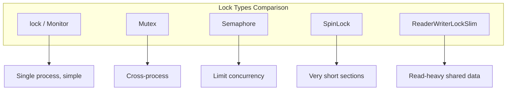

---

## Scenario-Based Question 2: Deadlock

**Scenario:** Thread A holds Lock1 and waits for Lock2; Thread B holds Lock2 and waits for Lock1. The application hangs. How would you fix this?

**Solution:** Acquire locks in a consistent order (e.g., always Lock1 then Lock2) or use `Monitor.TryEnter` with timeout:

```csharp
// Fix: Always acquire in same order
lock (Lock1)
{
    lock (Lock2)
    {
        // work
    }
}

// Or: Use TryEnter with timeout
if (Monitor.TryEnter(Lock1, TimeSpan.FromSeconds(5)))
{
    try
    {
        if (Monitor.TryEnter(Lock2, TimeSpan.FromSeconds(5)))
        {
            try { /* work */ }
            finally { Monitor.Exit(Lock2); }
        }
    }
    finally { Monitor.Exit(Lock1); }
}
```

---

## 16. TPL (Task Parallel Library)

**Question:** What is TPL?

**Answer:** The Task Parallel Library (TPL) is a set of .NET APIs for parallel and asynchronous programming. It provides `Task`, `Task<T>`, `Parallel` classes, and async/await support.

**Key Components:**
- **Task** – Represents an asynchronous operation
- **Task<T>** – Task with a result
- **Parallel.For / ForEach** – Data parallelism
- **PLINQ** – Parallel LINQ
- **async/await** – Async programming model

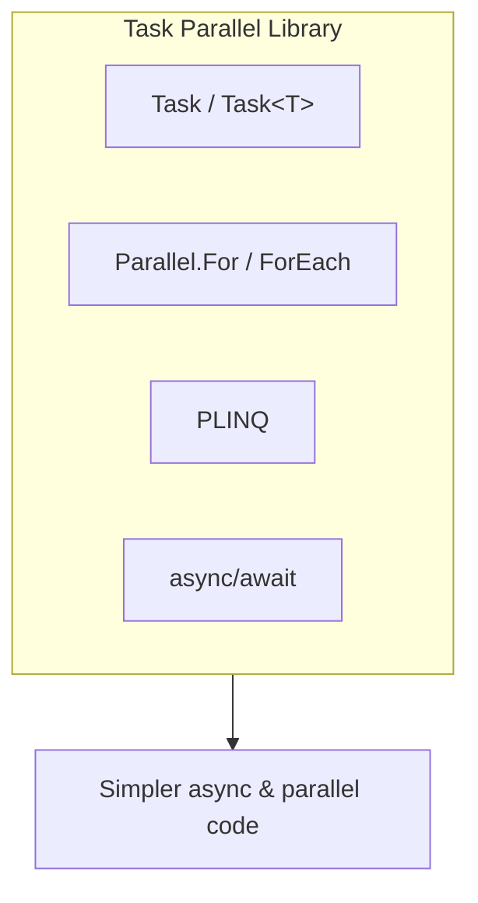

---

## 17. Task vs Task&lt;T&gt;

**Question:** What is the difference between Task and Task&lt;T&gt;?

**Answer:**

| Aspect | Task | Task&lt;T&gt; |
|--------|------|----------------|
| **Return** | void | T (e.g., int, string) |
| **Usage** | Fire-and-forget, no result | Need a result from the operation |
| **Completion** | await task; | var result = await task; |

**Example:**

```csharp
// Task - no return value
Task LogAsync() => Task.Run(() => File.AppendAllText("log.txt", "done"));

// Task<T> - returns a value
Task<int> GetCountAsync() => Task.Run(() => GetRecordCount());

// Usage
await LogAsync();
int count = await GetCountAsync();
```

---

## 18. Task vs Thread

**Question:** What is the difference between Task and Thread?

**Answer:**

| Aspect | Thread | Task |
|--------|--------|------|
| **Abstraction** | OS thread | Work unit (may use ThreadPool) |
| **Resource** | One thread per instance | Shared pool; lightweight |
| **Result** | None directly | Task&lt;T&gt; returns result |
| **Composition** | Manual | await, ContinueWith, WhenAll |
| **Cancellation** | Manual | CancellationToken |
| **Preference** | Rare, legacy | Preferred in modern .NET |

**When to use Task:** Almost always for async/parallel work.  
**When to use Thread:** Long-running dedicated threads (e.g., server listener loop).

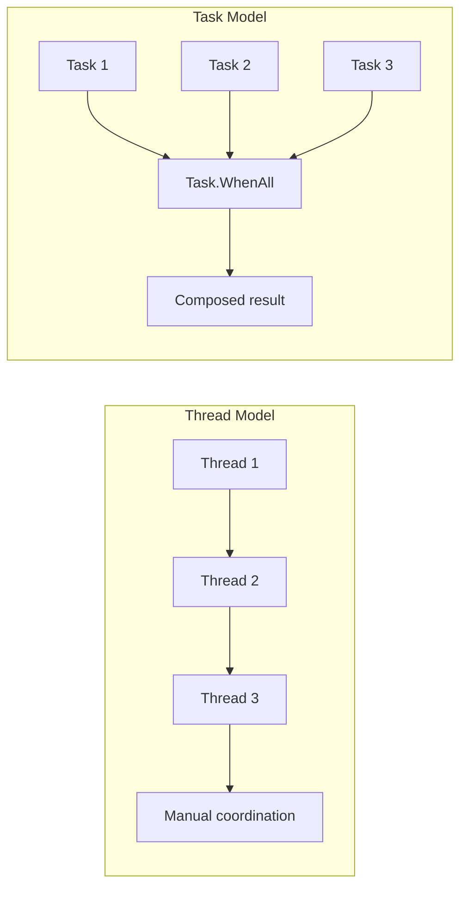

---

## Scenario-Based Question 3: High-Load API

**Scenario:** An API receives 10,000 requests. Each request must call 3 external services and combine the results. Sequential calls are too slow. How would you fix this?

**Solution:** Use `Task.WhenAll` to call the 3 services in parallel:

```csharp
public async Task<CombinedResult> GetDataAsync(int id)
{
    var task1 = CallServiceAAsync(id);
    var task2 = CallServiceBAsync(id);
    var task3 = CallServiceCAsync(id);

    await Task.WhenAll(task1, task2, task3);

    return new CombinedResult
    {
        FromA = await task1,
        FromB = await task2,
        FromC = await task3
    };
}
```

---

## Scenario-Based Question 4: Cancellation

**Scenario:** A long-running operation must be cancellable when the user clicks "Cancel". How would you implement this?

**Solution:** Use `CancellationToken` and pass it through the async chain:

```csharp
public async Task ProcessLargeDatasetAsync(CancellationToken ct = default)
{
    foreach (var item in _dataset)
    {
        ct.ThrowIfCancellationRequested();
        await ProcessItemAsync(item, ct);
    }
}

// Usage
var cts = new CancellationTokenSource();
var task = ProcessLargeDatasetAsync(cts.Token);
// User clicks Cancel:
cts.Cancel();
```

---

## Summary

| Topic | Key Takeaway |
|-------|--------------|
| Processor | Executes instructions; multiple cores enable parallel execution |
| Process | Isolated instance of a program with its own memory |
| Thread | Smallest unit of execution; shares process memory |
| Time Slice | Max CPU time before scheduler switches threads |
| Worker vs I/O Thread | CPU-bound vs I/O-bound; different pooling strategies |
| Thread vs ThreadPool | Use ThreadPool for short tasks; Thread for long-running |
| Foreground vs Background | Foreground keeps process alive; background does not |
| Synchronization | Required for safe access to shared data |
| Lock Types | Choose based on scope, concurrency needs, and usage pattern |
| TPL | Prefer Task/async over raw Thread for most scenarios |
| Task vs Thread | Task is higher-level, composable, and pool-based |

---

*Document generated as a study guide for Multi-Threading and TPL concepts.*
