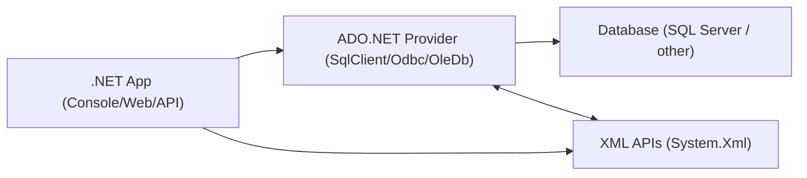
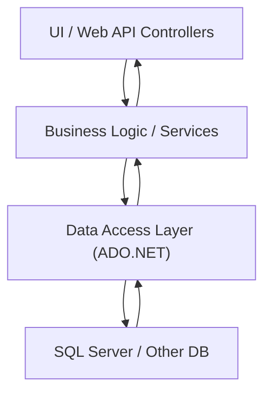
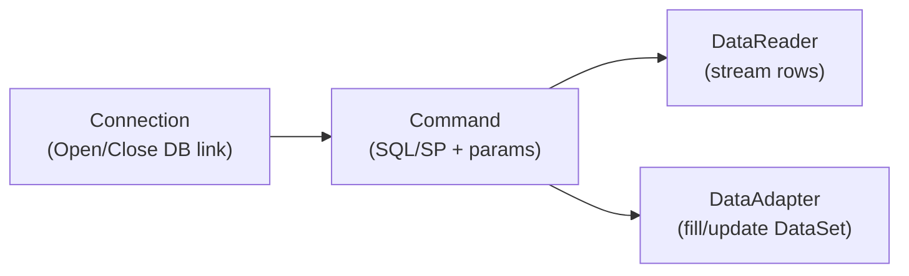
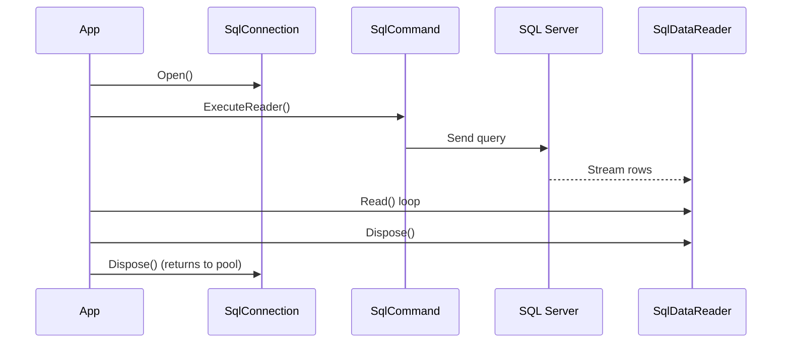
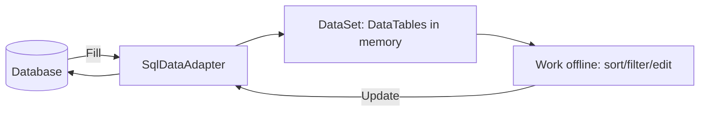
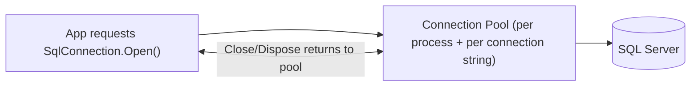
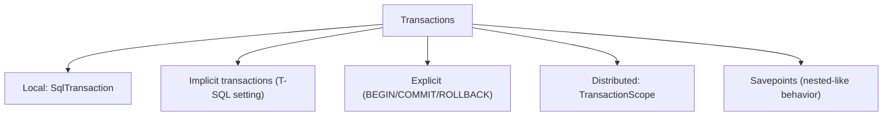
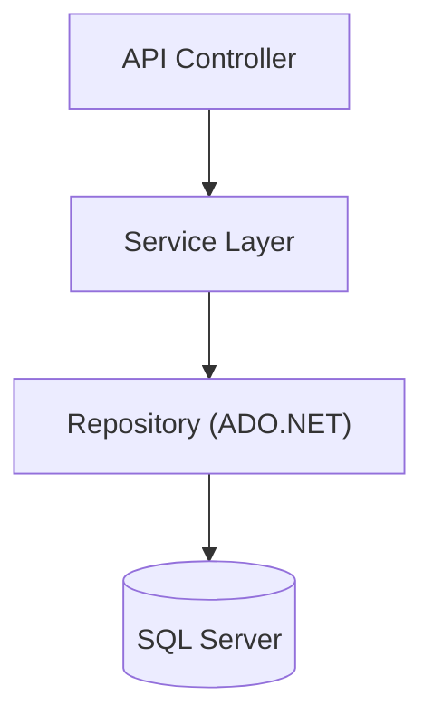

# ADO.NET — Professional Learning Guide

**Enterprise-grade reference** for .NET data access using ADO.NET: architecture, providers, connectivity, commands, security, transactions, and performance. Includes **copy-ready C# examples** and **Mermaid** diagrams. All code samples use the **sample database** defined in the setup scripts below.

---

## Table of Contents

| Phase | Topic |
|-------|--------|
| **Prerequisites** | [Database setup](#prerequisites--database-setup) |
| 1 | [What is ADO.NET?](#1-what-is-adonet) · [Architecture](#2-architecture-overview) · [Data providers](#3-net-data-providers) · [Namespaces](#6-namespaces) · [Internal flow](#7-how-adonet-works-internally) |
| 2 | [Core components](#phase-2--core-adonet-components-sql-server): SqlConnection, SqlCommand, SqlDataReader, SqlDataAdapter, DataSet, DataTable, SqlParameter, SqlTransaction |
| 3 | [Connectivity](#phase-3--connectivity--configuration): Connected vs disconnected, [connection strings](#17-connection-strings), [authentication](#18-authentication-methods), [connection pooling](#19-connection-pooling) |
| 4 | [Commands](#phase-4--commands--execution): ExecuteNonQuery/Reader/Scalar/XmlReader, command types, CommandTimeout, CommandBehavior |
| 5 | [Data retrieval](#phase-5--data-retrieval-approaches): SqlDataReader (async, multiple result sets), DataSet & DataAdapter (Fill, Update, relations, XML) |
| 6 | [Security](#phase-6--security): SQL injection, parameterized queries, output/return/TVP |
| 7 | [Transactions](#phase-7--transactions): ACID, local/distributed, isolation levels |
| 8 | [Advanced](#phase-8--advanced-adonet-topics): Async, SqlBulkCopy, stored procedures, XML/JSON, large data, error handling |
| 9 | [Performance & practices](#phase-9--performance--best-practices) |
| 10 | [Architecture](#phase-10--architecture--real-world-usage): Web API, repository, DI, logging, testing |
| — | [Limitations & alternatives](#ado-net-limitations--alternatives) · [References](#references) |

---

## Prerequisites — Database Setup

All examples in this guide assume the following **sample database and objects** exist. Run the script **once** before executing any C# code.

**Script location:** [`AdoNetSampleDatabase.sql`](AdoNetSampleDatabase.sql)

**What it creates:**

| Object | Purpose |
|--------|---------|
| Database `AdoNetSample` | Isolated database for labs |
| `dbo.Customers` | Id, Name, Email, City, Country, CreatedAt — CRUD, filtering, relations |
| `dbo.Orders` | Id, CustomerId, OrderNumber, OrderDate, TotalAmount, Status — multi-table, DataRelation |
| `dbo.Accounts` | Id, AccountName, Balance — transaction (transfer) examples |
| `dbo.Files` | Id, FileName, ContentType, Content (VARBINARY(MAX)) — BLOB/streaming |
| `dbo.ApplicationUsers` | Id, UserName, DisplayName, IsActive — SQL injection / parameterized examples |
| `usp_GetCustomerById` | Input parameter, single result set |
| `usp_GetDashboardData` | Multiple result sets |
| `usp_GetCustomerCountByCity` | Output parameter |
| `usp_TransferBalance` | Inputs, output message, return code, internal transaction |
| `usp_GetCustomersByIds` | Table-valued parameter (dbo.IdList) |

**How to run:** In **SQL Server Management Studio** or **Azure Data Studio**, open `AdoNetSampleDatabase.sql`, connect to your instance (local or Azure SQL), and execute the full script.

**Connection string used in examples:**

```text
Server=.;Database=AdoNetSample;Integrated Security=True;TrustServerCertificate=True;
```

For Azure SQL, use your server name and enable `Encrypt=True` (see [Authentication](#18-authentication-methods)).

---

## 1) What is ADO.NET?

**ADO.NET** provides a rich set of components for creating distributed, data-sharing applications. It is an integral part of the .NET Framework and provides access to:

- **Relational data** (SQL Server, etc.)
- **XML data**
- Data exposed through **OLE DB** and **ODBC**

**Key assemblies and integration**

- ADO.NET classes live in **`System.Data.dll`**
- ADO.NET is integrated with XML classes in **`System.Xml.dll`**



---

## 2) Architecture Overview

ADO.NET is typically used from a **Data Access Layer (DAL)**, which the rest of the application calls.



---

## 3) .NET Data Providers

A **.NET Framework data provider** is used for:

- Connecting to a database
- Executing commands
- Retrieving results

**Official docs**: `https://learn.microsoft.com/en-us/dotnet/framework/data/adonet/data-providers`

### 3.1 Core Objects of a Data Provider

Every provider is built around four core objects:



- **Connection**: `SqlConnection`, `OdbcConnection`, `OleDbConnection`
- **Command**: `SqlCommand`, `OdbcCommand`, `OleDbCommand`
- **DataReader**: `SqlDataReader`, `OdbcDataReader`, `OleDbDataReader`
- **DataAdapter**: `SqlDataAdapter`, `OdbcDataAdapter`, `OleDbDataAdapter`

---

## 4) Managed Providers

**Managed provider**: implemented in managed .NET code, integrates cleanly with .NET runtime services (exceptions, GC, etc.). A provider can still rely on native drivers underneath (e.g., ODBC driver manager), but your app uses a consistent .NET surface area.

---

## 5) Provider Types (ODBC, OLE DB, SQL Server)

### 5.1 ODBC Provider (`System.Data.Odbc`)

**ODBC** (Open Database Connectivity) is Microsoft’s strategic interface for accessing data in a heterogeneous environment of relational and non-relational DBMS systems.

- The .NET ODBC provider uses the **native ODBC Driver Manager (DM)** to enable data access.
- Namespace: **`System.Data.Odbc`**
- Reference: `https://learn.microsoft.com/en-us/dotnet/api/system.data.odbc?view=net-8.0`

**ODBC driver + DSN**

- ODBC is an industry-wide standard interface for accessing table-like data.
- Each database vendor provides an ODBC driver for their DB.

**Create a DSN (Windows)**

- Search for **ODBC Data Sources**
- Select the target **DSN type** (User/System) and click **Add**
- Select the driver
- Provide connection details
- Click **OK**, then verify the DSN appears in the list

**ODBC connection string example (SQL Server)**

```csharp
using System.Data.Odbc;

var connection = new OdbcConnection(
    "Driver={SQL Server};Server=myServerAddress;Database=myDataBase;UID=myUsername;PWD=myPassword;");
```

### 5.2 OLE DB Provider (`System.Data.OleDb`)

The .NET OLE DB provider uses **native OLE DB through COM interop** to enable data access.

Namespace: **`System.Data.OleDb`**

Common OleDB drivers (from the source notes):

- `SQLOLEDB` — Microsoft OLE DB provider for SQL Server
- `MSDAORA` — Microsoft OLE DB provider for Oracle
- `Microsoft.Jet.OLEDB.4.0` — OLE DB provider for Microsoft Jet

### 5.3 SQL Server Provider (SqlClient)

The SQL Server provider (`SqlClient`) uses its **own protocol** to communicate with SQL Server.

- Lightweight and performant
- Optimized to access SQL Server directly (no extra OLE DB/ODBC layer)

Namespace:

```csharp
using System.Data.SqlClient; // or Microsoft.Data.SqlClient (recommended for newer apps)
```

---

## 6) Namespaces You’ll Use Most

- **`System.Data`**
  - Common ADO.NET types: `DataSet`, `DataTable`, `DataRow`, `DataColumn`, `DataView`, and base `Db*` types.
- **`System.Data.SqlClient`** (classic)
  - SQL Server types: `SqlConnection`, `SqlCommand`, `SqlDataReader`, `SqlParameter`, `SqlTransaction`, `SqlDataAdapter`, `SqlBulkCopy`.
- **`System.Xml`**
  - XML parsing and processing; ADO.NET can serialize `DataSet` to XML.

---

## 7) How ADO.NET Works Internally (Conceptual)

### 7.1 Connected approach (DataReader)

The **DataReader** is the connected approach:

- Reads data **line by line**
- Uses a buffer
- **Forward-only**, **read-only**
- Keeps the connection open during reading



### 7.2 Disconnected approach (DataSet + DataAdapter)

The **DataSet** + **DataAdapter** is the disconnected approach:

- DataAdapter opens a connection temporarily
- Loads data into `DataSet` (in-memory)
- Connection closes
- App manipulates data offline
- App reconnects later to update DB

**Important notes (from the source)**

- One **DataSet** is a **collection of tables**
- Tables can come from **different data sources** (RDBMS, XML, internal tables)
- Relationships can be created between tables



---

## PHASE 2 — Core ADO.NET Components (SQL Server)

All examples use the **AdoNetSample** database and tables created by [`AdoNetSampleDatabase.sql`](AdoNetSampleDatabase.sql). The same patterns apply to ODBC/OLE DB with their equivalent types.

**Shared connection string for this section:**

```csharp
private const string ConnectionString =
    "Server=.;Database=AdoNetSample;Integrated Security=True;TrustServerCertificate=True;";
```

### 8) SqlConnection

Open a connection, verify state, and ensure disposal so the connection returns to the pool.

```csharp
using System;
using System.Data.SqlClient;

using (var connection = new SqlConnection(ConnectionString))
{
    connection.Open();
    Console.WriteLine($"Connection state: {connection.State}, Server: {connection.DataSource}");
}
```

### 9) SqlCommand — Insert with parameters

Use **parameterized** commands for all user input (see [Security](#24-sql-injection)).

```csharp
using System.Data;
using System.Data.SqlClient;

public static int InsertCustomer(string connectionString, string name, string email, string city, string country)
{
    const string sql = @"
        INSERT INTO dbo.Customers (Name, Email, City, Country)
        VALUES (@Name, @Email, @City, @Country);
        SELECT CAST(SCOPE_IDENTITY() AS INT);";

    using var connection = new SqlConnection(connectionString);
    using var command = new SqlCommand(sql, connection);

    command.Parameters.Add("@Name",    SqlDbType.NVarChar, 100).Value = name;
    command.Parameters.Add("@Email",   SqlDbType.NVarChar, 255).Value = (object?)email ?? DBNull.Value;
    command.Parameters.Add("@City",    SqlDbType.NVarChar, 100).Value = (object?)city ?? DBNull.Value;
    command.Parameters.Add("@Country", SqlDbType.NVarChar, 100).Value = (object?)country ?? DBNull.Value;

    connection.Open();
    return (int)command.ExecuteScalar();
}
```

### 10) SqlDataReader — Forward-only, read-only stream

Prefer **column index** or **GetOrdinal** in hot paths for performance; handle `DBNull` for nullable columns.

```csharp
using System;
using System.Collections.Generic;
using System.Data;
using System.Data.SqlClient;

public static List<(int Id, string Name, string? City)> GetCustomers(string connectionString)
{
    const string sql = "SELECT Id, Name, City FROM dbo.Customers ORDER BY Name;";
    var list = new List<(int, string, string?)>();

    using var connection = new SqlConnection(connectionString);
    using var command = new SqlCommand(sql, connection);
    connection.Open();

    using var reader = command.ExecuteReader();
    var colId   = reader.GetOrdinal("Id");
    var colName = reader.GetOrdinal("Name");
    var colCity = reader.GetOrdinal("City");

    while (reader.Read())
    {
        var id   = reader.GetInt32(colId);
        var name = reader.GetString(colName);
        var city = reader.IsDBNull(colCity) ? null : reader.GetString(colCity);
        list.Add((id, name, city));
    }

    return list;
}
```

### 11) SqlDataAdapter — Fill DataTable

Adapter manages connection open/close around `Fill`/`Update`; no need to hold the connection open.

```csharp
using System.Data;
using System.Data.SqlClient;

public static DataTable GetCustomersTable(string connectionString)
{
    const string sql = "SELECT Id, Name, Email, City, Country, CreatedAt FROM dbo.Customers;";
    var table = new DataTable("Customers");

    using (var adapter = new SqlDataAdapter(sql, connectionString))
    {
        adapter.Fill(table);
    }

    return table;
}
```

### 12) DataSet — Multiple tables and table mappings

Use **TableMappings** so `ds.Tables["Customers"]` and `ds.Tables["Orders"]` are named correctly.

```csharp
using System.Data;
using System.Data.SqlClient;

public static DataSet GetCustomersAndOrders(string connectionString)
{
    const string sql = "SELECT * FROM dbo.Customers; SELECT * FROM dbo.Orders;";
    var ds = new DataSet();

    using (var adapter = new SqlDataAdapter(sql, connectionString))
    {
        adapter.TableMappings.Add("Table",  "Customers");
        adapter.TableMappings.Add("Table1", "Orders");
        adapter.Fill(ds);
    }

    return ds;
}
```

### 13) DataTable, DataRow, DataColumn, DataView

Build in-memory tables, add rows, and apply **DataView** for filtering and sorting without hitting the database.

```csharp
using System.Data;

// Create schema
var table = new DataTable("Customers");
table.Columns.Add("Id",   typeof(int));
table.Columns.Add("Name", typeof(string));
table.Columns.Add("City", typeof(string));

// Add rows
var row = table.NewRow();
row["Id"]   = 1;
row["Name"] = "Contoso Ltd";
row["City"] = "London";
table.Rows.Add(row);

// Filtered/sorted view (e.g. for binding to UI)
var view = new DataView(table)
{
    RowFilter = "City = 'London'",
    Sort      = "Name ASC"
};
```

### 14) SqlParameter — Typed parameters

Prefer **Add(name, SqlDbType, size)** over `AddWithValue` for stable query plans and correct types.

```csharp
using System.Data;
using System.Data.SqlClient;

public static void ListCustomersByCity(string connectionString, string city)
{
    const string sql = "SELECT Id, Name, City, Country FROM dbo.Customers WHERE City = @City;";

    using var connection = new SqlConnection(connectionString);
    using var command = new SqlCommand(sql, connection);
    command.Parameters.Add("@City", SqlDbType.NVarChar, 100).Value = city;

    connection.Open();
    using var reader = command.ExecuteReader();
    while (reader.Read())
    {
        Console.WriteLine($"{reader.GetInt32(0)} | {reader.GetString(1)} | {reader.GetString(2)}");
    }
}
```

### 15) SqlTransaction — Explicit local transaction

Use the **same connection** and pass the **transaction** into every command. Commit only after all steps succeed; otherwise roll back.

```csharp
using System.Data.SqlClient;

public static void TransferBalance(string connectionString, int fromAccountId, int toAccountId, decimal amount)
{
    using var connection = new SqlConnection(connectionString);
    connection.Open();

    using var transaction = connection.BeginTransaction();
    try
    {
        using (var debit = new SqlCommand(
            "UPDATE dbo.Accounts SET Balance = Balance - @Amount WHERE Id = @Id;", connection, transaction))
        {
            debit.Parameters.AddWithValue("@Amount", amount);
            debit.Parameters.AddWithValue("@Id", fromAccountId);
            debit.ExecuteNonQuery();
        }

        using (var credit = new SqlCommand(
            "UPDATE dbo.Accounts SET Balance = Balance + @Amount WHERE Id = @Id;", connection, transaction))
        {
            credit.Parameters.AddWithValue("@Amount", amount);
            credit.Parameters.AddWithValue("@Id", toAccountId);
            credit.ExecuteNonQuery();
        }

        transaction.Commit();
    }
    catch
    {
        transaction.Rollback();
        throw;
    }
}
```

---

## PHASE 3 — Connectivity & Configuration

### 16) Connected vs Disconnected: When to use which?

**Connected architecture (SqlDataReader)**

- Best for: fast forward-only reads, low memory, streaming large results
- Trade-off: keeps connection open while reading

**Disconnected architecture (DataSet + DataAdapter)**

- Best for: offline work, UI binding, complex in-memory filtering/sorting, multiple tables and relations
- Trade-off: more memory; possible synchronization/concurrency complexity

#### Disconnected approach — advantages (from the source notes)

- Minimizes database load and network traffic (connect only when needed)
- Supports offline work + updating later
- Represents relational data (tables, relations, views) in memory
- Supports sorting/filtering/searching
- Handles multiple tables
- Relationships between tables
- Strong XML support (`ReadXml`, `WriteXml`)
- Serialization for transport across layers
- Batch updates via adapters/table adapters
- Can manage concurrency (multiple versions)

#### Disconnected approach — disadvantages (from the source notes)

- Memory consumption can be high for large datasets
- Synchronization issues if source changes frequently
- Concurrency issues (multi-user changes require careful handling)
- More complex update code
- Potential redundancy/security concerns (data copies exist in multiple places)

#### Alternatives (from the source notes)

- **DataReader** (connected, low memory)
- **LINQ to SQL / Entity Framework** (ORM)
- **Dapper** (micro-ORM, built on ADO.NET)

---

### 17) Connection Strings

#### Structure (common parts)

```text
Server=.;Database=AdoNetSample;Integrated Security=True;Encrypt=True;TrustServerCertificate=True;
```

Useful keywords:

- `Server` / `Data Source`
- `Database` / `Initial Catalog`
- `Integrated Security=True` (Windows auth)
- `User ID=...;Password=...` (SQL auth)
- `Encrypt=True/False`
- `TrustServerCertificate=True/False`
- `Pooling=True`
- `Min Pool Size=0;Max Pool Size=100`
- `Connection Timeout=15`

#### Store in `app.config` (Desktop / Console .NET Framework)

```xml
<configuration>
  <connectionStrings>
    <add name="DefaultConnection"
         connectionString="Server=.;Database=AdoNetSample;Integrated Security=True;TrustServerCertificate=True;"
         providerName="System.Data.SqlClient" />
  </connectionStrings>
</configuration>
```

#### Store in `web.config` (ASP.NET)

```xml
<configuration>
  <connectionStrings>
    <add name="DefaultConnection"
         connectionString="Server=.;Database=AdoNetSample;Integrated Security=True;TrustServerCertificate=True;"
         providerName="System.Data.SqlClient" />
  </connectionStrings>
</configuration>
```

#### Store in `appsettings.json` (.NET / ASP.NET Core)

```json
{
  "ConnectionStrings": {
    "DefaultConnection": "Server=.;Database=AdoNetSample;Integrated Security=True;TrustServerCertificate=True;"
  }
}
```

#### Encrypting connection strings (classic ASP.NET / web.config)

From an elevated command prompt:

```powershell
aspnet_regiis -pef "connectionStrings" "C:\Path\To\YourWebApp"
```

#### Read using `ConfigurationManager` (.NET Framework)

```csharp
using System.Configuration;

string cs = ConfigurationManager.ConnectionStrings["DefaultConnection"].ConnectionString;
```

#### Read using `IConfiguration` (.NET / ASP.NET Core)

```csharp
public class MyRepo
{
    private readonly string _cs;
    public MyRepo(IConfiguration config)
    {
        _cs = config.GetConnectionString("DefaultConnection");
    }
}
```

---

### 18) Authentication Methods

#### Windows Authentication

```text
Server=.;Database=AdoNetSample;Integrated Security=True;TrustServerCertificate=True;
```

#### SQL Server Authentication

```text
Server=.;Database=AdoNetSample;User ID=AppUser;Password=StrongPassword!;TrustServerCertificate=True;
```

#### Azure SQL

Use encryption and your Azure server/database name:

```text
Server=yourserver.database.windows.net;Database=AdoNetSample;
User ID=...;Password=...;Encrypt=True;TrustServerCertificate=False;
```

---

### 19) Connection Pooling

Connection pooling is a method used to manage and reuse DB connections to enhance performance and scalability.

**How it works (from the source notes)**

- When your app requests a connection, it is served from the pool (if possible).
- When your app closes a connection, the connection is returned to the pool (not physically closed).
- By default, SQL Server connection pooling is **enabled**.



**Common pooling settings**

```text
Pooling=True;Min Pool Size=0;Max Pool Size=100;Connection Timeout=15;
```

Notes (from the source):

- `Max Pool Size`: max connections in the pool (default often 100).
- `Min Pool Size`: minimum connections kept open (default often 0).
- `Connection Timeout`: how long to wait for a connection before error (default often 15s).

**Clear pools**

```csharp
using System.Data.SqlClient;

SqlConnection.ClearAllPools();
```

---

## PHASE 4 — Commands & Execution

### 20) SqlCommand execution methods

#### ExecuteNonQuery()

- `INSERT`, `UPDATE`, `DELETE`, DDL

```csharp
int rows = command.ExecuteNonQuery();
```

#### ExecuteReader()

```csharp
using (var reader = command.ExecuteReader())
{
    while (reader.Read()) { }
}
```

#### ExecuteScalar()

```csharp
object value = command.ExecuteScalar();
```

#### ExecuteXmlReader()

```csharp
using (var xml = command.ExecuteXmlReader())
{
    while (xml.Read()) { }
}
```

---

### 21) Command types and important options

#### Text commands

```csharp
command.CommandType = System.Data.CommandType.Text;
command.CommandText = "SELECT * FROM Customers WHERE Id = @Id;";
```

#### Stored procedures

```csharp
command.CommandType = System.Data.CommandType.StoredProcedure;
command.CommandText = "usp_GetCustomer";
```

#### Table-valued functions (commonly invoked as text)

```csharp
command.CommandType = System.Data.CommandType.Text;
command.CommandText = "SELECT * FROM dbo.GetCustomersByCity(@City);";
```

#### CommandTimeout

```csharp
command.CommandTimeout = 30; // seconds
```

#### CommandBehavior (reader)

```csharp
using (var reader = command.ExecuteReader(System.Data.CommandBehavior.SequentialAccess))
{
}
```

Common behaviors:

- `CloseConnection`
- `SingleRow`
- `SingleResult`
- `SequentialAccess` (large data streaming)

---

## PHASE 5 — Data Retrieval Approaches

### 22) SqlDataReader deep dive (Connected)

- **Forward-only**, **read-only** — ideal for streaming and report-style reads.
- **Low memory**: one row in the buffer at a time.
- **Connection must stay open** for the duration of the read.

#### Async reading with CancellationToken

```csharp
using System.Data.SqlClient;

public static async Task<List<string>> GetCustomerNamesAsync(
    string connectionString, CancellationToken cancellationToken = default)
{
    const string sql = "SELECT Name FROM dbo.Customers ORDER BY Name;";
    var names = new List<string>();

    await using var connection = new SqlConnection(connectionString);
    await using var command = new SqlCommand(sql, connection);
    await connection.OpenAsync(cancellationToken);

    await using var reader = await command.ExecuteReaderAsync(cancellationToken);
    while (await reader.ReadAsync(cancellationToken))
    {
        names.Add(reader.GetString(0));
    }

    return names;
}
```

#### Multiple result sets (e.g. from `usp_GetDashboardData`)

```csharp
using System.Data.SqlClient;

public static void ReadDashboardData(string connectionString)
{
    using var connection = new SqlConnection(connectionString);
    using var command = new SqlCommand("dbo.usp_GetDashboardData", connection);
    command.CommandType = System.Data.CommandType.StoredProcedure;

    connection.Open();
    using var reader = command.ExecuteReader();

    // First result set: recent customers
    while (reader.Read())
    {
        Console.WriteLine($"Customer: {reader["Name"]}, City: {reader["City"]}");
    }

    // Second result set: recent orders
    if (reader.NextResult())
    {
        while (reader.Read())
        {
            Console.WriteLine($"Order: {reader["OrderNumber"]}, Total: {reader["TotalAmount"]}");
        }
    }
}
```

---

### 23) DataSet & DataAdapter deep dive (Disconnected)

#### Fill() with table mappings

```csharp
using System.Data;
using System.Data.SqlClient;

var ds = new DataSet();
const string sql = "SELECT * FROM dbo.Customers; SELECT * FROM dbo.Orders;";

using (var adapter = new SqlDataAdapter(sql, connectionString))
{
    adapter.TableMappings.Add("Table",  "Customers");
    adapter.TableMappings.Add("Table1", "Orders");
    adapter.Fill(ds);
}

// Access by name
DataTable customers = ds.Tables["Customers"];
DataTable orders    = ds.Tables["Orders"];
```

#### DataRelation and navigation

```csharp
ds.Relations.Add("Customer_Orders",
    customers.Columns["Id"],
    orders.Columns["CustomerId"]);

foreach (DataRow custRow in customers.Rows)
{
    var orderRows = custRow.GetChildRows("Customer_Orders");
    Console.WriteLine($"Customer {custRow["Name"]} has {orderRows.Length} order(s).");
}
```

#### Update() with SqlCommandBuilder

```csharp
using System.Data;
using System.Data.SqlClient;

var table = new DataTable();
using (var adapter = new SqlDataAdapter(
    "SELECT Id, Name, Email, City, Country FROM dbo.Customers;", connectionString))
{
    adapter.Fill(table);
    table.Rows[0]["City"] = "Manchester";

    var builder = new SqlCommandBuilder(adapter);
    adapter.UpdateCommand = builder.GetUpdateCommand();
    int updated = adapter.Update(table);
}
```

#### DataView — filter and sort in memory

```csharp
var view = new DataView(ds.Tables["Customers"])
{
    RowFilter = "Country = 'United Kingdom'",
    Sort      = "Name ASC"
};
```

#### XML serialization and Merge

```csharp
ds.WriteXml("customers_orders.xml", XmlWriteMode.WriteSchema);

var ds2 = new DataSet();
ds2.ReadXml("customers_orders.xml");

ds.Tables["Customers"].AcceptChanges();  // Mark current rows as unchanged
ds.Tables["Customers"].RejectChanges(); // Discard pending changes
ds.Merge(ds2);                          // Merge another DataSet
```

---

## PHASE 6 — Security

### 24) SQL Injection

SQL injection occurs when **untrusted input** is concatenated into SQL, allowing arbitrary statement execution (data theft, modification, or privilege escalation).

#### Vulnerable code (do not use)

```csharp
// BAD: user input concatenated into SQL (uses ApplicationUsers table)
string sql = "SELECT * FROM dbo.ApplicationUsers WHERE UserName = '" + userInput + "'";
```

If `userInput` is `' OR '1'='1`, the effective predicate becomes `WHERE UserName = '' OR '1'='1'`, which is always true and can return every row.

---

### 25) Parameterized Queries and Stored Procedures (Mitigation)

**Rule:** Never embed user input in SQL text. Use **parameters** or **stored procedures** only.

#### Safe parameterized query (ApplicationUsers)

```csharp
using System.Data;
using System.Data.SqlClient;

public static DataTable GetUserByUserName(string connectionString, string userName)
{
    const string sql = "SELECT Id, UserName, DisplayName, IsActive FROM dbo.ApplicationUsers WHERE UserName = @UserName;";
    var table = new DataTable();

    using var connection = new SqlConnection(connectionString);
    using var command = new SqlCommand(sql, connection);
    command.Parameters.Add("@UserName", SqlDbType.NVarChar, 50).Value = userName;

    using var adapter = new SqlDataAdapter(command);
    adapter.Fill(table);
    return table;
}
```

#### Add vs AddWithValue

- **Prefer** `command.Parameters.Add("@Name", SqlDbType.NVarChar, 100).Value = value` for explicit type/size and stable query plans.
- **Avoid** `AddWithValue` for non-trivial apps: it can infer wrong types (e.g. string as NVARCHAR(1)) and hurt performance.

#### Stored procedure with output parameter (`usp_GetCustomerCountByCity`)

```csharp
using System.Data;
using System.Data.SqlClient;

public static int GetCustomerCountByCity(string connectionString, string city)
{
    using var connection = new SqlConnection(connectionString);
    using var command = new SqlCommand("dbo.usp_GetCustomerCountByCity", connection);
    command.CommandType = CommandType.StoredProcedure;

    command.Parameters.Add("@City", SqlDbType.NVarChar, 100).Value = city;
    var outParam = new SqlParameter("@Count", SqlDbType.Int) { Direction = ParameterDirection.Output };
    command.Parameters.Add(outParam);

    connection.Open();
    command.ExecuteNonQuery();
    return (int)outParam.Value;
}
```

#### Stored procedure with return value and output message (`usp_TransferBalance`)

```csharp
using System.Data;
using System.Data.SqlClient;

public static bool TransferBalance(string connectionString, int fromId, int toId, decimal amount, out string? errorMessage)
{
    errorMessage = null;

    using var connection = new SqlConnection(connectionString);
    using var command = new SqlCommand("dbo.usp_TransferBalance", connection);
    command.CommandType = CommandType.StoredProcedure;

    command.Parameters.Add("@FromAccountId", SqlDbType.Int).Value = fromId;
    command.Parameters.Add("@ToAccountId",   SqlDbType.Int).Value = toId;
    command.Parameters.Add("@Amount",       SqlDbType.Decimal, 18).Value = amount;
    command.Parameters.Add("@ErrorMessage", SqlDbType.NVarChar, 500).Direction = ParameterDirection.Output;

    var returnParam = new SqlParameter("@Return", SqlDbType.Int) { Direction = ParameterDirection.ReturnValue };
    command.Parameters.Add(returnParam);

    connection.Open();
    command.ExecuteNonQuery();

    int result = (int)returnParam.Value!;
    errorMessage = command.Parameters["@ErrorMessage"].Value as string;
    return result == 0;
}
```

#### Table-valued parameter (`usp_GetCustomersByIds`)

```csharp
using System.Data;
using System.Data.SqlClient;

public static DataTable GetCustomersByIds(string connectionString, IEnumerable<int> ids)
{
    var idTable = new DataTable();
    idTable.Columns.Add("Id", typeof(int));
    foreach (var id in ids)
        idTable.Rows.Add(id);

    var result = new DataTable();
    using var connection = new SqlConnection(connectionString);
    using var command = new SqlCommand("dbo.usp_GetCustomersByIds", connection);
    command.CommandType = CommandType.StoredProcedure;

    var tvp = command.Parameters.AddWithValue("@Ids", idTable);
    tvp.SqlDbType = SqlDbType.Structured;
    tvp.TypeName = "dbo.IdList";

    using var adapter = new SqlDataAdapter(command);
    adapter.Fill(result);
    return result;
}
```

---

## PHASE 7 — Transactions

### 26) Transaction programming + ACID (from the source notes)

**Transaction**: a single logical unit of work with one or more SQL statements.

**ACID properties**

- **Atomicity**: all succeed or all fail (rollback on failure)
- **Consistency**: transaction moves DB from one valid state to another
- **Isolation**: concurrent transactions behave as if executed sequentially (depending on isolation level)
- **Durability**: committed work remains even after system failure (via transaction log)

Typical lifecycle:

- Begin transaction
- Execute SQL commands
- Commit if no errors
- Rollback if errors

### 27) Transaction types (overview)



### 28) Isolation levels (what they mean)

- **Read Uncommitted**: allows dirty reads
- **Read Committed**: default; prevents dirty reads
- **Repeatable Read**: prevents changes to rows you read
- **Serializable**: strongest locking; can reduce concurrency
- **Snapshot**: uses row versioning to reduce blocking (DB setting required)

---

## PHASE 8 — Advanced ADO.NET Topics

### 29) Asynchronous ADO.NET

Use **OpenAsync**, **ExecuteReaderAsync**, **ExecuteNonQueryAsync**, **ExecuteScalarAsync** with **CancellationToken** so long-running or parallel work can be cancelled and does not block threads.

```csharp
using System.Data;
using System.Data.SqlClient;

public static async Task<int> InsertCustomerAsync(
    string connectionString,
    string name, string? email, string? city, string? country,
    CancellationToken cancellationToken = default)
{
    const string sql = @"
        INSERT INTO dbo.Customers (Name, Email, City, Country)
        VALUES (@Name, @Email, @City, @Country);
        SELECT CAST(SCOPE_IDENTITY() AS INT);";

    await using var connection = new SqlConnection(connectionString);
    await using var command = new SqlCommand(sql, connection);

    command.Parameters.Add("@Name",    SqlDbType.NVarChar, 100).Value = name;
    command.Parameters.Add("@Email",   SqlDbType.NVarChar, 255).Value = (object?)email ?? DBNull.Value;
    command.Parameters.Add("@City",    SqlDbType.NVarChar, 100).Value = (object?)city ?? DBNull.Value;
    command.Parameters.Add("@Country", SqlDbType.NVarChar, 100).Value = (object?)country ?? DBNull.Value;

    await connection.OpenAsync(cancellationToken);
    var id = await command.ExecuteScalarAsync(cancellationToken);
    return Convert.ToInt32(id);
}
```

### 30) Bulk operations (SqlBulkCopy)

Use **SqlBulkCopy** for high-volume inserts into `dbo.Customers` (or any table). Map source columns to destination columns; optionally set **BatchSize** and **BulkCopyTimeout**.

```csharp
using System.Data;
using System.Data.SqlClient;

public static void BulkInsertCustomers(string connectionString, DataTable customers)
{
    using var connection = new SqlConnection(connectionString);
    connection.Open();

    using var bulk = new SqlBulkCopy(connection)
    {
        DestinationTableName = "dbo.Customers",
        BatchSize = 1000,
        BulkCopyTimeout = 60
    };

    bulk.ColumnMappings.Add("Name",    "Name");
    bulk.ColumnMappings.Add("Email",   "Email");
    bulk.ColumnMappings.Add("City",    "City");
    bulk.ColumnMappings.Add("Country", "Country");
    bulk.WriteToServer(customers);
}
```

### 31) Stored procedures — summary

The sample database provides:

- **usp_GetCustomerById** — input param, single result set.
- **usp_GetDashboardData** — multiple result sets; use `NextResult()` in C#.
- **usp_GetCustomerCountByCity** — output parameter.
- **usp_TransferBalance** — return value + output message; transaction inside SP.
- **usp_GetCustomersByIds** — table-valued parameter (`dbo.IdList`).

Always set `CommandType = CommandType.StoredProcedure` and pass parameters by name (never concatenate).

### 32) XML and JSON with SQL Server

- **FOR XML**: use `command.ExecuteXmlReader()` and read the XML stream.
- **FOR JSON**: use `ExecuteScalar()` (or a reader) to get the JSON string; parse with `System.Text.Json` or Newtonsoft.
- **OPENJSON**: use in T-SQL for server-side JSON parsing; call from ADO.NET as normal text or SP.

### 33) Handling large data (BLOB streaming)

For `dbo.Files.Content` (VARBINARY(MAX)), use **CommandBehavior.SequentialAccess** and **GetBytes** to stream without loading the entire column into memory.

```csharp
using System.Data;
using System.Data.SqlClient;
using System.IO;

public static async Task SaveFileContentToStreamAsync(
    string connectionString, int fileId, Stream destination, CancellationToken ct = default)
{
    const string sql = "SELECT Content FROM dbo.Files WHERE Id = @Id;";

    await using var connection = new SqlConnection(connectionString);
    await using var command = new SqlCommand(sql, connection);
    command.Parameters.Add("@Id", SqlDbType.Int).Value = fileId;

    await connection.OpenAsync(ct);
    await using var reader = await command.ExecuteReaderAsync(CommandBehavior.SequentialAccess, ct);

    if (!await reader.ReadAsync(ct)) return;

    const int bufferSize = 81920;
    var buffer = new byte[bufferSize];
    long offset = 0;
    int read;

    while ((read = (int)reader.GetBytes(0, offset, buffer, 0, bufferSize)) > 0)
    {
        await destination.WriteAsync(buffer.AsMemory(0, read), ct);
        offset += read;
    }
}
```

### 34) Error handling and retry (SqlException)

Catch **SqlException** to access **Number**, **State**, **Class**, and **Message**. Use these for logging and for **retry logic** on transient errors (e.g. Azure SQL throttling, network blips).

```csharp
using System.Collections.Generic;
using System.Data.SqlClient;

// Common transient error numbers (Azure SQL / network)
private static readonly HashSet<int> TransientErrors = new() { -2, 20, 64, 233, 10053, 10054, 10060, 40197, 40501, 40613, 49918, 49919, 49920 };

public static async Task<T> ExecuteWithRetryAsync<T>(
    Func<Task<T>> operation,
    int maxRetries = 3,
    CancellationToken cancellationToken = default)
{
    for (int attempt = 1; ; attempt++)
    {
        try
        {
            return await operation();
        }
        catch (SqlException ex) when (attempt < maxRetries && TransientErrors.Contains(ex.Number))
        {
            await Task.Delay(TimeSpan.FromSeconds(Math.Pow(2, attempt)), cancellationToken);
        }
    }
}

// Usage: wrap any ADO.NET call
var customer = await ExecuteWithRetryAsync(() => GetCustomerByIdAsync(connectionString, id), 3, ct);
```

Log **SqlException** with at least: `Number`, `State`, `Message`, and your correlation ID.

---

## PHASE 9 — Performance & Best Practices

### 35) Performance optimization

| Practice | Rationale |
|----------|-----------|
| Use indexes on filter/join/sort columns | Reduces I/O and CPU; verify with execution plans. |
| Avoid `SELECT *` | Reduces network and memory; only request needed columns. |
| Prefer **SqlDataReader** for read-only, forward-only scenarios | Minimal memory and latency. |
| Use **DataSet** only when you need offline multi-table editing or relations | Otherwise reader or Dapper-style mapping is cheaper. |
| Cache reference/lookup data | Avoid repeated identical queries. |
| Use **SqlBulkCopy** for bulk inserts | Far faster than row-by-row inserts. |
| Set **CommandTimeout** and **BulkCopyTimeout** appropriately | Avoid indefinite waits in production. |

Profile with **SQL Server Profiler**, **Extended Events**, or **Query Store** to find slow queries and blocking.

### 36) Resource management

ADO.NET requires **explicit** open/close and disposal. Best practices:

- **Always** use `using` or `await using` for `SqlConnection`, `SqlCommand`, `SqlDataReader`, `SqlTransaction`, `SqlBulkCopy`, and `SqlDataAdapter` when scope is local.
- **Keep transactions short** to reduce lock time and deadlock risk.
- **Dispose on all code paths** (including catch blocks) so connections return to the pool.
- For **deadlocks**, handle `SqlException` (e.g. error 1205), log, and consider a single retry with backoff.

---

## PHASE 10 — Architecture & Real-World Usage

### 37) ADO.NET in Web API — Repository and DI

Use a **repository** over ADO.NET and inject it via **DI** so controllers stay thin and testable.



**DTOs and implementation (AdoNetSample schema):**

```csharp
using System.Data;
using System.Data.SqlClient;

public record CustomerDto(int Id, string Name, string? Email, string? City, string? Country);
public record CustomerCreateDto(string Name, string? Email, string? City, string? Country);

public interface ICustomerRepository
{
    Task<CustomerDto?> GetByIdAsync(int id, CancellationToken ct = default);
    Task<int> CreateAsync(CustomerCreateDto dto, CancellationToken ct = default);
}

public sealed class CustomerRepository : ICustomerRepository
{
    private readonly string _connectionString;

    public CustomerRepository(IConfiguration configuration)
    {
        _connectionString = configuration.GetConnectionString("DefaultConnection")
            ?? throw new InvalidOperationException("DefaultConnection is missing.");
    }

    public async Task<CustomerDto?> GetByIdAsync(int id, CancellationToken ct = default)
    {
        const string sql = "SELECT Id, Name, Email, City, Country FROM dbo.Customers WHERE Id = @Id;";

        await using var connection = new SqlConnection(_connectionString);
        await using var command = new SqlCommand(sql, connection);
        command.Parameters.Add("@Id", SqlDbType.Int).Value = id;

        await connection.OpenAsync(ct);
        await using var reader = await command.ExecuteReaderAsync(ct);

        if (!await reader.ReadAsync(ct)) return null;

        return new CustomerDto(
            reader.GetInt32(0),
            reader.GetString(1),
            reader.IsDBNull(2) ? null : reader.GetString(2),
            reader.IsDBNull(3) ? null : reader.GetString(3),
            reader.IsDBNull(4) ? null : reader.GetString(4));
    }

    public async Task<int> CreateAsync(CustomerCreateDto dto, CancellationToken ct = default)
    {
        const string sql = @"
            INSERT INTO dbo.Customers (Name, Email, City, Country) VALUES (@Name, @Email, @City, @Country);
            SELECT CAST(SCOPE_IDENTITY() AS INT);";

        await using var connection = new SqlConnection(_connectionString);
        await using var command = new SqlCommand(sql, connection);
        command.Parameters.Add("@Name",    SqlDbType.NVarChar, 100).Value = dto.Name;
        command.Parameters.Add("@Email",   SqlDbType.NVarChar, 255).Value = (object?)dto.Email ?? DBNull.Value;
        command.Parameters.Add("@City",    SqlDbType.NVarChar, 100).Value = (object?)dto.City ?? DBNull.Value;
        command.Parameters.Add("@Country", SqlDbType.NVarChar, 100).Value = (object?)dto.Country ?? DBNull.Value;

        await connection.OpenAsync(ct);
        var id = await command.ExecuteScalarAsync(ct);
        return Convert.ToInt32(id);
    }
}
```

**Registration (e.g. in ASP.NET Core):**

```csharp
builder.Services.AddScoped<ICustomerRepository, CustomerRepository>();
```

### 38) Logging and monitoring

- Log **command text** (without secrets), **parameters**, **duration**, and **row count** for each execution.
- Attach a **correlation ID** (e.g. from `HttpContext.TraceIdentifier`) to every log line.
- On **SqlException**, log **Number**, **State**, and **Message** for diagnostics and alerting.

### 39) Testing

- **Unit tests**: mock `ICustomerRepository` (and other interfaces); no database required.
- **Integration tests**: run against a real database (e.g. AdoNetSample on LocalDB or a test instance); use transactions that roll back so data stays clean.
- ADO.NET has no in-memory provider; for true isolation use a test DB or fakes at the repository boundary.

---

## ADO.NET Limitations and Alternatives

### Limitations

- **Manual resource management**: connections/transactions must be opened/closed explicitly; mistakes cause leaks and perf issues.
- **Limited type safety**: often uses loosely typed structures (`DataSet`, `DataTable`) → runtime type mismatch errors.
- **Performance overhead**: `DataSet`/`DataTable` can add overhead for large datasets due to in-memory representation.

### Alternatives mentioned in the source notes

- **Entity Framework**: ORM with LINQ, change tracking, migrations; reduces boilerplate.
- **Dapper**: micro-ORM; maps results to objects efficiently; very fast.
- **LINQ to SQL**: older ORM option.

### When ADO.NET is still a great choice

- You need maximum control over SQL
- You need predictable performance and minimal abstraction
- You want to avoid ORM change-tracking overhead for read-heavy workloads

---

## References

- [.NET Data Providers](https://learn.microsoft.com/en-us/dotnet/framework/data/adonet/data-providers)
- [System.Data.Odbc](https://learn.microsoft.com/en-us/dotnet/api/system.data.odbc?view=net-8.0)
- [SqlConnection.ConnectionString](https://learn.microsoft.com/en-us/dotnet/api/system.data.sqlclient.sqlconnection.connectionstring)
- [Microsoft.Data.SqlClient](https://www.nuget.org/packages/Microsoft.Data.SqlClient) (recommended for .NET Core / .NET 5+)

